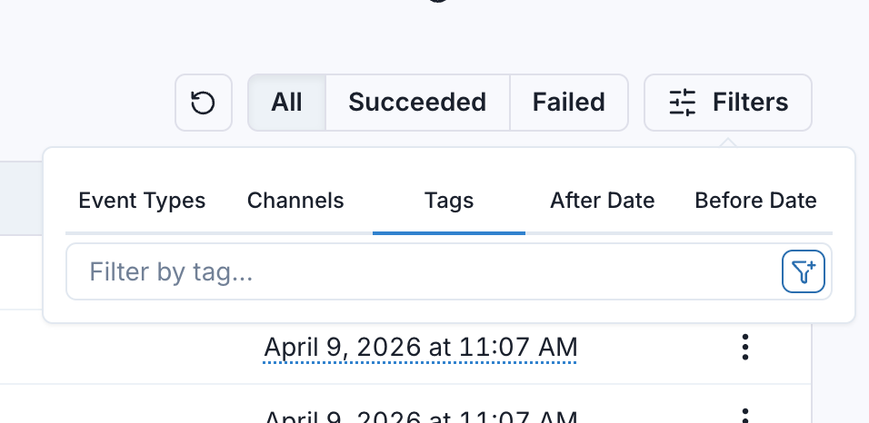

import RAW from '!!raw-loader!@site/docs/message-tags.mdx';
import HeaderWithCopyButton from '@site/src/components/HeaderWithCopyButton';

<HeaderWithCopyButton title="Message Tags" sourceMarkdown={RAW} />

Message tags are free-form strings that can be added to messages to use them for filtering.

In some cases, while debugging webhooks, you may want to get a specific message with a certain field or attribute in the payload, beyond it's event type or channel.

## How to use it

To use message tags, simply add the `tags` field to the create message call. For example, if you want to give your users the option to filter messages related to a specific user id, you can add the user id as a tag.

```typescript
await svix.message.create('app_id', {
    eventType: "user.signup",
    tags: ["user_1"],
    payload: {
        "user_id": "user_1",
        "email": "test@example.com"
    },
});
```

Usually, tags contain values that are already present in the payload, such as user ids, order ids, product categories, etc.

Tags will be visible in the Application Portal, and your users will be able to use them to filter messages.



They can also be used via the API when [listing messages](https://api.svix.com/docs#tag/Message/operation/v1.message.list) or [message attempts](https://api.svix.com/docs#tag/Message-Attempt/operation/v1.message-attempt.list-attempted-messages).

## When not to use it

Tags are not meant as a way to route messages to specific endpoints or specific customers, that's what [event types](./event-types) and [channels](./channels) are for.

Message tags have no impact on message delivery. They are only meant to be used for message filtering.
