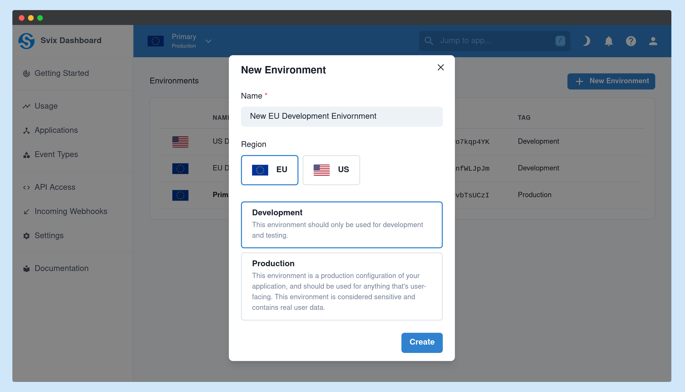
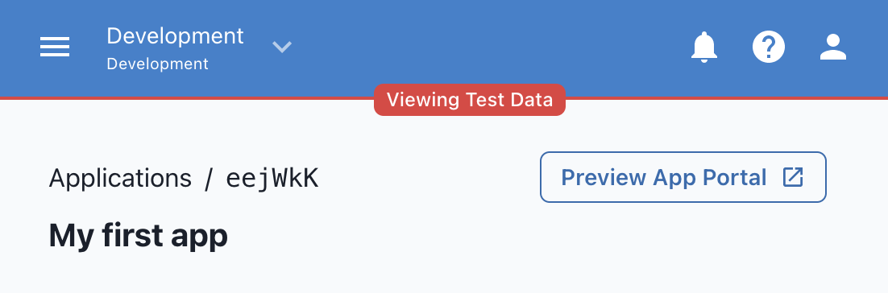
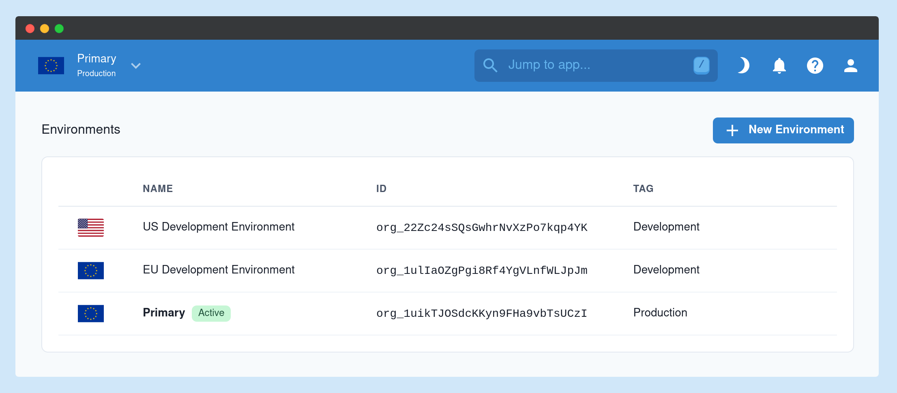
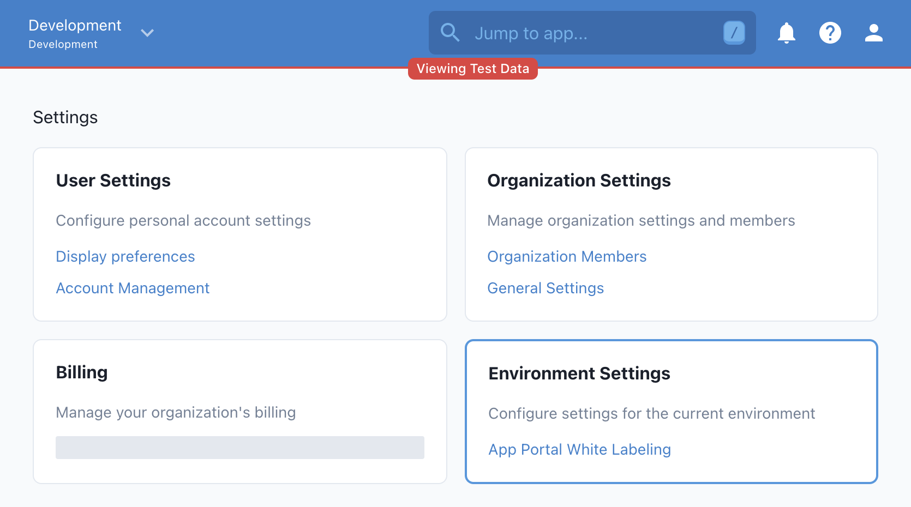

This section explains how to add and use multiple environments (e.g. dev, staging, and prod) from the same account.

## What are environments

It's common practice for engineering teams to have multiple environments, such as development, staging, and production. The idea behind having multiple environments is to be able to test changes in isolation and catch issues before they hit production. So for example, a developer may make some changes locally, test them, and push them for testing in CI/CD. Following that, the change will be moved to a shared `development` environment where it would be tested by the wider team. Changes that pass this level of testing will move to `staging`, where they are deployed to an environment that's as similar as possible to the `production` environment, and after all testing pass there they would be deployed to `production` and rolled out to users.

Not all teams go through all of the steps above (and some go through more), but the idea remains the same: you want to isolate your `production` environment, where real user data lies, from your non-production environments that may contain bugs and regressions.

## Managing environments

Your Svix environments are completely isolated and have separate data, settings, and API keys.

You can create as many environments as you want from the [Environment Management page](https://dashboard.svix.com/environments) on the dashboard.

### Add environments

Click on `New Environment`, choose a name, and mark the environment as either `Development` or `Production`.

Development and production environments function identically; however, you will only be able to preview the App Portal for your development environments.

### View environments

This is how it looks like after adding multiple environments:

You can then switch between the active environment using the switcher on the top left corner and just start using that environment like you used your account before.

### Environment-specific settings

When configuring your environments, it's important to know which settings are shared across your environments and which are kept separate. On the settings page, there is a separate section for "environment-specific" settings.

The App Portal [White Labeling](../app-portal#white-labeling) is configured separately for each environment. This allows you to experiment with how the App Portal will look in your development environment without affecting your production users.
