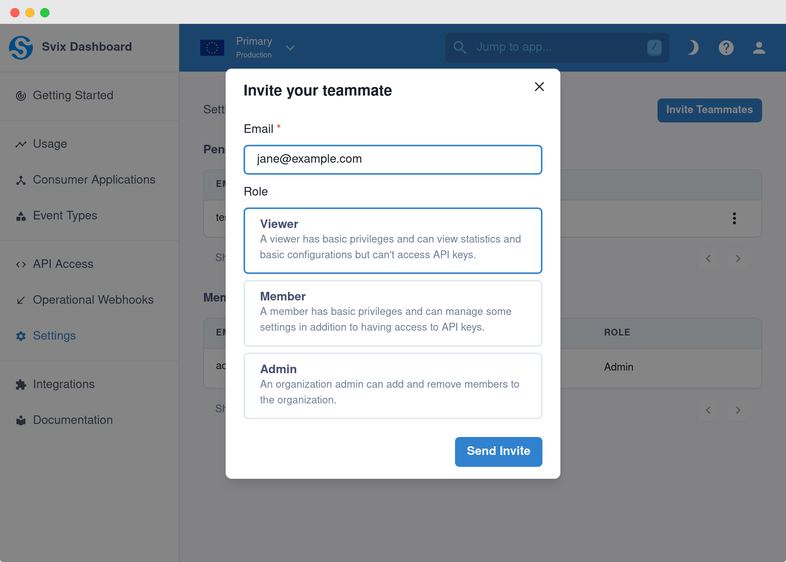
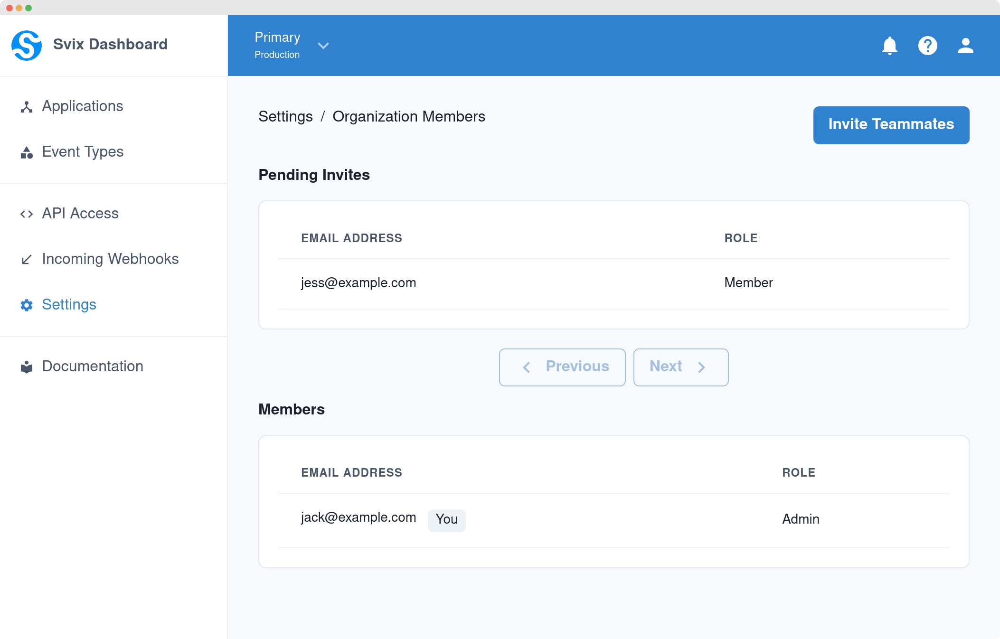

This section explains how to manage access to your organization's account. You can easily give your teammates access, manage it, and invite new team members.

## Managing members

There are currently three supported roles: `Viewer`, `Member` and `Admin`. A `Viewer` has basic privileges and can view statistics and basic configurations but can't access API keys. A `Member` can control most aspects of the account, including applications, endpoints and event types. An `Admin` can do all of that, and also manage members.

You can invite as many members as you want to your organization, so feel free to invite all of your team. To do it, go to the [organization members page](https://dashboard.svix.com/settings/organization-group/members) on the dashboard.

### Invite a user

Click on `Invite Teammates`, put in the email address of the teammate you would like to invite, and choose the appropriate role.

Svix will then send an invitation to the provided email address.

### Accept an invitation

Once your teammate receives the invitation via email, they can follow the link to decide whether to accept or decline the invitation. Accepting the invitation will remove the recipient from their current account and add them to the new account. Declining the invitation will expire it.

The recipient's email must be verified before they can accept an invitation.

### View members

This is how it looks like after you've sent some invitations:

You can then add more members, manage access and manage invitations directly from this page.
