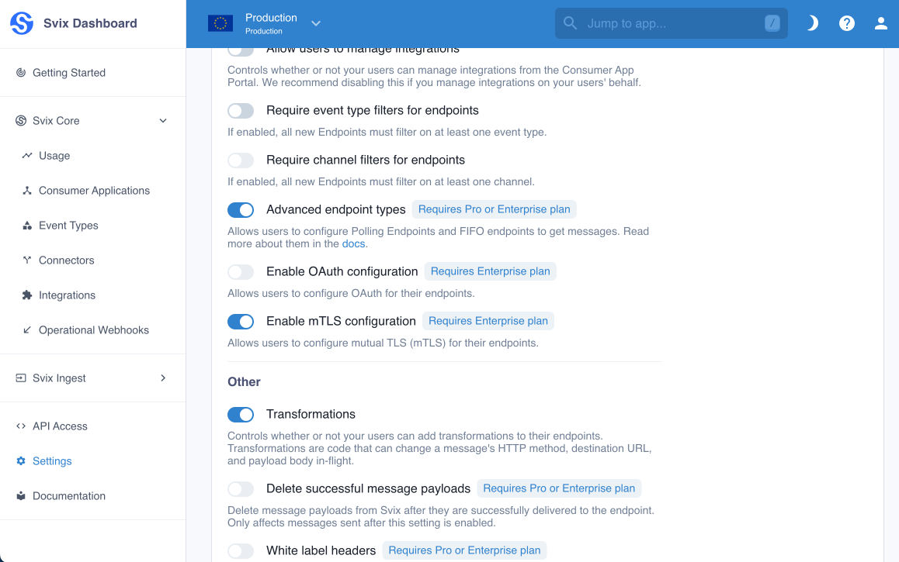
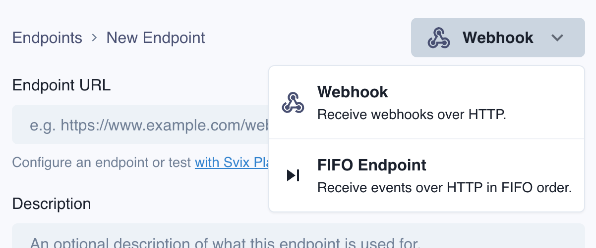
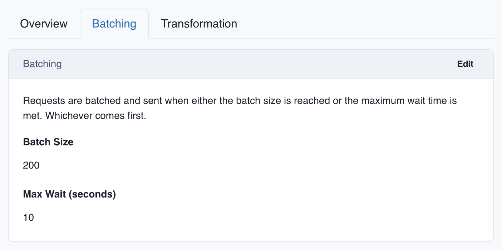

import RAW from '!!raw-loader!@site/docs/advanced-endpoints/fifo-endpoints.mdx';
import HeaderWithCopyButton from '@site/src/components/HeaderWithCopyButton';

<HeaderWithCopyButton title="FIFO Endpoints" sourceMarkdown={RAW} />


FIFO endpoints let your webhook consumers receive webhooks in strict FIFO ordering (first in first out), unlike regular webhooks, which are delivered independently and order is on a best effort basis.

Svix supports sending webhooks to both FIFO and regular endpoints, with no code changes required on your end.

:::info[Why not make all webhooks FIFO?]
Ensuring strict FIFO ordering comes with some tradeoffs. Since every call to the receiver endpoint is blocked until the previous one is successful, throughput is limited compared to regular webhook endpoints.

Read more about [how FIFO endpoints work](https://www.svix.com/blog/fifo-ordered-webhooks-delivery/) and [the challenges with guaranteeing webhook ordering](https://www.svix.com/blog/guaranteeing-webhook-ordering/).
:::


## Enabling FIFO Endpoints
FIFO Endpoints can be enabled at the environment level in the [Svix Dashboard](https://dashboard.svix.com/settings/organization/general-settings) by enabling **Advanced Endpoint Types**.




When you enable FIFO Endpoints, your users will be able to create them in the [App Portal](/app-portal).



## Message Batching
Because of the strict ordering, Svix has to wait for a successful acknowledgement of delivery before sending any other messages. To address throughput constraints FIFO endpoints deliver webhooks in configurable batch sizes.

The batching parameters can be configured in the [App Portal](/app-portal) for each endpoint.



## Transformations
[Transformations](/transformations) are also supported on FIFO endpoints. For FIFO endpoints, transformations are applied to each batch of messages.

### How to write a FIFO endpoint transformation
Svix expects a Transformation to declare a function named `handler`. Svix will pass a `InputObject` to this function as its only argument, and expects the function to always return an `OutObject`.

`InputObject` is a JSON object containing one property:

- `events`, an array of objects containing `payload` and `eventType` properties. There is one element in the array for each message in the batch.

`OutObject` is a JSON object containing one property:

- `requestBody`, a string with the raw request body to be sent to the endpoint.

### An example Transformation

You can write a transformation that transforms certain messages in the batch and forwards them.

```js
function handler(input) {
  const events = input.events.map((evt) => {
    if (evt.eventType === "user.created") {
      return {
        ...evt.payload,
        name: evt.payload.firstName + " " + evt.payload.lastName
      }
    }
  });

  return {
    requestBody: JSON.stringify({ data: events })
  }
}
```

Or you can write transformations that collect messages and returns a summarized response.

```js
function handler(input) {
  const total = input.events.reduce((acc, evt) => {
    if (evt.eventType === "invoice.created") {
      return acc + evt.payload.amount;
    }
    return acc;
  }, 0);

  return {
    requestBody: JSON.stringify({ total })
  }
}
```
