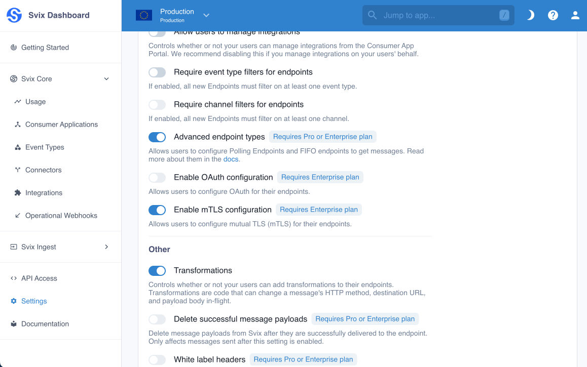
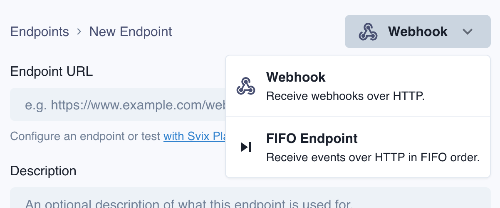
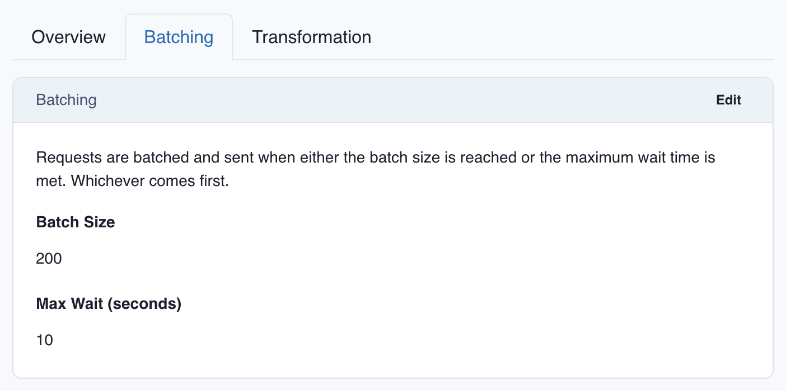

# FIFO Endpoints

FIFO endpoints let your webhook consumers receive webhooks in strict FIFO ordering (first in first out), unlike regular webhooks, which are delivered independently and order is on a best effort basis.

Svix supports sending webhooks to both FIFO and regular enpoints, with no code changes required on your end. 

:::info[Why not make all webhooks FIFO?]
Ensuring strict FIFO ordering comes with some tradeoffs. Since every call to the receiver endpoint is blocked until the previous one is successful, throughput is limited compared to regular webhook endpoints. 

Read more about [how FIFO endpoints work](https://www.svix.com/blog/guaranteeing-webhook-ordering/) and [the challenges with guaranteeing webhook ordering](https://www.svix.com/blog/guaranteeing-webhook-ordering/).
:::

## Enabling FIFO Endpoints
FIFO Endpoints can be enabled at the environment level in the [Svix Dashboard](https://dashboard.svix.com/settings/organization/general-settings) by enabling **Advanced Endpoint Types**.

When you enable FIFO Endpoints, your users will be able to create them in the [App Portal](/app-portal).

## Message Batching
Because of the strict ordering, Svix has to wait for a successful acknowledgement of delivery before sending any other messages. To address throughput constraints FIFO endpoints deliver webhooks in configurable batch sizes.

The batching parameters can be configured in the [App Portal](/app-portal) for each endpoint. 

