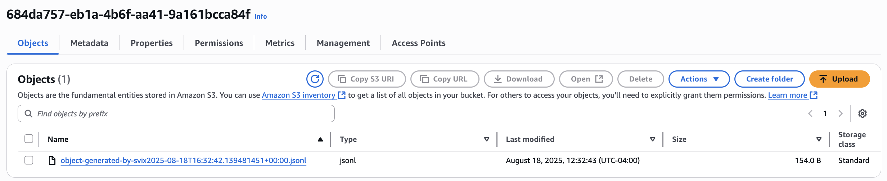

import RAW from '!!raw-loader!@site/docs/advanced-endpoints/object-storage.mdx';
import HeaderWithCopyButton from '@site/src/components/HeaderWithCopyButton';

<HeaderWithCopyButton title="Object Storage" sourceMarkdown={RAW} />

# Object Storage Endpoints

Svix supports sending messages directly to [AWS S3](https://aws.amazon.com/s3/), [Google Cloud Storage](https://cloud.google.com/storage) and [Azure Blob Storage](https://azure.microsoft.com/en-us/products/storage/blobs).

This is useful for storing payloads in a cloud storage bucket without your customers having to set up any listener endpoint or write any glue code.

When **Advanced Endpoint Types** is [enabled](/advanced-endpoints/intro#enabling-advanced-endpoint-types), your customers will see the option to use object storage destinations in the [App Portal](/app-portal).


They will be able to configure the connection right in the App Portal.


## Usage

By default, all Object Storage Endpoints come bundled with the following transformation code.

```JavaScript
/**
 * @param input - The input object
 * @param input.events - The array of events in the batch. The number of events in the batch is capped by the Object Storage Endpoint's batch size.
 * @param input.events[].payload - The message payload (string or JSON)
 * @param input.events[].eventType - The message event type (string)
 *
 * @returns Object describing what will be put to the bucket.
 * @returns returns.config
 * @returns returns.config.format - The format of the request object put to the bucket. Valid values are "jsonl", "json", or "raw" (Defaults to jsonl).
 * @returns returns.config.key - The name of the object that will be put to the bucket. This will be suffixed with a timestamp to avoid duplicate object names.
 * @returns returns.data - The array of events to send to the bucket. This will be formatted according to the format.
 */
function handler(input) {
    return {
        config: {
            format: "jsonl",
            key: "object-generated-by-svix"
        },
        data: input.events
    }
}
```

`input.events` is the list of webhooks received by the endpoint, processed in batches.

`config` describes the object put in the destination - the key name of the object, and the format of the object saved to the bucket.

By default, the actual object key is always suffixed with a timestamp after the transformations are run. This ensures each event batch is saved as a unique object in the bucket.

For example, if the endpoint receives the following events:

```json
{
  "eventType": "user.created",
  "payload": "{\"email\": \"joe@enterprise.io\"}"
}
```

```json
{
  "eventType": "user.login",
  "payload": "{\"id\": 12, \"timestamp\": \"2025-07-21T14:23:17.861Z\"}"
}
```

The default transformation code would result in the following object being uploaded to the bucket.



And the files contents would match the jsonl format.

```jsonl
{"payload":{"email":"joe@enterprise.io"},"eventType":"user.created"}
{"payload":{"id":12,"timestamp":"2025-07-21T14:23:17.861Z"},"eventType":"user.login"}
```

If you want to control the format of the object more precisely, you can use `config.format = "raw"`, and set `data` to a string of the exact file contents you want.
