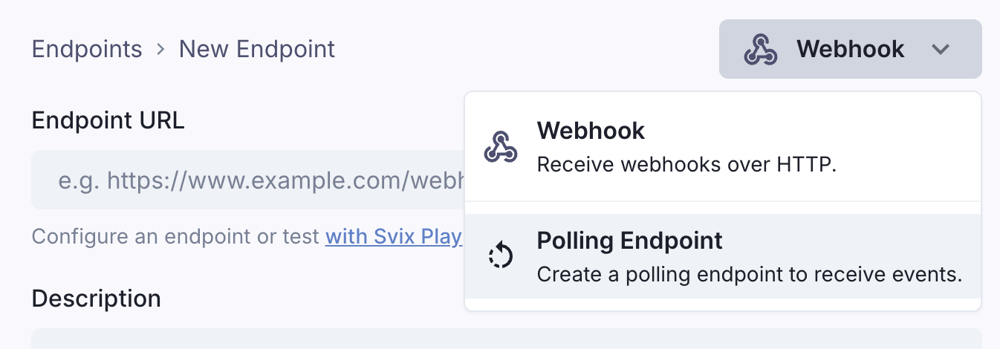

# Polling Endpoints

Polling Endpoints are a way for your users to get a stream of events by polling instead of listening to webhooks.

## When is polling better?

There are a few examples where polling for events works better than webhooks.

One example is when testing webhooks locally. It's much easier to poll for events than exposing a public HTTP endpoint (even with tools like [Svix Play](/play) or [ngrok](/integrations/ngrok)).

Another example is when your users don't care about getting events in real-time and prefer getting them all at once at the end of a day. One place where this use-case comes up, is when your users need to store all events for compliance reasons. In that case batching and saving them all at once is easier and more cost efficient for them.

## Enabling Polling Endpoints

Polling Endpoints can be enabled at the environment level in the [Svix Dashboard](https://dashboard.svix.com/settings/organization/general-settings) by enabling **Advanced Endpoint Types**.


When you enable Polling Endpoints, your users will be able to create them in the [App Portal](/app-portal).



## Usage
Like with webhook endpoints, Polling Endpoints support filtering messages by [event types](/event-types) and [channels](/channels).

In the App Portal, event consumers will get a unique URL and an API key to iterate through the full list of events sent to their [Svix Application](/overview#consumer-applications) since the endpoint was created.

When creating a Polling Endpoint, consumers will get a unique URL like `https://api.svix.com/api/v1/app/app_2mG6DgUaGlwCNdM5oRCUJec2kQC/poller/poll_59q`

When first calling the endpoint, it will return an empty array and an iterator.

```json
{
  "data": [],
  "iterator": "eyJvZmZzZXQiOi05MjIzMzcyMDM2ODU0Nzc1ODA4LCJhZnRlciI6bnVsbH0",
  "done": false
}
```

Then, using the iterator in the next call, they can iterate through the events and poll for new ones.

```bash
curl \
  "https://api.svix.com/api/v1/app/app_2mG6DgUaGlwCNdM5oRCUJec2kQC/poller/poll_59q?iterator=eyJv..." \
  -H 'Accept: application/json' \
  -H 'Authorization: Bearer sk_poll_*****.eu'
```

Messages will be returned in the order they were sent to Svix.

Polling Endpoints can be used in parallel with regular Svix webhooks, and you don't need to make any changes to how you [create messages](/quickstart#send-a-message).