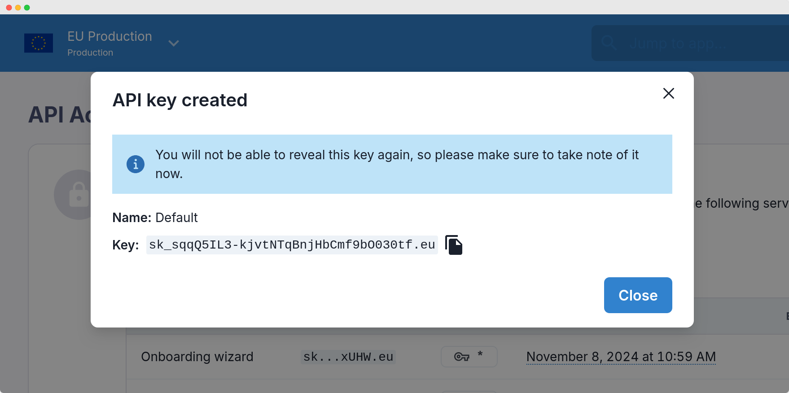

# API keys

Manage your API keys to authenticate requests with Svix.
Svix authenticates your API requests using your account’s API keys. If you don’t include your key when making an API request, or use an incorrect or outdated one, Svix returns an error.

**API keys are per environment.** Every organization starts with a development environment with a corresponding API key. This key should only be used for development or internal testing and is not intended to be used in any production systems.

## Obtaining your API keys

Your API keys can be found on the "API Access" page of the Svix Dashboard.

## Keeping your keys safe

Your secret API key can be used to make any API call on behalf of your account. Treat your secret API key as you would any other password. Grant access only to those who need it. Ensure it is kept out of any version control system you may be using. Control access to your key using a password manager or secrets management service.

## Rotating keys

If an API key is compromised, rotate the key in the Dashboard to block it and generate a new one.

When you rotate an API key, the old key will be blocked immediately, so any systems currently using that key will experience downtime. This behavior will change in a future release.
