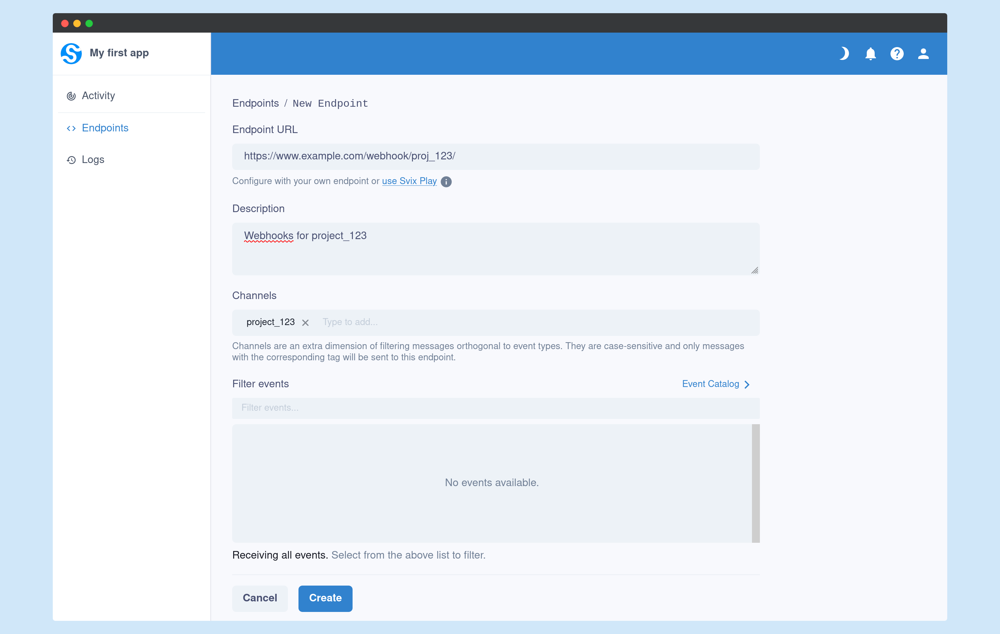

Channels are an extra dimension of filtering messages that is orthogonal to [event types](./event-types.mdx). You can listen to multiple channels from each endpoint, and you can send each message to multiple channels.

Event types imply a specific consistent schema, and mean a specific type of message. Channels are filters based on the expected recipient or group of recipients.

## How to use it

You first need to enable support to it for each of your environments from [the dashboard](https://dashboard.svix.com/settings/organization/general-settings).

Once enabled, your customers can choose their wanted channels from the Application Portal, or alternatively you can set it per endpoint in the API.



You then need to send messages with the corresponding channels in order for these to reach the endpoints that filter by them. See below for the channels filtering rules.

```typescript
await svix.message.create('app_id', {
    eventType: "user.signup",
    channels: [
        "project_123",
        "project_group_11"
    ],
    payload: {
        "username": "test_user",
        "email": "test@example.com"
    },
});
```

## Example use-cases

Channels are useful for when you have a variety of sub-categories or recipients that expect the same types of messages but just need additional filtering.

For example, consider Github. You may want to define webhooks for the whole organization, but only send certain events to certain endpoints based on the repository. You could just create a Svix App per repository and then manually add the endpoints to each, but it makes for a much better experience to have the webhook handling defined in one place with the same endpoints listening to multiple projects.

So for example, you can have `svix`, `svix/svix-libs` and `svix/svix-docs` as channels, and then have Github send messages for both `svix` and for each repo whenever an event occurs on a specific repository. Github's customers can then create endpoints that listen to events either for the whole group, or for each repository in particular.

## Channels filtering rules

Channels are case-sensitive, and endpoints that are filtering for specific channels will only get messages sent to that specific channel.

Svix will send (or not send) to endpoints based on the following conditions:
1. Endpoint has no channels set: this is a catch-all, all messages are sent to to it, regardless of whether the message had channels set.
2. Both endpoint and message have channels set: if there's a shared channel between them, the message will be sent to the endpoint.
3. Endpoint has channels set and message has *no* channels set: the message will not be sent to the endpoint.
