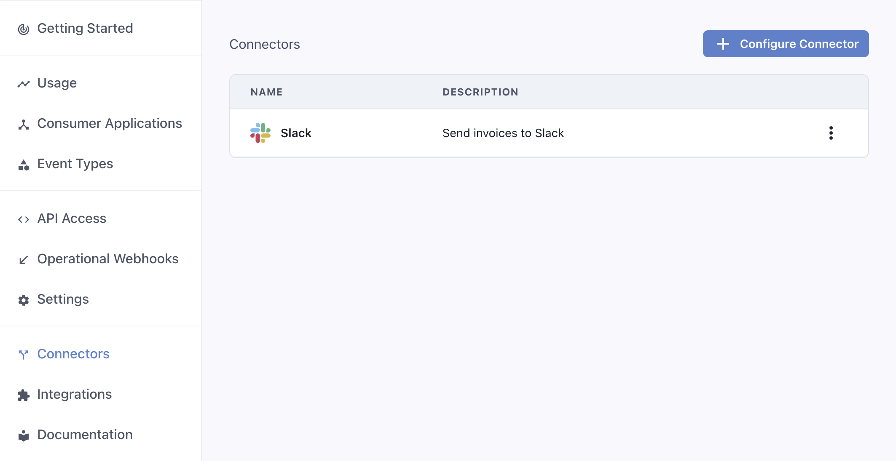
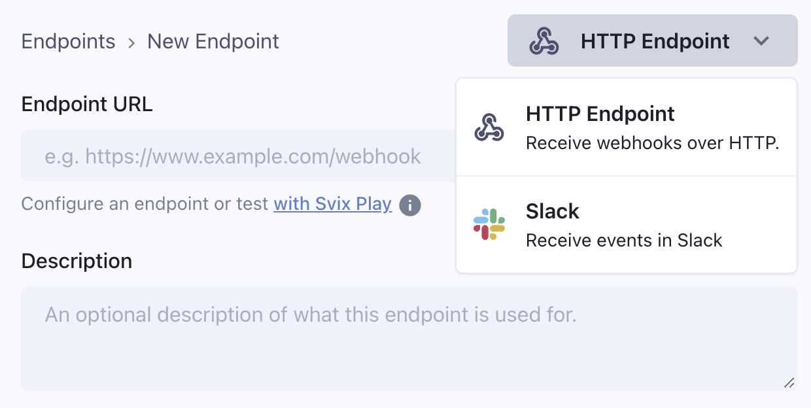
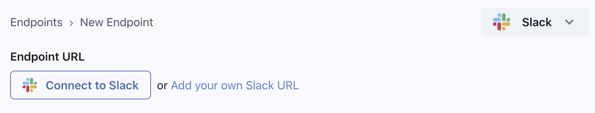
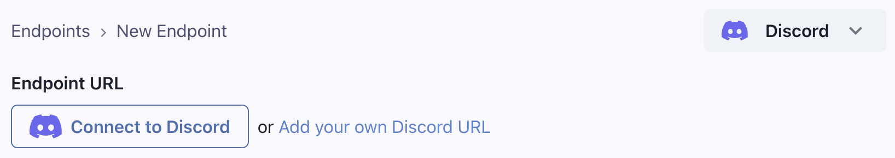
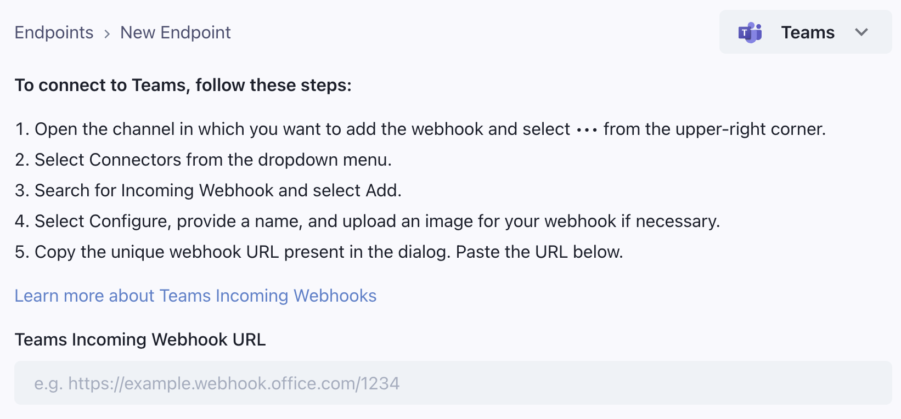
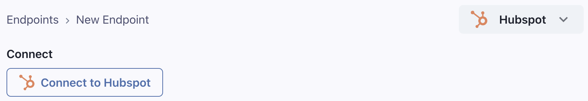
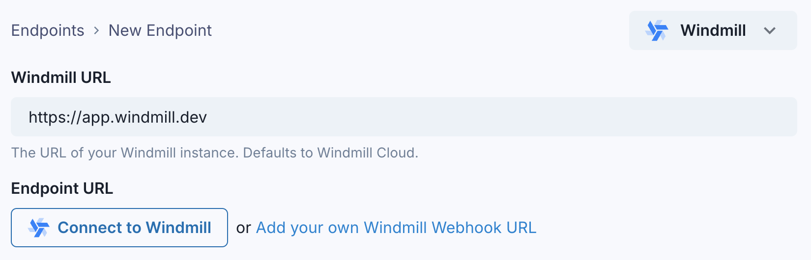
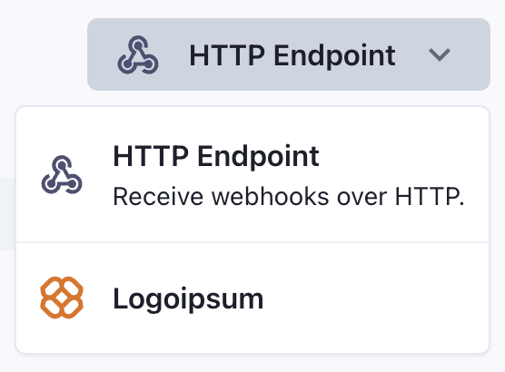

import ConnectorLogo from "@site/src/components/ConnectorLogo";

Connectors is a Svix feature that lets you provide your customers with pre-made integrations to connect your webhooks to other services.

### How to use Connectors

Connectors are enabled when [enabling transformations](/transformations#enabling-transformations). After enabling Transformations, you will see a new dashboard section where you will be able to create new connectors.



To configure a connector, you need to provide the following details:

- `Type`: Choose from a set of services that provide easy webhook integrations, or choose `Custom` to build your own integration. We currently support Slack, Discord, and many more services, listed below.
- `Description`: Describe the integration to your customers.
- `Event Types`: Specify which events are going to be supported out-of-the-box by the integration. 
- `Transformation Code`: This is the glue code that will turn incoming webhook events into useful payloads for your integration. For example, if you are building a connector that sends Slack messages 
every time a new invoice is created, the transformation will read `invoice.created` events and return a payload that works for Slack, like:
```js
webhook.payload = { "text": `An invoice of $${webhook.payload.amount} has been created.` }
```

The transformation code needs to account for all event types you choose to support. You can define different behaviors for each event type by switching on the `webhook.eventType` field. 

For example, this transformation will create a different message depending on if the event type is `invoice.created` or `invoice.deleted`:

```js
/**
 * @param webhook the webhook object
 * @param webhook.method destination method. Allowed values: "POST", "PUT"
 * @param webhook.url current destination address
 * @param webhook.eventType current webhook Event Type
 * @param webhook.payload JSON payload
 * @param webhook.cancel whether to cancel dispatch of the given webhook
 */
function handler(webhook) {
  switch (webhook.eventType) {
    case "invoice.created":
      webhook.payload = {
        text: `${webhook.payload.name} created an invoice for $${webhook.payload.amount}`
      };
      break;
    case "invoice.deleted":
      webhook.payload = {
        text: `${webhook.payload.name} deleted an invoice`
      };
      break;
  }

  return webhook
}
```

Your customers will be able to customize the transformation code and the event types they listen to. Your definition should act as a working starting point they can use. 


### Connectors in the App Portal

After creating at least one connector, your customers will be able to choose it when creating an endpoint. 



## Connection types

### <ConnectorLogo name="slack" /> Slack \{#slack}

The Slack built-in integration lets you send messages to Slack channels via webhooks. It shows a 'Connect to Slack' button that lets your users get a Slack incoming webhook URL using OAuth in a few clicks, without leaving your site.



The transformation code should format the webhook payload according to [Slack's Incoming Webhook API](https://api.slack.com/messaging/webhooks#posting_with_webhooks).

Here's an example transformation:

```js
function handler(webhook) {
  /**
   * Example payload is:
   * {
   *   amount: 99.99,
   *   customer_name: "John Doe",
   *   invoice_id: "inv_123"
   * }
   * 
   * See https://api.slack.com/messaging/webhooks#posting_with_webhooks
   */
  webhook.payload = {
    text: `💰 New invoice for $${webhook.payload.amount} from ${webhook.payload.customer_name}`
  };

  return webhook;
}
```


### <ConnectorLogo name="discord" /> Discord \{#discord}

The Discord built-in integration lets you send messages to Discord channels via webhooks. It shows a 'Connect to Discord' button that lets your users get a Discord incoming webhook URL using OAuth in a few clicks, without leaving your site.



The transformation code should format the webhook payload according to [Discord's Execute Webhook API](https://discord.com/developers/docs/resources/webhook#execute-webhook).

Here's an example transformation:

```js
function handler(webhook) {
  /**
   * Example payload is:
   * {
   *   user: {
   *     email: "john@example.com",
   *     name: "John Doe"
   *   },
   *   cancellation_reason: "Too expensive"
   * }
   * 
   * See https://discord.com/developers/docs/resources/webhook#execute-webhook
   */
  webhook.payload = {
    embeds: [{
      title: "❌ Subscription Cancelled",
      description: `User ${webhook.payload.user.email} cancelled their subscription`,
      color: 0xff0000
    }]
  };

  return webhook;
}
```

### <ConnectorLogo name="microsoft-teams" /> Microsoft Teams \{#teams}

The Microsoft Teams integration will show your users instructions on how to get a Teams webhook URL. 

The transformation code should format the webhook payload according to [Microsoft Teams' Incoming Webhook API](https://learn.microsoft.com/en-us/microsoftteams/platform/webhooks-and-connectors/how-to/connectors-using?#send-adaptive-cards-using-an-incoming-webhook).



Here's an example transformation for a support ticket created event:

```js
function handler(webhook) {
  /**
   * Example payload is:
   * {
   *   ticket_id: "TICKET-123",
   *   customer_name: "John Doe",
   *   priority: "high",
   *   description: "Can't access my account"
   * }
   * 
   * See https://learn.microsoft.com/en-us/microsoftteams/platform/webhooks-and-connectors/how-to/connectors-using?#send-adaptive-cards-using-an-incoming-webhook
   */
  webhook.payload = {
    type: "message",
    attachments: [{
      contentType: "application/vnd.microsoft.card.adaptive",
      content: {
        type: "AdaptiveCard",
        body: [
          {
            type: "TextBlock",
            text: "🆘 New Support Ticket",
            weight: "Bolder"
          },
          {
            type: "TextBlock",
            text: `Ticket #${webhook.payload.ticket_id} from ${webhook.payload.customer_name}`
          }
        ]
      }
    }]
  };

  return webhook;
}
```

### <ConnectorLogo name="hubspot" /> Hubspot \{#hubspot}

The Hubspot integration lets you connect webhooks directly to the [Hubspot API](https://developers.hubspot.com/docs/api/overview). It shows a 'Connect to Hubspot' button that lets your users get a Hubspot access token that can be used to connect to the Hubspot API.

The integration will request access to the following [OAuth scopes](https://developers.hubspot.com/docs/api/working-with-oauth) in the [Hubspot API](https://developers.hubspot.com/docs/api/overview):

- `crm.objects.contacts.write`
- `crm.objects.companies.write`
- `crm.objects.deals.write`
- `crm.objects.quotes.write`
- `crm.objects.marketing_events.write`



The transformation code should set the webhook URL to the Hubspot API endpoint (depending on the object) and format the payload appropriately to create the object in Hubspot.

For example, if you send a `user.created` webhook, and want to write a connector that creates a contact in Hubspot, the transformation code could look like this:

```js
function handler(webhook) {
  /**
   * Example payload is:
   * {
   *   user: {
   *     firstname: 'John',
   *     lastname: 'Doe',
   *     email: 'john.doe@example.com'
   *   }
   * }
   */  
  webhook.url = "https://api.hubapi.com/crm/v3/objects/contacts"; // The method is already POST
  webhook.payload = {
    properties: {
      email: webhook.payload.email,
      firstname: webhook.payload.user.firstname,
      lastname: webhook.payload.user.lastname,
    }
  };

  return webhook
}
```

### <ConnectorLogo name="closeio" /> Close.IO \{#closeio}

The Close.IO connector lets your users connect their webhooks to the Close.IO API. Users enter their Close.IO API key in the [App Portal](/app-portal).

This example uses [Close.IO's Contact API](https://developer.close.com/resources/contacts/), formatting the payload to create a contact in Close.IO:

```js
function handler(webhook) {
  /**
   * Example payload is:
   * {
   *   user: {
   *     email: "john@example.com",
   *     name: "John Doe",
   *     phone: "+1234567890"
   *   }
   * }
   * 
   * See https://developer.close.com/resources/contacts/
   */
  webhook.url = "https://api.close.com/api/v1/contact/";
  webhook.payload = {
    lead_id:"lead_QyNaWw4fdSwxl5Mc5daMFf3Y27PpIcH0awPbC9l7uyo",
    name: webhook.payload.user.name,
    emails: [webhook.payload.user.email],
    phones: [webhook.payload.user.phone]
  };

  return webhook;
}
```

### <ConnectorLogo name="segment" /> Segment \{#segment}

The Segment connector lets your users send events to Segment's API. Users enter their Segment Write Key in the [App Portal](/app-portal).

This example uses [Segment's Track API](https://segment.com/docs/connections/sources/catalog/libraries/server/http-api/#track), formatting the payload appropriately:

```js
function handler(webhook) {
  /**
   * Example payload is:
   * {
   *   user: {
   *     id: "user123",
   *     email: "john@example.com",
   *     name: "John Doe"
   *   },
   *   event: "subscription_created",
   *   properties: {
   *     plan: "premium",
   *     price: 99.99
   *   }
   * }
   * 
   * See https://segment.com/docs/connections/sources/catalog/libraries/server/http-api/#track
   */
  webhook.url = "https://api.segment.io/v1/track";
  webhook.payload = {
    userId: webhook.payload.user.id,
    event: webhook.payload.event,
    properties: {
      ...webhook.payload.properties,
      email: webhook.payload.user.email,
      name: webhook.payload.user.name
    },
    timestamp: new Date().toISOString()
  };

  return webhook;
}
```

### <ConnectorLogo name="sendgrid" /> Sendgrid \{#sendgrid}

The SendGrid connector lets your users send events as emails using SendGrid. Users enter their SendGrid API key in the [App Portal](/app-portal).

The transformation code should format the webhook payload according to [SendGrid's Mail Send API](https://www.twilio.com/docs/sendgrid/api-reference/mail-send/mail-send).

Here's an example transformation for a user signup event:

```js
function handler(webhook) {
  /**
   * Example payload is:
   * {
   *   user: {
   *     email: "john@example.com",
   *     name: "John Doe"
   *   }
   * }
   * 
   * See https://www.twilio.com/docs/sendgrid/api-reference/mail-send/mail-send
   */
  webhook.payload = {
    personalizations: [
      {
        to: [{ email: webhook.payload.user.email }]
      }
    ],
    from: {
      email: "notifications@yourdomain.com",
      name: "Your App"
    },
    subject: "Welcome to Your App!",
    content: [
      {
        type: "text/html",
        value: `<h1>Welcome ${webhook.payload.user.name}!</h1>
                <p>Thank you for signing up to our service.</p>`
      }
    ]
  };

  return webhook;
}
```

### <ConnectorLogo name="resend" /> Resend \{#resend}

The Resend connector lets your users send events as emails using Resend. Users enter their Resend API key in the [App Portal](/app-portal).

The transformation code should format the webhook payload according to [Resend's Email API](https://resend.com/docs/api-reference/emails/send-email).

Here's an example transformation for a user signup event:

```js
function handler(webhook) {
  /**
   * Example payload is:
   * {
   *   user: {
   *     email: "john@example.com",
   *     name: "John Doe"
   *   }
   * }
   * 
   * See https://resend.com/docs/api-reference/emails/send-email
   */
  webhook.payload = {
    from: "Your App <notifications@yourdomain.com>",
    to: [webhook.payload.user.email],
    subject: "Welcome to Your App!",
    html: `<h1>Welcome ${webhook.payload.user.name}!</h1>
           <p>Thank you for signing up to our service.</p>`
  };

  return webhook;
}
```

### <ConnectorLogo name="loops" /> Loops \{#loops}

The Loops connector lets your users send events to Loops to trigger email automations. Users enter their Loops API key in the [App Portal](/app-portal).

The transformation code should format the webhook payload according to [Loops' Send Event API](https://loops.so/docs/api-reference/send-event).

Here's an example transformation for a user signup event:

```js
function handler(webhook) {
  /**
   * Example payload is:
   * {
   *   user: {
   *     email: "john@example.com",
   *     id: "user123"
   *   }
   * }
   * 
   * See https://loops.so/docs/api-reference/send-event
   */
  webhook.payload = {
    email: webhook.payload.user.email,
    userId: webhook.payload.user.id,
    eventName: "user_signup",
    eventProperties: {
      source: "webhook"
    }
  };

  return webhook;
}
```

### <ConnectorLogo name="windmill" /> Windmill \{#windmill}

The Windmill connector lets your users get a [Windmill](https://windmill.dev) webhook URL in a few clicks from the App Portal. It supports [Windmill Cloud](https://app.windmill.dev) as well as self-hosted Windmill instances.



Since Windmill webhooks support arbitrary payloads, it does not require any custom transformation code.

### <ConnectorLogo name="inngest" /> Inngest \{#inngest}

The Inngest connector lets your users send events to Inngest to trigger serverless functions. Users enter their Inngest API key in the [App Portal](/app-portal).

Since Inngest webhooks support arbitrary payloads, it does not require any custom transformation code.

### <ConnectorLogo name="zapier" /> Zapier \{#zapier}

The Zapier connector lets your users send events to Zapier to trigger automations. It shows instructions on how to get a Zapier webhook URL.

Since Zapier Webhooks support arbitrary payloads, it does not require any custom transformation code.


### Custom Integration

In case you don't find a built-in integration for the service you want to connect to, you can create a custom integration. You can provide your own integration name and icon, and write instructions for your users on how to use it. 



If you have a request for a built-in integration not listed above, [contact us](https://www.svix.com/contact/).
