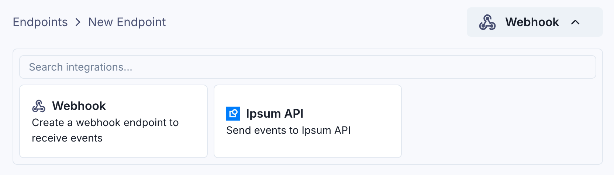
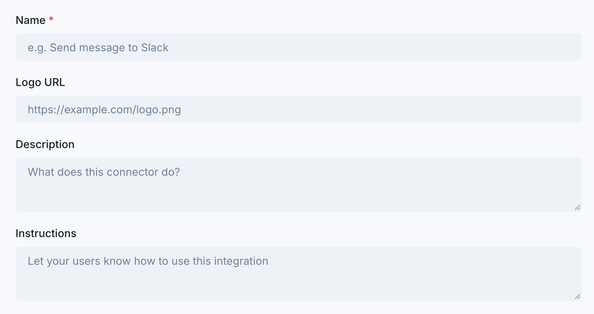
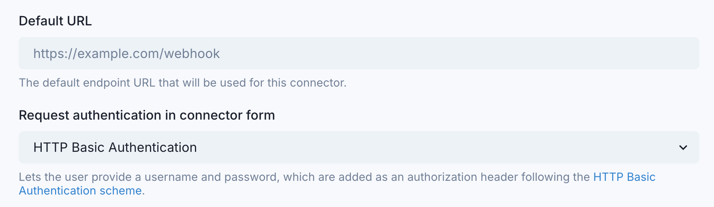
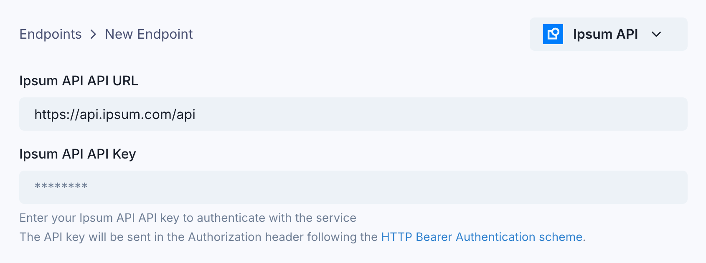

import ConnectorLogo from "@site/src/components/ConnectorLogo";

If you don't find a built-in integration for the service you want to connect to, you can create a Custom Connector.

### Configuration

You can provide your own integration name and icon, and write instructions for your users on how to use it (in addition to the [default transformation code](/connectors/#how-to-use-connectors) like in any other connector).

You can also (optionally) configure a default endpoint URL and a default authentication method for custom connectors. This will prefill certain fields in the app portal for your customers, to make it easier for them to use the connector.

The supported authentication methods are `HttpBasic` and `HttpBearer`.

When using `HttpBasic`, the App Portal will display a `username` and `password` input field, and add the `Authorization: Basic base64(<username>:<password>)` header to the endpoint (see [RFC 7617](https://datatracker.ietf.org/doc/html/rfc7617)) .

When using `HttpBearer`, the App Portal will display a `token` input field, and add the `Authorization: Bearer <token>` header to the endpoint (see [RFC 6750](https://datatracker.ietf.org/doc/html/rfc6750)).

