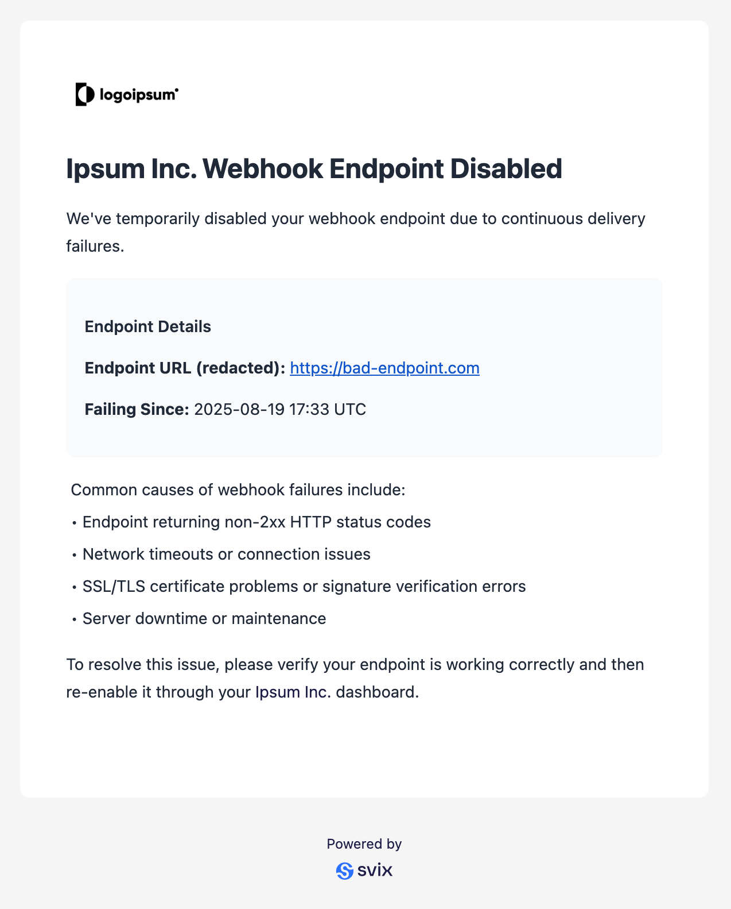

import CodeTabs from "@theme/CodeTabs";
import TabItem from "@theme/TabItem";

Svix supports sending personalized email notifications to your customers when certain events occur with their webhooks setup. This is useful for keeping customers aware of webhook delivery issues that might affect their integrations.


{/* ## How email notifications work */}

Email notifications are sent per [Consumer Application](/overview#consumer-applications). For example, when an endpoint for a particular Application is disabled due to repeated failures, Svix will send an email to the configured email address for that application.

## Setting up email notifications

### Enable email notifications in your organization

To get started, you'll need to enable email notifications for your organization. Head to the [Email Notifications](https://dashboard.svix.com/email-notifications) section of the Svix dashboard.

### Configure your branding

Personalize the email notifications by adding:
- Company name - The name of your company or service
- Logo URL - A link to your company logo for branding
- Webhooks management page URL - Where your customers can manage their webhook settings

### Set the email address for each application

For each application that should receive email notifications, you'll need to specify an email address. This is done by setting the `svix.email` field in the Application's `metadata`.

You can set the email address when creating an application, or by updating an existing application's metadata.

#### When creating an application

<CodeTabs>
<TabItem value="js">

```js
import { Svix } from "svix";

const svix = new Svix("AUTH_TOKEN");
const app = await svix.application.create({
  name: "Example customer 123",
  uid: "example-customer-123",
  metadata: {
    "svix.email": "example-customer-123@example.com"
  }
});
```

</TabItem>
<TabItem value="py">

```python
from svix.api import Svix, ApplicationIn

svix = Svix("AUTH_TOKEN")
app = svix.application.create(ApplicationIn(
    name="Example customer 123",
    uid="example-customer-123",
    metadata={
        "svix.email": "example-customer-123@example.com"
    }
))
```

</TabItem>
<TabItem value="go">

```go
import (
	svix "github.com/svix/svix-webhooks/go"
)

svixClient := svix.New("AUTH_TOKEN", nil)
metadata := map[string]interface{}{
    "svix.email": "example-customer-123@example.com",
}
app, err := svixClient.Application.Create(ctx, &svix.ApplicationIn{
    Name: "Example customer 123",
    Uid:  "example-customer-123",
    Metadata: &metadata,
})
```

</TabItem>
<TabItem value="rust">

```rust
use svix::api::{ApplicationIn, Svix, SvixOptions};

let svix = Svix::new("AUTH_TOKEN".to_string(), None);
let mut metadata = std::collections::HashMap::new();
metadata.insert("svix.email".to_string(), serde_json::Value::String("example-customer-123@example.com".to_string()));

let app = svix
    .application()
    .create(
        ApplicationIn {
            name: "Example customer 123".to_string(),
            uid: Some("example-customer-123".to_string()),
            metadata: Some(metadata),
            ..ApplicationIn::default()
        },
        None,
    )
    .await?;
```

</TabItem>
<TabItem value="java">

```java
import com.svix.models.ApplicationIn;
import com.svix.models.ApplicationOut;
import com.svix.Svix;
import java.util.HashMap;
import java.util.Map;

Svix svix = new Svix("AUTH_TOKEN");
Map<String, Object> metadata = new HashMap<>();
metadata.put("svix.email", "example-customer-123@example.com");

ApplicationOut app = svix.getApplication().create(
    new ApplicationIn().name("Example customer 123").uid("example-customer-123").metadata(metadata)
);
```

</TabItem>
<TabItem value="kotlin">

```kotlin
import com.svix.kotlin.models.ApplicationIn
import com.svix.kotlin.models.ApplicationOut
import com.svix.kotlin.Svix

val svix = Svix("AUTH_TOKEN")
val metadata = mapOf("svix.email" to "example-customer-123@example.com")

val applicationOut = svix.application.create(
    ApplicationIn(
        name = "Example customer 123", 
        uid = "example-customer-123",
        metadata = metadata
    )
)
```

</TabItem>
<TabItem value="ruby">

```ruby
require "svix"

svix = Svix::Client.new("AUTH_TOKEN")

application_out = svix.application.create(Svix::ApplicationIn.new({
    "name" => "Example customer 123",
    "uid" => "example-customer-123",
    "metadata" => {
        "svix.email" => "example-customer-123@example.com"
    }
}))
```

</TabItem>
<TabItem value="csharp">

```csharp
var svix = new SvixClient("AUTH_TOKEN", new SvixOptions("https://api.us.svix.com"));
var metadata = new Dictionary<string, object>
{
    { "svix.email", "example-customer-123@example.com" }
};

var applicationOut = await svix.Application.CreateAsync(
    new ApplicationIn(name: "Example customer 123", uid: "example-customer-123", metadata: metadata)
);
```

</TabItem>
<TabItem value="cli">

```shell
export SVIX_AUTH_TOKEN='AUTH_TOKEN'
svix application create '{ 
  "name": "Example customer 123", 
  "uid": "example-customer-123",
  "metadata": { 
    "svix.email": "example-customer-123@example.com" 
  } 
}'
```

</TabItem>
<TabItem value="curl">

```shell
export SVIX_AUTH_TOKEN='AUTH_TOKEN'

curl -X POST "https://api.us.svix.com/api/v1/app/" \
    -H  "Accept: application/json" \
    -H  "Content-Type: application/json" \
    -H  "Authorization: Bearer ${SVIX_AUTH_TOKEN}" \
    -d '{
      "name": "Example customer 123", 
      "uid": "example-customer-123",
      "metadata": { 
        "svix.email": "example-customer-123@example.com" 
      }
    }'
```

</TabItem>
</CodeTabs>

#### Updating an existing application

<CodeTabs>
<TabItem value="js">

```js
import { Svix } from "svix";

const svix = new Svix("AUTH_TOKEN");
await svix.application.patch("example-customer-123", {
  metadata: {
    "svix.email": "example-customer-123@example.com"
  }
});
```

</TabItem>
<TabItem value="py">

```python
from svix.api import Svix

svix = Svix("AUTH_TOKEN")
svix.application.patch("example-customer-123", {
    "metadata": {
        "svix.email": "example-customer-123@example.com"
    }
})
```

</TabItem>
<TabItem value="go">

```go
import (
	svix "github.com/svix/svix-webhooks/go"
)

svixClient := svix.New("AUTH_TOKEN", nil)
metadata := map[string]interface{}{
    "svix.email": "example-customer-123@example.com",
}
app, err := svixClient.Application.Patch(ctx, "example-customer-123", &svix.ApplicationPatch{
    Metadata: &metadata,
})
```

</TabItem>
<TabItem value="rust">

```rust
let svix = Svix::new("AUTH_TOKEN".to_string(), None);
let mut metadata = std::collections::HashMap::new();
metadata.insert("svix.email".to_string(), serde_json::Value::String("example-customer-123@example.com".to_string()));

let app = svix
    .application()
    .patch(
        "example-customer-123".to_string(),
        ApplicationPatch {
            metadata: Some(metadata),
            ..ApplicationPatch::default()
        },
    )
    .await?;
```

</TabItem>
<TabItem value="java">

```java
import com.svix.Svix;
import com.svix.models.ApplicationPatch;
import java.util.HashMap;
import java.util.Map;

Svix svix = new Svix("AUTH_TOKEN");
Map<String, Object> metadata = new HashMap<>();
metadata.put("svix.email", "example-customer-123@example.com");

svix.getApplication()
  .patch("example-customer-123", new ApplicationPatch()
    .metadata(metadata)
  );
```

</TabItem>
<TabItem value="kotlin">

```kotlin
import com.svix.kotlin.Svix
import com.svix.kotlin.models.ApplicationPatch

val svix = Svix("AUTH_TOKEN")
val metadata = mapOf("svix.email" to "example-customer-123@example.com")

svix.application.patch("example-customer-123", ApplicationPatch(
    metadata = metadata
))
```

</TabItem>
<TabItem value="ruby">

```ruby
svix = Svix::Client.new("AUTH_TOKEN")
svix.application.patch("example-customer-123", Svix::ApplicationPatch.new({
    "metadata" => {
        "svix.email" => "example-customer-123@example.com"
    }
}))
```

</TabItem>
<TabItem value="csharp">

```csharp
var svix = new SvixClient("AUTH_TOKEN", new SvixOptions("https://api.us.svix.com"));
var metadata = new Dictionary<string, object>
{
    { "svix.email", "example-customer-123@example.com" }
};

await svix.Application.PatchAsync("example-customer-123", new ApplicationPatch(
    metadata: metadata
));
```

</TabItem>
<TabItem value="cli">

```shell
export SVIX_AUTH_TOKEN='AUTH_TOKEN'
svix application patch 'example-customer-123' '{ "metadata": { "svix.email": "example-customer-123@example.com" } }'
```

</TabItem>
<TabItem value="curl">

```shell
export SVIX_AUTH_TOKEN='AUTH_TOKEN'

curl -X PATCH "https://api.us.svix.com/api/v1/app/example-customer-123/" \
    -H  "Accept: application/json" \
    -H  "Content-Type: application/json" \
    -H  "Authorization: Bearer ${SVIX_AUTH_TOKEN}" \
    -d '{ "metadata": { "svix.email": "example-customer-123@example.com" } }'
```

</TabItem>
</CodeTabs>

### An example email notification

