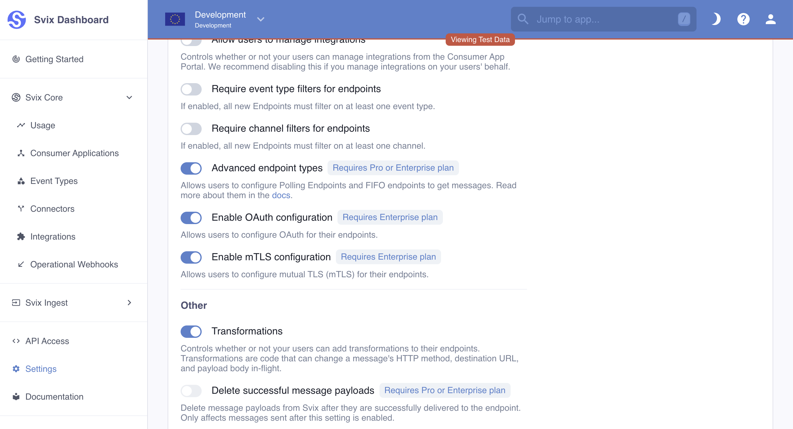
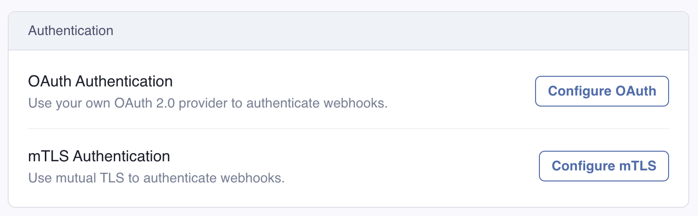
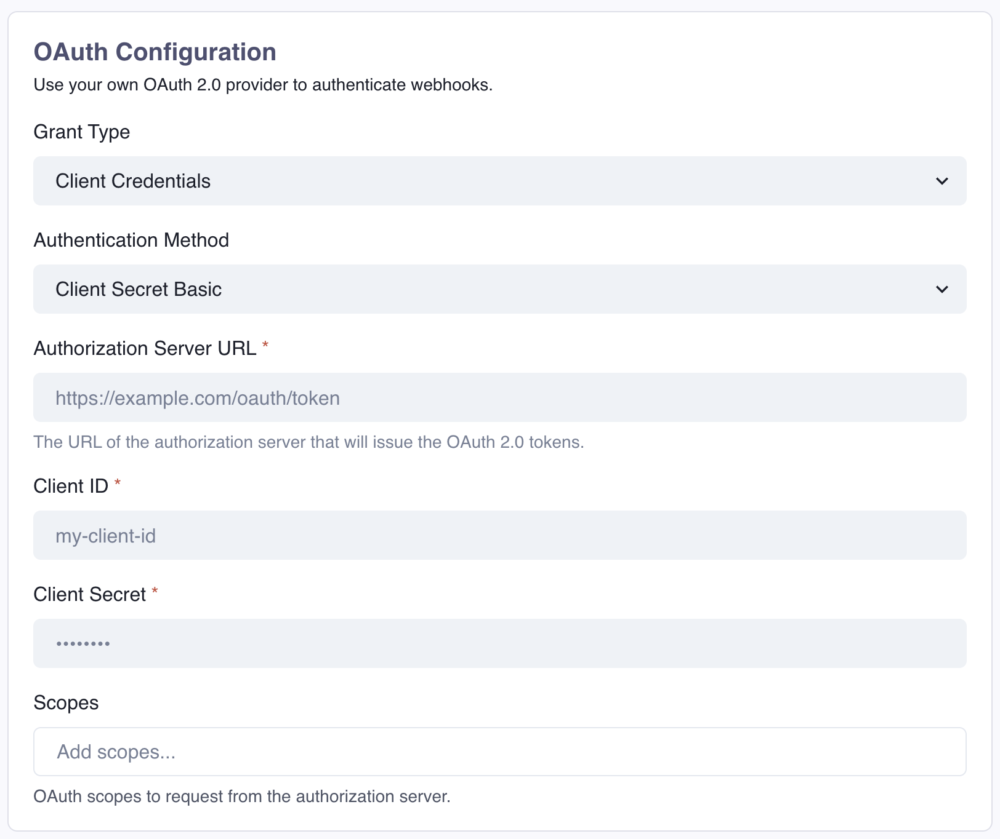
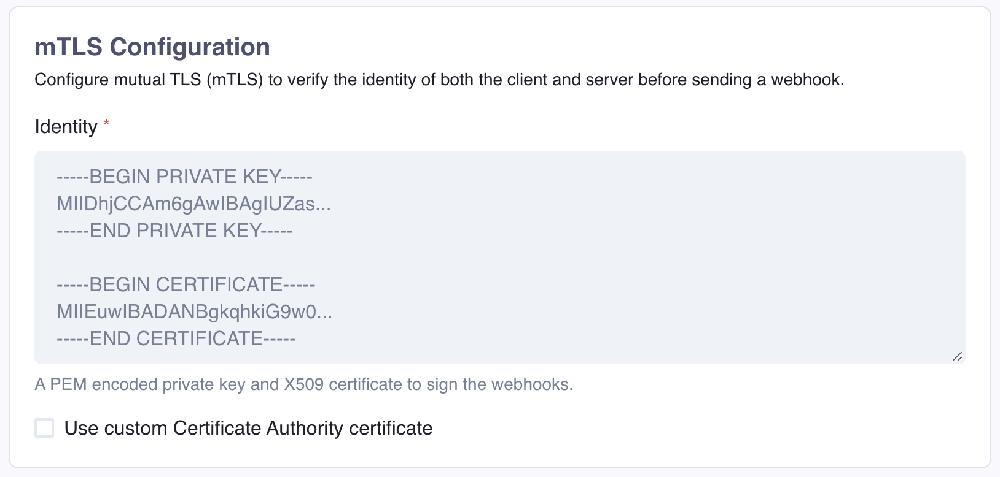

# Endpoint Authentication

Svix supports advanced endpoint authentication methods that can be used by your customers on top of the standard signature verification. 

:::info
These are advanced methods that are not required to keep your webhooks secure, but your customers might need them for their use case.
Read the [security docs](/security) for more information.
:::

## Enabling OAuth and mTLS

OAuth and mTLS can be enabled at the environment level in the [Svix Dashboard](https://dashboard.svix.com/settings/organization/general-settings).

When enabled, your users will see an option in the [App Portal](/app-portal) to configure the respective authentication method on their endpoints.

## OAuth 
To configure OAuth, your users will need to enter a `Client ID` and the `Authorization Server URL`, as well as the rest of the OAuth parameters, depending on the desired `Grant type` and `Authentication method`. 

## Mutual TLS (mTLS)

With mTLS, your users can upload a private PEM encoded private key and certificate, which will be used to sign the requests sent to the endpoint, and to verify the identity of the receiving server.

For self-signed certificates, a custom Certificate Authority certificate can also be specified.