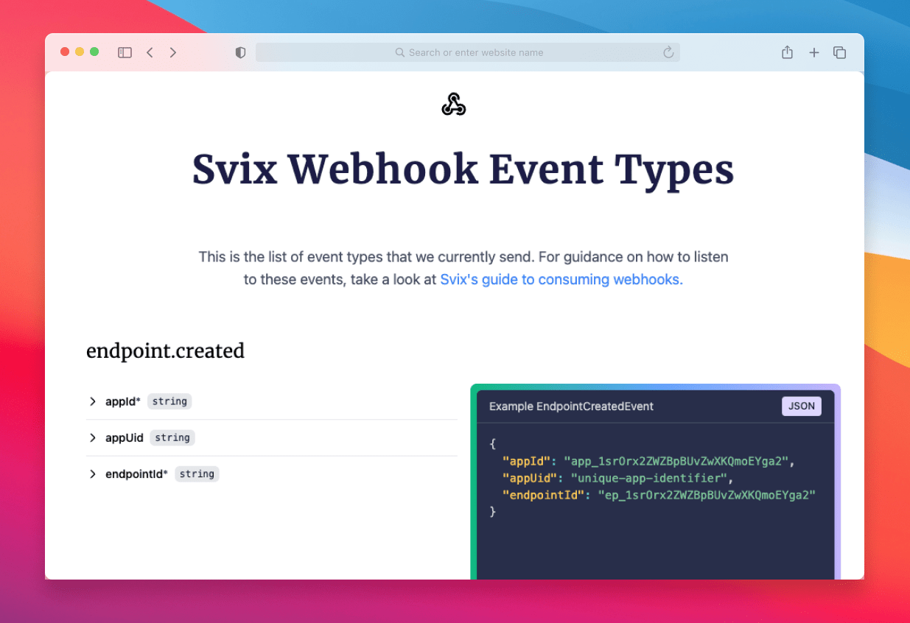

import CodeTabs from "@theme/CodeTabs";
import TabItem from "@theme/TabItem";

Each message sent through Svix has an associated event type.
Event types are identifiers denoting the type of message being sent.
Because they are the primary way for webhook consumers to configure what events they are interested in receiving, we highly recommend including an event catalog that describes each event type and provides sample payloads in your documentation.
To make it easy for webhook consumers to find and subscribe to the right events, Svix automatically generates an event catalog. See more about [publishing your event catalog here](#publishing-your-event-catalog).

Event types are just a string, for example: `user.signup`, `invoice.paid` and `workflow.completed`.

Webhook consumers can choose which events are sent to which endpoint. By default, all messages are sent to all endpoints. Though when adding or editing endpoints, users can choose to only subscribe to some of the event types for this particular endpoint.

:::tip[Bulk Create]
It's recommended to add the event types you are going to use ahead of time. You can do it by [importing them from an OpenAPI spec](#import-event-types-from-an-openapi-specification) or [bulk creating them from code](#bulk-creating-event-types-from-code).
:::

## What your users will see

This is how choosing event types look like in the [pre-built application portal](app-portal.mdx):


## Event Type Format

Event types have a pattern defined a `^[a-zA-Z0-9\\-_.]+$`, meaning it can contain any of the following characters:

- A through Z (uppercase or lowercase)
- 0 through 9
- Special characters: `-`, `_`, `.`

:::tip[Style guide]
We recommend you use period-delimited event type names (e.g. `<group>.<event>`). If you do, the App Portal UI will logically group them for your users and make it easier for them to subscribe an endpoint to all events in a particular group of event types.
:::

## Using event types

You can add, edit, and delete event types in [the dashboard](https://dashboard.svix.com) or through the API below.

<CodeTabs>
<TabItem value="js">

```js
import { Svix } from "svix";

const svix = new Svix("AUTH_TOKEN");
const eventType = await svix.eventType.create({
  name: "user.signup",
  description: "A user has signed up",
});
```

</TabItem>
<TabItem value="py">

```python
from svix.api import Svix, EventTypeIn

svix = Svix("AUTH_TOKEN")
app = svix.event_type.create(EventTypeIn(
    name="user.signup",
    description="A user has signed up"
))
```

</TabItem>
<TabItem value="go">

```go
import (
	svix "github.com/svix/svix-webhooks/go"
)

svixClient := svix.New("AUTH_TOKEN", nil)
app, err := svixClient.EventType.Create(ctx, &svix.EventTypeIn{
    Name: "user.signup",
    Description: "A user has signed up",
})}
```

</TabItem>
<TabItem value="rust">

```rust
 let svix = Svix::new("AUTH_TOKEN".to_string(), None);
 let event_type = svix
     .event_type()
     .create(
         EventTypeIn {
             name: "user.signup".to_string(),
             description: "A user has signed up".to_str
             ..EventTypeIn::default()
         },
         None,
     )
     .await?;
```

</TabItem>
<TabItem value="java">

```java
import com.svix.Svix;
import com.svix.models.EventTypeIn;


Svix svix = new Svix("AUTH_TOKEN");
svix.getEventType()
  .create(new EventTypeIn()
    .name("user.signup")
    .description("A user has signed up")
  );
```

</TabItem>
<TabItem value="kotlin">

```kotlin
import com.svix.kotlin.Svix;
import com.svix.kotlin.models.EventTypeIn;

val svix = Svix("AUTH_TOKEN");
svix.eventType.create(
                EventTypeIn(
                    name = "user.signup",
                    description = "A user has signed up",
                ));
```

</TabItem>
<TabItem value="ruby">

```ruby
svix = Svix::Client.new("AUTH_TOKEN")
svix.event_type.create(Svix::EventTypeIn.new({
        "name" => "user.signup",
        "description" => "A user has signed up"}))
```

</TabItem>
<TabItem value="csharp">

```csharp
var svix = new SvixClient("AUTH_TOKEN", new SvixOptions("https://api.us.svix.com"));
await svix.EventType.CreateAsync(new EventTypeIn(
    name: "user.signup",
    description: "A user has signed up"
))
```

</TabItem>
<TabItem value="cli">

```shell
export SVIX_AUTH_TOKEN='AUTH_TOKEN'
svix event-type create '{ "name": "user.signup", "description": "A user has signed up" }'
```

</TabItem>
<TabItem value="curl">

```shell
export SVIX_AUTH_TOKEN='AUTH_TOKEN'

curl -X POST "https://api.us.svix.com/api/v1/event-type/" \
    -H  "Accept: application/json" \
    -H  "Content-Type: application/json" \
    -H  "Authorization: Bearer ${SVIX_AUTH_TOKEN}" \
    -d '{ "name": "user.signup", "description": "A user has signed up" }'
```

</TabItem>
</CodeTabs>

## Event Type Schema

One of the best ways to help your users integrate with you is by defining schemas for your event types. Event type schemas allow your users to anticipate the shape of the message body they will receive as well as introduce guardrails for each data type.

Schemas can be created using our visual schema editor, or by providing your own JSONSchema (Draft 7) spec either in the UI or [the API](https://api.svix.com/docs#tag/Event-Type/operation/v1.event-type.create).


Once you have a schema defined, your users will be able to view the schema definition as well as an example event from the Event Catalog in the App Portal.


To learn more about creating schemas, check out our guide on [adding your first event type schema](./tutorials/event-type-schema).

### Schema validation

Svix doesn't enforce the event type schema when creating a message. There are a few reasons to why we do it, though the main one is that we would much rather send a message with a bad schema, than block messages because the schema was slightly wrong. This is especially true for more strict schemas like ones that enforce some fields follow a specific regex (a potentially minor violation).

Additionally, since the payload is fully controlled by our customers (you), it's very easy to verify the schema on the sender side, before sending to Svix, which ensures people get exactly the level of validation they expect.

We do however love schemas and think they are super important, so we plan on adding an automatic SDK generator that will have type checked and validated schemas for you client side, so that bad schemas will fail at compile time, not run time!


## Import event types from an OpenAPI specification

The [OpenAPI specification](https://www.openapis.org/) is a formal standard for describing HTTP APIs. Some people write these by hand, and some automatically generate these from the web framework of their choice.

If you already have an OpenAPI specification, you can upload it to Svix which will automatically create event types for you based on the [`webhooks`](https://github.com/OAI/OpenAPI-Specification/blob/main/versions/3.1.0.md#fixed-fields) section (or `x-webhooks` for OpenAPI 3.0).

In addition to the standard features supported by the OpenAPI spec, Svix also supports a couple of extensions: `x-svix-feature-flag` and `x-svix-group-name` which let you set the [feature flag](#event-type-feature-flags) and group name on the event type respectively as follows:

```json
"webhooks": {
  "pet.new": {
    "post": {
      "operationId": "pet.new",
      "x-svix-feature-flag": "beta-feature-a",
      "x-svix-group-name": "group-name-1",
      "requestBody": {
        ...
      }
    }
  }
}
```

If your API spec has a `webhooks` section (or `x-webhooks`) you can continue to the next sections to learn how to upload it. If you need help with adding the `webhooks` section to your OpenAPI spec, please refer to the [Generating an OpenAPI spec section](#generating-an-openapi-spec).


### From the dashboard

Your first option for uploading your OpenAPI spec is by uploading it from the Svix dashboard. Once uploaded you'll be faced with this preview which will give you the opportunity to review the added event types before saving them.


The event description, schema and examples will be used to create the Svix event type, using the `path id` as the event type name.
If you use choose the name of an already existing event type, it will be updated with the new values.

### Using the API

The API includes an endpoint which helps keep your [event-types in sync with a JSON OpenAPI Spec](https://api.svix.com/docs#tag/Event-Type/operation/v1.event-type.import-openapi).
Event types and their schemas are generated from `webhooks` or `x-webhooks` top-level key of the spec, just like with the UI importer.

When the event type already exists, it'll be updated with the latest description and schema, otherwise a new event type will be created.


<CodeTabs>

<TabItem value="js">

```js

const spec = loadOpenapiFromFile("openapi.json");
await svix.eventType.importOpenApi({ spec });

```

</TabItem>

<TabItem value="py">

```python

spec = load_openapi_from_file("openapi.json")
svix.event_type.import_openapi(EventTypeImportOpenApiIn(spec=spec))

```

</TabItem>


<TabItem value="rust">

```rust

let spec = load_openapi_from_file("openapi.json")?;
let _ = svix
    .event_type()
    .import_openapi(EventTypeImportOpenApiIn { spec }, None)
    .await?;

```

</TabItem>

<TabItem value="go">

```go

spec := loadOpenapiFromFile("openapi.json")
svixClient.EventType.ImportOpenApi(context.Background(), svix.EventTypeImportOpenApiIn{
    Spec: spec,
})

```

</TabItem>

<TabItem value="java">

```java

Map<String, Object> spec = MySpecReader.loadOpenapiFromFile("openapi.json");
svix.getEventType().importOpenApi(new EventTypeImportOpenApiIn().spec(spec));

```

</TabItem>

<TabItem value="kotlin">

```kotlin

var spec = load_openapi_from_file("openapi.json")
var eventTypeImportOpenApiOut = await svix.EventType.ImportOpenapiAsync(
    new EventTypeImportOpenApiIn{spec: spec}
)

```

</TabItem>

<TabItem value="ruby">

```ruby

spec = load_openapi_from_file("openapi.json")
event_type_import_open_api_out = svix.event_type.import_openapi(Svix::EventTypeImportOpenApiIn.new(spec))

```

</TabItem>

<TabItem value="csharp">

```csharp

var spec = loadOpenapiFromFile("openapi.json")
var eventTypeImportOpenApiOut = await svix.EventType.ImportOpenapiAsync(
    new EventTypeImportOpenApiIn{
        spec: spec
    }
)

```

</TabItem>

<TabItem value="cli">

```shell
# TBD
```

</TabItem>

<TabItem value="curl">

```shell

export SVIX_AUTH_TOKEN='AUTH_TOKEN'

curl -X POST "https://api.us.svix.com/api/v1/event-type/import/openapi/" \
-H  "Accept: application/json" \
-H  "Content-Type: application/json" \
-H  "Authorization: Bearer ${SVIX_AUTH_TOKEN}" \
-d '{"spec":' $(cat path/to/openapi.json) '}'

```

</TabItem>
</CodeTabs>

### Using the Github Action

Svix also provides a [Github Action](https://github.com/svix/svix-event-type-import-action) to upload your OpenAPI spec and automatically create or update your event types as part of your CI/CD pipeline.

```yaml
- name: Upload Event Types to Svix
  uses: svix/svix-event-type-import-action@v1.0.0
  with:
    openapi-file: 'path/to/your/openapi-spec.yml' # can be a .json too
    svix-api-key: ${{ secrets.SVIX_API_KEY }}
```


## Bulk creating event types from code

The easiest way to bulk-create event types is by just writing a simple script to load a [pipe delimited `CSV`](https://en.wikipedia.org/wiki/Comma-separated_values) file or a `JSON` file with the event types and make the API requests.

Here is an example `CSV` file (without headers) of events:

```csv
user.created|A user has been created
user.removed|A user has been removed
user.changed|A user has changed
```

Here are some example scripts for processing the above file:

<CodeTabs>
<TabItem value="js">

```js
import { Svix } from "svix";
import fs from "fs";
import readline from "readline";

const svix = new Svix("AUTH_TOKEN");

async function execute() {
  const fileStream = fs.createReadStream("./data.csv");

  const data = readline.createInterface({
    input: fileStream,
    crlfDelay: Infinity,
  });

  for await (const lineItr of data) {
    const line = lineItr.split("|");
    const eventType = await svix.eventType.create({
      name: line[0],
      description: line[1],
    });
  }
}

execute();
```

</TabItem>
<TabItem value="py">

```python
import json
from svix.api import Svix, EventTypeIn

svix = Svix("AUTH_TOKEN")

with open("./data.csv", "r") as f:
    for line in f:
        name, description = line.split("|")
        app = svix.event_type.create(EventTypeIn(
            name=name,
            description=description,
        ))
```

</TabItem>
<TabItem value="go">

```go
package main

import (
	"bufio"
	"log"
	"os"
	"strings"

	svix "github.com/svix/svix-webhooks/go"
)

func main() {
	svixClient := svix.New("AUTH_TOKEN", nil)

	f, err := os.Open("./data.csv")
	if err != nil {
		log.Fatal(err)
	}
	defer f.Close()

	scanner := bufio.NewScanner(f)
	for scanner.Scan() {
		line := strings.Split(scanner.Text(), "|")
		_, err = svixClient.EventType.Create(ctx, &svix.EventTypeIn{
			Name:        line[0],
			Description: line[1],
		})
		if err != nil {
			log.Println(err)
		}
	}
	if err := scanner.Err(); err != nil {
		log.Fatal(err)
	}
}
```

</TabItem>
<TabItem value="rust">

```rust
use std::{error::Error, fs::File};
use svix::api::{EventTypeIn, Svix};

async fn execute() -> Result<(), Box<dyn Error>> {
    let svix = Svix::new("AUTH_TOKEN".to_string(), None);

    let mut reader = csv::ReaderBuilder::new()
        .delimiter(b'|')
        .from_reader(File::open("src/data.csv")?);

    for result in reader.records() {
        let record = result?;

        svix.event_type()
            .create(
                EventTypeIn {
                    name: record[0].to_string(),
                    description: record[1].to_string(),
                    ..EventTypeIn::default()
                },
                None,
            )
            .await?;
    }

    Ok(())
}

#[tokio::main]
async fn main() {
    execute().await.unwrap();
}
```

</TabItem>
<TabItem value="java">

```java
package sviximport;

import java.io.FileReader;
import java.io.IOException;
import java.util.Scanner;
import com.svix.Svix;
import com.svix.models.EventTypeIn;
import com.svix.exceptions.ApiException;

public class App {

    public static void main(String[] args) {
        Svix svix = new Svix("AUTH_TOKEN");

        try (Scanner scanner = new Scanner(new FileReader("/path/to/data.csv"));) {
            while (scanner.hasNextLine()) {
                try {
                    String[] line = scanner.nextLine().split("|");
                    svix.getEventType().create(new EventTypeIn().name(line[0]).description(line[1]));
                } catch(ApiException e) {
                    if (e.getCode() != 409) {
                        System.out.println(e.getResponseBody());
                        System.exit(1);
                    }
                }
            }
        } catch(IOException e) {
            System.out.println(e.toString());
            System.exit(1);
        }
    }
}
```

</TabItem>
<TabItem value="kotlin">

```kotlin
package sviximport

import com.svix.kotlin.Svix
import com.svix.kotlin.models.EventTypeIn
import com.svix.kotlin.exceptions.ApiException
import java.io.File
import java.io.IOException
import kotlinx.coroutines.runBlocking
import kotlin.system.exitProcess

fun main() = runBlocking {
    val svix = Svix("AUTH_TOKEN")
    try {
        File("/path/to/data.csv").useLines { lines ->
            lines.forEach {
                try {
                    val line = it.split("|")
                    svix.eventType.create(EventTypeIn(
                        name = line[0],
                        description = line[1]
                    ))
                } catch (e: ApiException) {
                    println(e.message)
                    exitProcess(1)
                }
            }
        }
    } catch (e: IOException) {
        println(e.toString())
        exitProcess(1)
    }
}
```

</TabItem>
<TabItem value="ruby">

```ruby
require "svix"
require "csv"

svix = Svix::Client.new("AUTH_TOKEN")

CSV.foreach('data.csv', {:col_sep => "|"}) do |line|
    event_type = svix.event_type.create(Svix::EventTypeIn.new({
        "name" => line[0],
        "description" => line[1]}))
end
```

</TabItem>
<TabItem value="csharp">

```csharp
// Example TBD
// Read the CSV and create event types
```

</TabItem>
<TabItem value="cli">

```shell
export SVIX_AUTH_TOKEN='AUTH_TOKEN'

while IFS=$'|', read -r name description
do
    svix event-type create "{ \"name\": \"${name}\", \"description\": \"${description}\" }"
done < data.csv
```

</TabItem>
<TabItem value="curl">

```shell
export SVIX_AUTH_TOKEN='AUTH_TOKEN'

while IFS=$'|', read -r name description
do
    curl -X POST "https://api.us.svix.com/api/v1/event-type/" \
        -H  "Accept: application/json" \
        -H  "Content-Type: application/json" \
        -H  "Authorization: Bearer ${SVIX_AUTH_TOKEN}" \
        -d  "{ \"name\": \"${name}\", \"description\": \"${description}\" }"
done < data.csv
```

</TabItem>
</CodeTabs>

## Publishing your Event Catalog

By default, your event types are only accessible to users from within an authenticated session on the Application Portal.

If you would like to have them publicly accessible, you can enable the "Make Public" setting from the Event Catalog configuration screen in the Dashboard settings.

Enabling this setting will cause your event types to be statically served on **svix.com**. You can link or embed that site within your own documentation.


### Configuration Options

- **Make Public:** Whether or not the Event Catalog will be publicly accessible from **svix.com**.
- **Display Name:** _Required to make your Event Catalog public._ The display name will be shown in the heading of the published page. It should be the name of your company or product.

### Using a custom domain

It is also possible to have the Event Catalog served from your own domain (e.g. `webhooks.example.com`) instead of the default `www.svix.com`.

To set this up, please set the following record on your DNS provider:
* Type: `CNAME`
* Name: `webhooks` (or whatever subdomain you would like to use)
* Value: `event-types.svix.com`

And [let us know](https://www.svix.com/contact/) once you do so that we can activate it on our end.

### What it looks like



## Event type feature flags

When introducing new features in your application it can be useful to only expose them to a select set of users.

Event types can be hidden from users by setting feature flags on them. If a feature flag is set on an event type, users won't see the event type in the Event Catalog and the API, unless they have an authorization token that explicitly allows them.

A feature flag is an arbitrary string that you can set at event type creation time. You can also remove or add back the feature flag by updating an existing event type. Feature flags follow the same naming rules as the event type name itself: `^[a-zA-Z0-9\\-_.]+$`.

Here's how you can create an event type with a feature flag:

<CodeTabs>
<TabItem value="js">

```js
import { Svix } from "svix";

const svix = new Svix("AUTH_TOKEN");
const eventType = await svix.eventType.create({
  name: "user.signup",
  description: "A user has signed up",
  featureFlags: ["beta-feature-a"],
});
```

</TabItem>
<TabItem value="py">

```python
from svix.api import Svix, EventTypeIn

svix = Svix("AUTH_TOKEN")
app = svix.event_type.create(EventTypeIn(
    name="user.signup",
    description="A user has signed up",
    feature_flags=["beta-feature-a"]
))
```

</TabItem>
<TabItem value="go">

```go
import (
	svix "github.com/svix/svix-webhooks/go"
)

svixClient := svix.New("AUTH_TOKEN", nil)
app, err := svixClient.EventType.Create(ctx, &svix.EventTypeIn{
    Name: "user.signup",
    Description: "A user has signed up",
    FeatureFlag: []string{"beta-feature-a"},
})}
```

</TabItem>
<TabItem value="rust">

```rust
use svix::api::{ApplicationIn, Svix, SvixOptions};

let svix = Svix::new("AUTH_TOKEN".to_string(), None);
let event_type = svix
    .event_type()
    .create(
        EventTypeIn {
            name: "user.signup".to_string(),
            description: "A user has signed up".to_string(),
            feature_flags: Some(vec!["beta-feature-a".to_string()]),
            ..EventTypeIn::default()
        },
        None,
    )
    .await?;
```

</TabItem>
<TabItem value="java">

```java
import com.svix.Svix;
import com.svix.models.EventTypeIn;


Svix svix = new Svix("AUTH_TOKEN");
svix.getEventType()
    .create(new EventTypeIn()
    .name("user.signup")
    .description("A user has signed up")
    .featureFlags(new String[]{"beta-feature-a"})
  );
```

</TabItem>
<TabItem value="kotlin">

```kotlin
import com.svix.kotlin.Svix;
import com.svix.kotlin.models.EventTypeIn;

val eventTypeOut = svix.eventType.create(EventTypeIn()
    .name("user.signup")
    .description("A user has signed up")
    .featureFlags(arrayOf("beta-feature-a"))
)
```

</TabItem>
<TabItem value="ruby">

```ruby
svix = Svix::Client.new("AUTH_TOKEN")
svix.event_type.create(Svix::EventTypeIn.new({
    "name": "user.signup",
    "description": "A user has signed up",
    "feature_flags": ["beta-feature-a"]
}))
```

</TabItem>
<TabItem value="csharp">

```csharp
var svix = new SvixClient("AUTH_TOKEN", new SvixOptions("https://api.us.svix.com"));
await svix.EventType.CreateAsync(new EventTypeIn{
    name: "user.signup",
    description: "A user has signed up",
    featureFlags: new string[] {"beta-feature-a"}
});
```

</TabItem>
<TabItem value="cli">

```shell
export SVIX_AUTH_TOKEN='AUTH_TOKEN'
svix event-type create '{ "name": "user.signup", "description": "A user has signed up", "featureFlags": ["beta-feature-a"] }'
```

</TabItem>
<TabItem value="curl">

```shell
export SVIX_AUTH_TOKEN='AUTH_TOKEN'

curl -X POST "https://api.us.svix.com/api/v1/event-type/" \
    -H  "Accept: application/json" \
    -H  "Content-Type: application/json" \
    -H  "Authorization: Bearer ${SVIX_AUTH_TOKEN}" \
    -d '{ "name": "user.signup", "description": "A user has signed up", "featureFlags": ["beta-feature-a"] }'
```

</TabItem>
</CodeTabs>

If a user tries to retrieve this newly created event type they will get a not-found error. To give them access you need to give them an access token that explicitly allows them to see event types with at least one of the feature flags set during creation.

<CodeTabs>
<TabItem value="js">

```js
const svix = new Svix("AUTH_TOKEN");
const dashboard = await svix.authentication.appPortalAccess("app_Xzx8bQeOB1D1XEYmAJaRGoj0", {
    featureFlags: ["beta-feature-a"]
});
// A URL that automatically logs user into the dashboard
console.log(dashboard.url);
```

</TabItem>
<TabItem value="py">

```python
svix = Svix("AUTH_TOKEN")
dashboard = svix.authentication.app_portal_access("app_Xzx8bQeOB1D1XEYmAJaRGoj0", AppPortalAccessIn(
    feature_flags=["beta-feature-a"]
))
# A URL that automatically logs user into the dashboard
print(dashboard.url)
```

</TabItem>
<TabItem value="go">

```go
svixClient := svix.New("AUTH_TOKEN", nil)
dashboard, _ := svixClient.Authentication.AppPortalAccess(ctx, "app_Xzx8bQeOB1D1XEYmAJaRGoj0", &svix.AppPortalAccessIn{
    FeatureFlags: []string{"beta-feature-a"}
})
// A URL that automatically logs user into the dashboard
fmt.Println(dashboard.Url)
```

</TabItem>
<TabItem value="rust">

```rust
let svix = Svix::new("AUTH_TOKEN".to_string(), None);
let dashboard = svix
    .authentication()
    .app_portal_access(
        "app_Xzx8bQeOB1D1XEYmAJaRGoj0".to_string(),
        AppPortalAccessIn {
            feature_flags: Some(vec!["beta-feature-a".to_string()]),
            ..Default::default()
        },
        None,
    )
    .await?;
// A URL that automatically logs user into the dashboard
println!("{}", dashboard.url);
```

</TabItem>
<TabItem value="java">

```java
Svix svix = new Svix("AUTH_TOKEN");
AppPortalAccessOut dashboard = svix.getAuthentication().appPortalAccess("app_Xzx8bQeOB1D1XEYmAJaRGoj0", new AppPortalAccessIn()
    .featureFlags(new String[]{"beta-feature-a"})
);
// A URL that automatically logs user into the dashboard
System.out.println(dashboard.getUrl());
```

</TabItem>
<TabItem value="kotlin">

```kotlin
val svix = Svix("AUTH_TOKEN")
val dashboard = svix.authentication.appPortalAccess("app_Xzx8bQeOB1D1XEYmAJaRGoj0", AppPortalAccessIn()
    .featureFlags(arrayOf("beta-feature-a"))
)
// A URL that automatically logs user into the dashboard
println(dashboard.url)
```

</TabItem>
<TabItem value="ruby">

```ruby
svix = Svix::Client.new("AUTH_TOKEN")
dashboard = svix.authentication.app_portal_access("app_Xzx8bQeOB1D1XEYmAJaRGoj0", Svix::AppPortalAccessIn.new({
    "feature_flags": ["beta-feature-a"]
}))
# A URL that automatically logs user into the dashboard
puts dashboard.url
```

</TabItem>
<TabItem value="csharp">

```csharp
var svix = new SvixClient("AUTH_TOKEN", new SvixOptions("https://api.us.svix.com"));
var dashboard = await svix.Authentication.AppPortalAccessAsync("app_Xzx8bQeOB1D1XEYmAJaRGoj0", new AppPortalAccessIn{
    featureFlags: new string[] {"beta-feature-a"}
});
// A URL that automatically logs user into the dashboard
Console.WriteLine(dashboard.Url)
```

</TabItem>
<TabItem value="cli">

```shell
export SVIX_AUTH_TOKEN="AUTH_TOKEN"
svix authentication app-portal app_Xzx8bQeOB1D1XEYmAJaRGoj0 '{
    "featureFlags": ["beta-feature-a"]
}'
```

</TabItem>
<TabItem value="curl">

```shell
curl -X POST "https://api.us.svix.com/api/v1/auth/app-portal-access/app_Xzx8bQeOB1D1XEYmAJaRGoj0/" \
    -H  "Accept: application/json" \
    -H  "Authorization:  Bearer AUTH_TOKEN" \
    -H 'Content-Type: application/json' \
    -d '{"featureFlags": ["beta-feature-a"]}'
```

</TabItem>
</CodeTabs>

A user with this newly minted dashboard access token will be able to see this new event type.

Once you're ready to release this new event type to all of your users simply remove the feature flag from it.

<CodeTabs>
<TabItem value="js">

```js
const svix = new Svix("AUTH_TOKEN");
await svix.eventType.update("user.signup", { featureFlag: null });
```

</TabItem>
<TabItem value="py">

```python
svix = Svix("AUTH_TOKEN")
svix.event_type.update("user.signup", EventTypeUpdate(feature_flag=None))
```

</TabItem>
<TabItem value="go">

```go
svixClient := svix.New("AUTH_TOKEN", nil)
eventTypeOut, _ := svixClient.EventType.Update(ctx, "user.signup", &svix.EventTypeUpdate{ FeatureFlag: nil })
```

</TabItem>
<TabItem value="rust">

```rust
let svix = Svix::new("AUTH_TOKEN".to_string(), None);
let event_type_out = svix
    .event_type()
    .update(
        "user.signup".to_string(),
        EventTypeUpdate {
            feature_flag: None,
            ..Default::default()
        },
        None,
    )
    .await?;
```

</TabItem>
<TabItem value="java">

```java
Svix svix = new Svix("AUTH_TOKEN");
EventTypeOut eventTypeOut = svix.getEventType().update("user.signup", new EventTypeUpdate()
    .featureFlag(null)
);
```

</TabItem>
<TabItem value="kotlin">

```kotlin
val svix = Svix("AUTH_TOKEN")
val eventTypeOut = svix.eventType.update("user.signup", EventTypeUpdate().featureFlag(null))
```

</TabItem>
<TabItem value="ruby">

```ruby
svix = Svix::Client.new("AUTH_TOKEN")
event_type_out = svix.event_type.update("user.signup", Svix::EventTypeUpdate.new({
    "feature_flag": nil
}))
```

</TabItem>
<TabItem value="csharp">

```csharp
var svix = new SvixClient("AUTH_TOKEN", new SvixOptions("https://api.us.svix.com"));
var eventTypeOut = await svix.EventType.Update("user.signup", new EventTypeUpdate{
    featureFlag: null
});
```

</TabItem>
<TabItem value="cli">

```shell
export SVIX_AUTH_TOKEN="AUTH_TOKEN"
svix event-type update user.signup '{"featureFlag": null}'
```

</TabItem>
<TabItem value="curl">

```shell
curl -X POST "https://api.us.svix.com/api/v1/event-type/user.signup/" \
    -H  "Accept: application/json" \
    -H  "Authorization:  Bearer AUTH_TOKEN" \
    -H 'Content-Type: application/json' \
    -d '{"featureFlag": null}'
```

</TabItem>
</CodeTabs>

:::info[Important]
Keep in mind that endpoints with no event type filtering will receive all messages regardless of feature flags. Also, users with knowledge of a feature flag-gated event type can subscribe to that event type regardless of feature flags.
Feature flags only impact event types' visibility in the catalog and the API, not their deliverability.
:::

## Appendix

### Generating an OpenAPI spec

While most web frameworks support generating OpenAPI specs, not all of them support generating the new `webhooks` section (added in OpenAPI 3.1).

If your framework of choice already support webhooks you are probably good to go, just make sure that it generates it correctly. Here's an example of how a `pet.new` event type should look like in your OpenAPI file:

```json
"webhooks": {
  "pet.new": {
    "post": {
      "operationId": "pet.new",
      "description": "A new pet has been added",
      "x-svix-feature-flags": ["beta-feature-a"],  // Optional field
      "x-svix-group-name": "group-name-1",  // Optional field
      "requestBody": {
        "content": {
          "application/json": {
            "schema": {
              "type": "object",
              "properties": {
                "name": {
                  "type": "string"
                },
                "tag": {
                  "type": "integer"
                }
              }
            },
            "example": {
              "name": "Buddy",
              "tag": 1234
            }
          }
        }
      }
    }
  }
}
```

If your framework doesn't support generating a `webhooks` section, or if your webhooks section is not generated correctly, you can resort to generating the section yourself using a simple post-processing script that adds the `webhooks` section to your spec.

One alternative is to write the section manually and then have code to inject it into the OpenAPI spec. A better alternative is to use your web framework's auto-generation to do some of the heavy lifting for you.

You can make your web framework generate the types for you by creating a dummy model that includes all of your submodels. Here is a Python example:

```python
class PetNewEvent(pydantic.BaseModel):
    """A new pet has been added"""

    event_type = "pet.new"
    foo: str
    bar: str

...

class WebhookTypes(BaseModel):
    """All of the webhook types that we support"""

    a1: PetNewEvent
    a2: PetChangedEvent
    a3: PetDeletedEvent
```

This will generate the schemas for all of your event types. Once you have those, you can write a script to generate the `webhooks` for you, or you can generate it manually. The result should look something like this:


```json
"webhooks": {
  "pet.new": {
    "post": {
      "operationId": "pet.new",
      "description": "A new pet has been added",
      "requestBody": {
        "content": {
          "application/json": {
            "schema": {
              "$ref": "#/components/schemas/PetNewEvent"
            },
            "example": {
              "event_type": "pet.new",
              "foo": "Example 1",
              "bar": "Example 2",
            }
          }
        }
      }
    }
  }
  // ...
}
```
