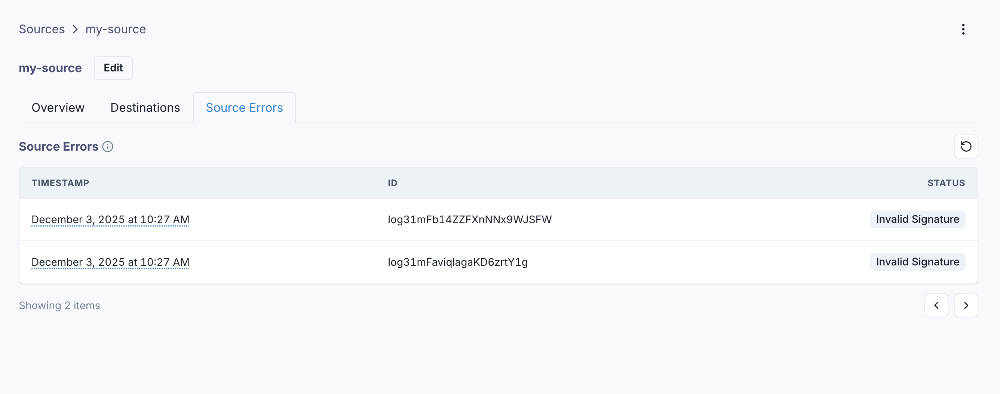

In the Source Errors tab, you can see the log of all the incoming webhooks that were rejected by the Source.
The most likely reason for a source error is an invalid signature, or an invalid payload format in the incoming message.

Every time your Ingest URL returns a non-200 status code, the reason for the failure will be logged here, and the incoming message will not be delivered to your endpoints.

In the error details, you can inspect the message payload, the HTTP method and headers, and the reason for the failure.

