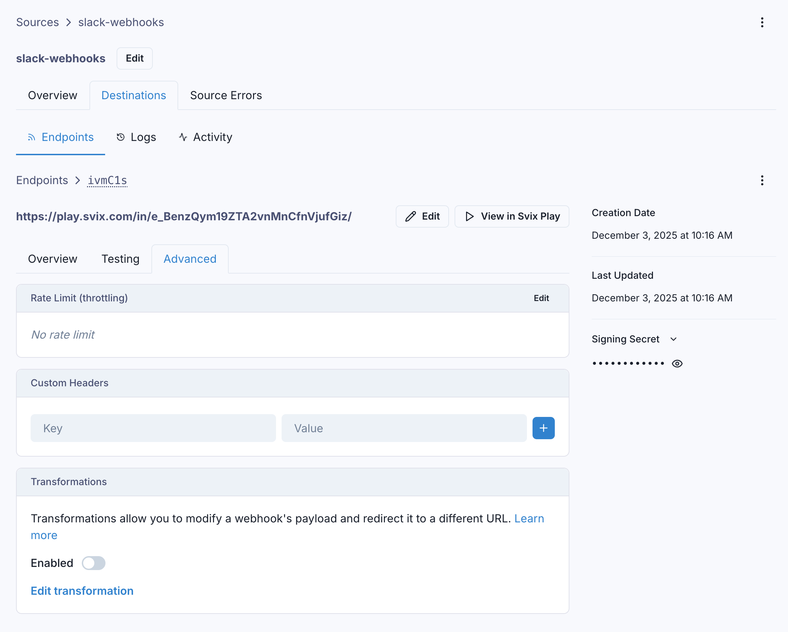
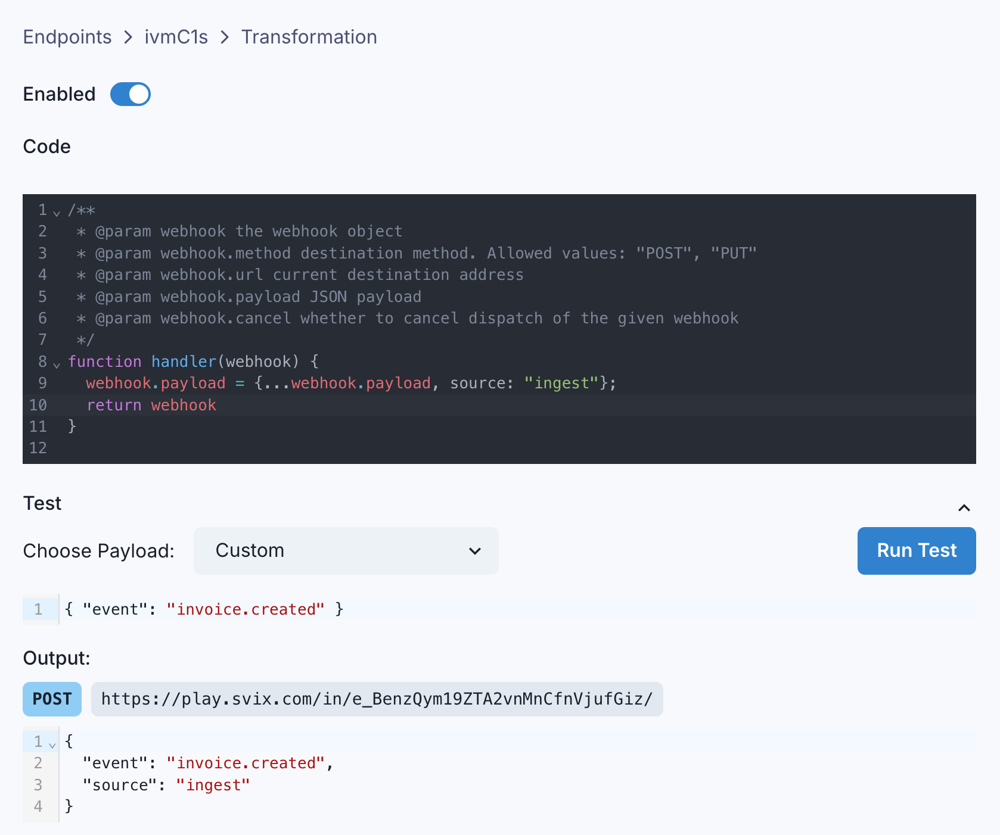

Ingest Transformations are a powerful Svix feature that allows the modification of certain webhook properties in-flight.
With transformations, you can write JavaScript code to change a webhook's HTTP method, target URL, and body payload before it's sent to your endpoint.

## Using Transformations

Ingest Transformations are available in all plans. To use them, after creating an endpoint in a Source, go to the 'Advanced' tab and scroll down to the 'Transformations' card:



An endpoint's Transformation can be enabled or disabled at any time by toggling the switch on this card.

You can write Javascript code to edit an endpoint's Transformation, and test your code against a sample incoming payload to see the result.



### How to write a Transformation

Svix expects a Transformation to declare a function named `handler`. Svix will pass an object with the following properties to the function:

- `method`, a string representing the HTTP method the webhook will be sent with. It is always `"POST"` by default, and its only valid values are `"POST"` or `"PUT"`.
- `url`, a string representing the destination endpoint's URL. It can be changed to any valid URL.
- `payload`, which contains the webhook's payload as a JSON object. It can be changed as needed.

The Transformation must return the same object, but may modify its properties as described above.
In addition to the ones listed above, it can also set the following properties on the returned object:

- `cancel`, a boolean which controls whether or not to cancel the dispatch of a webhook. This value defaults to `false`.
- `headers`, an object with keys being HTTP header names and values being the associated header values. Headers set here take precedence over endpoint headers.

### An example Transformation

Suppose that sometimes, you want to redirect webhooks to a custom URL instead of the endpoint's defined URL. And you only want to do this redirect if a custom URL is present in the webhook payload. You can write a transformation like this:

```js
function handler(webhook) {
	if (webhook.payload.customUrl) {
		webhook.url = webhook.payload.customUrl;
	}
	return webhook;
}
```

Great, the webhook is redirected to the custom URL if the `customUrl` property exists on the payload. Otherwise, it is sent to the endpoint's defined URL.
