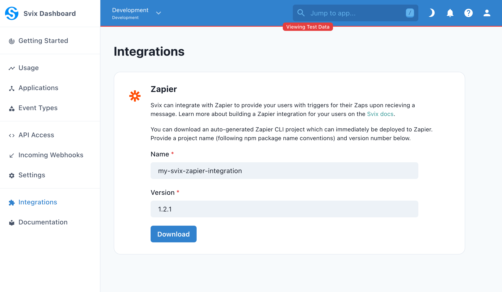

[Zapier](https://zapier.com/) is an online automation tool that connects apps and services.
You can build a Zapier integration that allows your customers to connect your service to other services with Svix.

The typical pattern of a Zapier integration for webhooks is to configure each event type as a trigger.
That trigger event starts a workflow ([Zap](https://zapier.com/help/create/basics/create-zaps)) which can start subsequent action steps.

Svix can auto-generate a Zapier integration package for your environment that follows this pattern.
It also comes with webhook verification baked in and can be extended for custom authentication schemes with your service or additional actions/triggers.

:::note Information
Zapier integrations can be defined on the Zapier UI or as a JavaScript project (defined through the Zapier CLI platform). The auto-generated integration package is a Node.js package. We recommend reading through the [How to Use REST Hooks in Zapier CLI](https://platform.zapier.com/cli_tutorials/resthooks) tutorial provided by Zapier to get a basic understanding of the structure.
:::

## Prerequisites

### Setup event type schemas

Before setting up a Zapier integration, we strongly recommend configuring event types with schemas and examples as those will be embedded in the auto-generated integration package.

You can follow the [Your first event type schema](/tutorials/event-type-schema) tutorial and refer to the [Event Types](/tutorials/event-type-schema) docs to set this up.

### Download dependencies

The integration requires Node.js v14 as that is the version used by the Zapier platform at runtime. Install the Zapier CLI globally:

```
npm install -g zapier-platform-cli
```

Make a Zapier platform account and login:
```
# Login with username and password
zapier login

# Login with SSO
zapier login --sso
```

## Create or upgrade an integration

:::note Upgrades & Modifications
If you're upgrading the integration after making customizations or adding new event types, you may need to reconcile differences between the last version deployed and the latest version downloaded. We recommend using a version control system like Git to manage the history.
:::

### Download the auto-generated integration package

You can download an auto-generated integration package from the [integrations page](https://dashboard.svix.com/integrations) on the dashboard shown below.

The download form requires a project name which corresponds to the NPM project name, and a version number which corresponds to both the NPM projection version and the Zapier integration version.



### Build and deploy

Once you've downloaded the auto-generated integration package, download the package dependencies:

```
npm install
```

Create a new Zapier integration using the CLI or link an existing one to the package. If you are upgrading, this will overwrite an unreleased integration or require a version bump for a released one.

```
# Create a new Zapier integration
zapier register

# Link an existing Zapier integration to upgrade it
zapier link
```

Build & deploy the integration:
```
zapier push
```

Finally, try it out! From the account where you deployed the integration, you can create a Zap and test the integration. It won't be generally available on Zapier until it's released.

## Release it live

In the [Zapier developer dashboard](https://developer.zapier.com/), you can configure publishing details like name and icon for the integration, invite users to use the integration through a link, and monitor the integration for issues.

When you're ready to publish the integration on Zapier (making it generally available), you'll need to submit it for review to Zapier. More information on this process can be found on the Zapier [lifecycle planning docs](https://platform.zapier.com/partners/lifecycle-planning). Zapier also provides [integration review guidelines](https://platform.zapier.com/partners/integration-review-guidelines) that describe the requirements for release.

## Customize an integration

### Alternative authentication schemes

By default, the auto-generated Zapier integration uses the API Key authentication type. It requires users to authenticate by providing an App ID and App Secret. To use this, you would need to provide this to your users or enable display of these values on the App Portal.

To provide a better user experience, we recommend using OAuth v2 or Session Auth.
- With OAuth2, Zapier will redirect your user to your site where you can authenticate them and send Zapier back an access token. Note that Zapier only supports Authorization Code grants.
- With Session Auth, Zapier will provide a login form for your user to provide their username and password. Those are securely sent to your service where you'll send Zapier back a session token.

With either scheme, you can send the App ID and App Secret back with the trigger for use by the triggers. That way, your users will interact with Svix fully transparently.

For more information, refer to [Zapier's authentication docs](https://platform.zapier.com/cli_docs/docs#authentication).

### Adding custom actions or triggers

The auto-generated Zapier integration can be extended with additional actions, triggers, creates, or other Zapier resources. More information on this is available on the [Zapier CLI platform docs](https://platform.zapier.com/cli_docs/docs).

The Zapier CLI can modify your package (e.g. creating a new action from a template). More information on that is available on the [Zapier CLI Reference](https://platform.zapier.com/cli_docs/cli).

