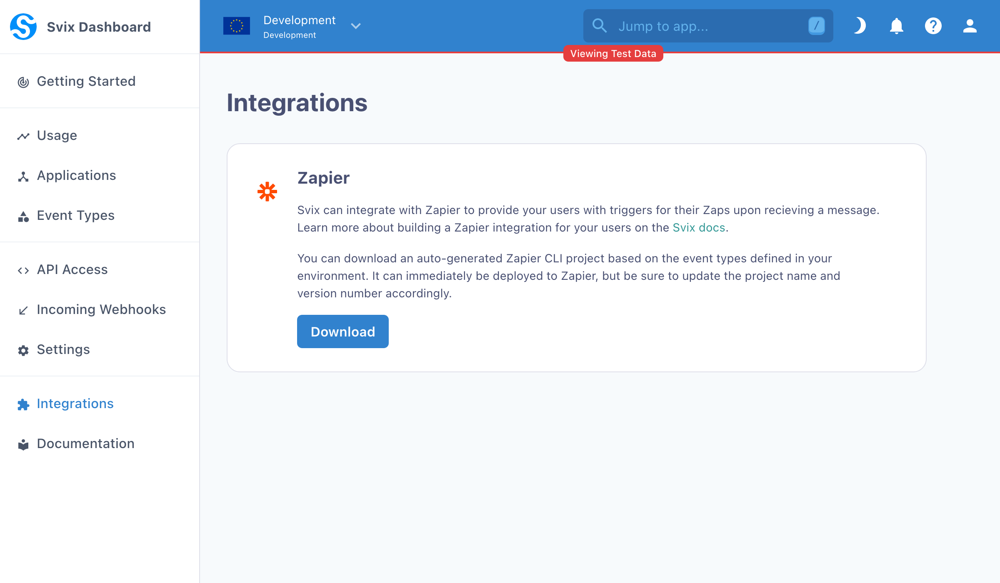
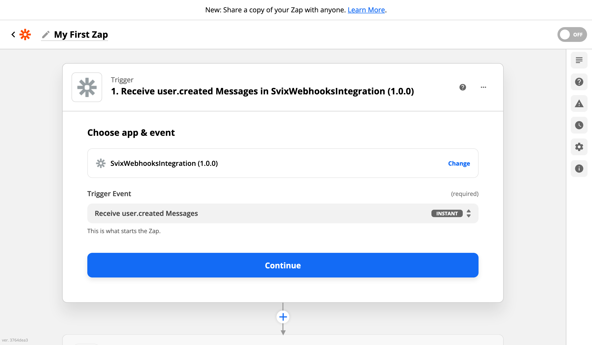
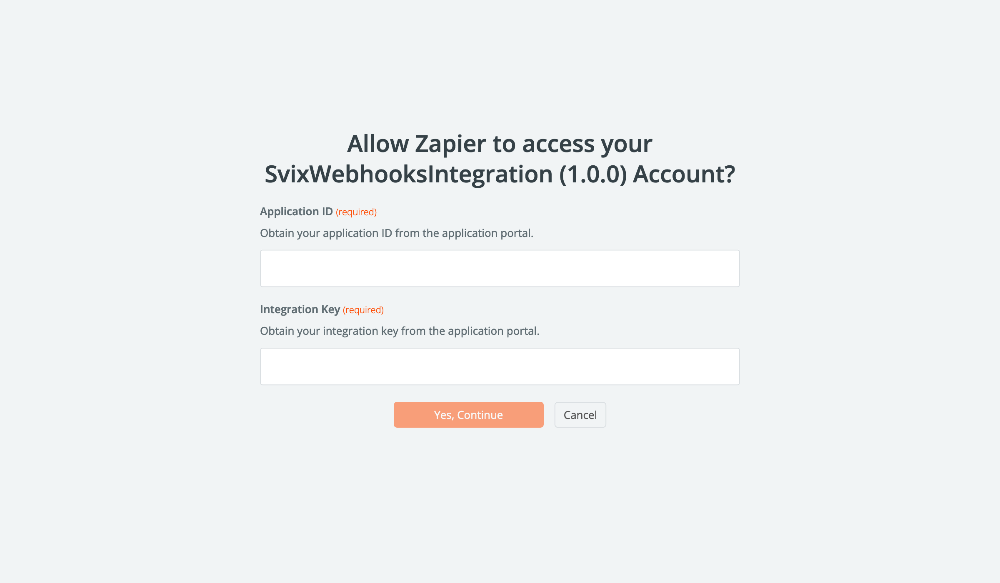
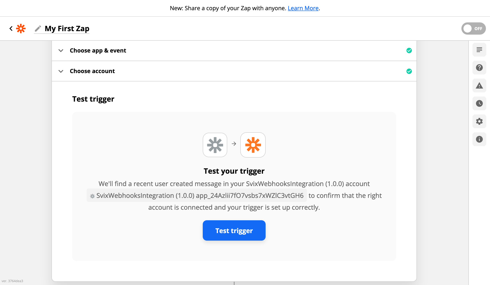
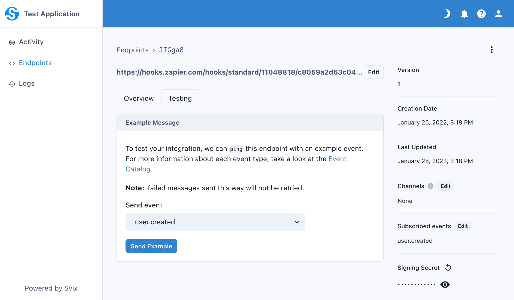
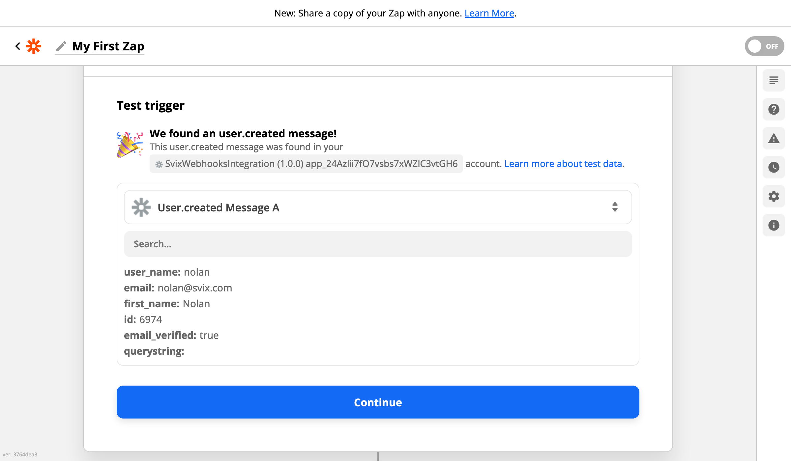
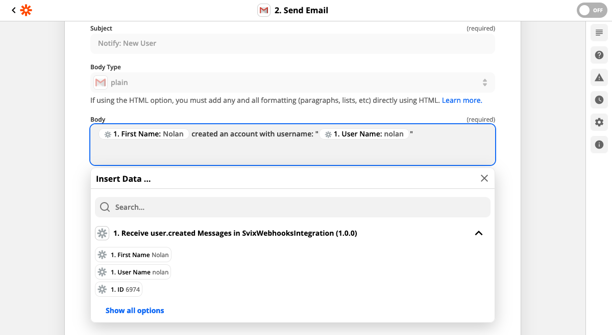

import CodeTabs from '@theme/CodeTabs';
import TabItem from '@theme/TabItem';


[Zapier](https://zapier.com/) is an online automation tool that connects apps and services.
Svix can automatically build a Zapier integration for your directly from your Svix account. This lets your customers to easily build Zapier workflows on top of your service.

It generates a trigger for each event type and a special trigger that subscribes to all event types. The integration package also comes with secure webhook verification enabled by default.

This guide will walk you through the steps to set up a Zapier integration for your users. You can see the end user experience (using the default API key auth) in the video below.

<div style={{position: "relative", paddingBottom: "69.23076923076923%", height: 0}}>
    <iframe src="https://www.loom.com/embed/74241c13e8454af29676723ddc1d334d" frameborder={"0"} webkitallowfullscreen mozallowfullscreen allowfullscreen allow="fullscreen" sandbox="allow-scripts allow-forms allow-same-origin allow-presentation" style={{
    position: "absolute", top: 0, left: 0, width: "100%", height: "100%"}}></iframe>
</div>

## Prerequisites

### Set up event type schemas

Before setting up a Zapier integration, we strongly recommend configuring event types with schemas and examples as those will be embedded in the auto-generated integration package.

Follow the [Your first event type schema](/tutorials/event-type-schema) tutorial and refer to the [Event Types](/tutorials/event-type-schema) docs to set this up.

### Set up Zapier CLI

:::info
Zapier integrations can be defined on the Zapier UI or via the Zapier CLI (as a Node/JavaScript package). This guide is based on the CLI which allows for more powerful customizations. We recommend reading through the [How to Use REST Hooks in Zapier CLI](https://platform.zapier.com/cli_tutorials/resthooks) tutorial provided by Zapier to get an understanding of the structure.
:::

The Zapier integration package requires [Node.js v14](https://nodejs.org/) as that is the version used by the Zapier platform at runtime. Install the Zapier CLI globally:

```
npm install -g zapier-platform-cli
```

Make a [Zapier Platform](https://developer.zapier.com/) account and login:
```
# Login with username and password
zapier login

# Login with SSO
zapier login --sso
```

## Create an integration

### Download the package

You can download an auto-generated integration package from the [integrations page](https://dashboard.svix.com/integrations) on the dashboard shown below.



### Generate integration keys

To integrate Svix with Zapier REST Hooks, the Zapier integration needs access to your user's application to add a Zapier endpoint.
Svix provides an Integrations API to generate long-lived rotatable credentials called integration keys for this purpose.

On your service, return the Svix application ID and integration secret to your user. See the [Integration section](http://api.svix.com/docs#tag/Integration) of the API docs for more information.

Code example including application creation:

<CodeTabs>
<TabItem value="js">

```js
import { Svix } from "svix";

const svix = new Svix("AUTH_TOKEN");
const app = await svix.application.create({ name: "Test Application" });
const integ = await svix.integration.create(app.id, { name: "Zapier Integration" });
const integKey = await svix.integration.getKey(app.id, integ.id);
```

</TabItem>
<TabItem value="py">

```python
from svix.api import Svix, ApplicationIn, IntegrationIn

svix = Svix("AUTH_TOKEN")
app_id = svix.application.create(ApplicationIn(name="Test Application")).id
integ_id = svix.integration.create(app_id, IntegrationIn(name="Zapier Integration")).id
integ_key = svix.integration.get_key(app_id, integ_id).key
```

</TabItem>
<TabItem value="go">

```go
import (
    svix "github.com/svix/svix-webhooks/go"
)

svixClient := svix.New("AUTH_TOKEN", nil)
appOut, err := svixClient.Application.Create(ctx, &svix.ApplicationIn{
    Name: "Test Application",
})}
integOut, err := svixClient.Integration.Create(ctx, appOut.Id, &svix.IntegrationIn{
    Name: "Zapier Integration",
})
integKeyOut, err := svixClient.Integration.GetKey(ctx, appOut.Id, integOut.Id)
```

</TabItem>
<TabItem value="rust">

```rust
// TBD
```

</TabItem>
<TabItem value="java">

```java
import com.svix.Svix;
import com.svix.models.ApplicationIn;
import com.svix.models.IntegrationIn;

Svix svix = new Svix("AUTH_TOKEN");
String appId = svix.getApplication().create(new ApplicationIn().name("Test Application")).id;
String integId = svix.getIntegration().create(appId, new IntegrationIn().name("Zapier Integration")).id;
String integKey = svix.getIntegration().getKey(appId, integId).key;
```

</TabItem>
<TabItem value="kotlin">

```kotlin
import com.svix.kotlin.Svix;
import com.svix.kotlin.models.ApplicationIn;
import com.svix.kotlin.models.IntegrationIn;

val svix = Svix("AUTH_TOKEN");
val appId = svix.application.create(ApplicationIn().name("Test Application")).id
val integId = svix.integration.create(appId, IntegrationIn().name("Zapier Integration")).id
val integKey = svix.integration.getKey(appId, integId).key
```

</TabItem>
<TabItem value="csharp">

```csharp
// TBD
```

</TabItem>
<TabItem value="cli">

```shell
svix application create '{"name": "Test Application"}'
svix integration create 'app_24D5XFE8W4VVYQ2XPdJlFKlYKrf' '{"name": "Zapier Integration"}'
svix integration get-key 'app_24D5XFE8W4VVYQ2XPdJlFKlYKrf' 'integ_24D5mQaRudh54XvMNMmgUroNfRA'
```

</TabItem>
<TabItem value="curl">

```shell
curl -X 'POST' \
  'https://api.svix.com/api/v1/app/' \
  -H 'Authorization: Bearer AUTH_TOKEN' \
  -H 'accept: application/json' \
  -H 'Content-Type: application/json' \
  -d '{
    "name": "Test Application",
}'

curl -X 'POST' \
  'https://api.svix.com/api/v1/app/APP_ID/integration/' \
  -H 'Authorization: Bearer AUTH_TOKEN' \
  -H 'accept: application/json' \
  -H 'Content-Type: application/json' \
  -d '{
    "name": "Zapier Integration"
}'

curl -X 'GET' \
  'https://api.svix.com/api/v1/app/APP_ID/integration/INTEG_ID/key/' \
  -H 'Authorization: Bearer AUTH_TOKEN' \
  -H 'accept: application/json' \
  -H 'Content-Type: application/json'

```

</TabItem>
</CodeTabs>


### Build and deploy

After downloading and extracting the auto-generated integration package, download the package dependencies:

```
npm install
```

Then, create a new Zapier integration using the Zapier CLI [register command](https://platform.zapier.com/cli_docs/cli#register):
```
zapier register
```

Finally, build & deploy the integration to Zapier through the [push command](https://platform.zapier.com/cli_docs/cli#push):
```
zapier push
```

### That's it!

You're done! You have a working Zapier integration for your Svix-powered webhooks. :)

Try it out! The next section walks through the experience of creating a Zap with a webhook trigger.
Then read on to see how you can customize your integration and release it publicly on the Zapier website.


## Try it out

You can create a Zap with a Svix-powered webhook trigger from the account where you deployed the integration. You try it out from another account by obtaining the share link on the [Zapier Platform console](https://developer.zapier.com/).

### Set up the trigger

1. Start by going to the [Zap editor](https://zapier.com/app/editor/) and give your Zap a name.
2. Select the integration (aka "app"). You can search for it by name (the same name you set when calling `zapier register`).
3. Select a trigger event. This corresponds to an event type (or the all trigger for all event types) which the Zap will be triggered on.



### Authenticate

#### Retrieve the integration key for your application

Your users should use the mechanism you provide to generate integration keys, but for testing you can use the Svix CLI to obtain an application ID and integration key.

```bash
$ svix application create '{"name": "Test Application"}'
{
  "name": "Test Application",
  "id": "app_24D5XFE8W4VVYQ2XPdJlFKlYKrf", # <------------------- Application ID
  "createdAt": "2022-01-25T23:12:34.055654Z",
  "updatedAt": "2022-01-25T23:12:34.055694Z"
}
$ svix integration create 'app_24D5XFE8W4VVYQ2XPdJlFKlYKrf' '{"name": "Zapier Integration"}'
{
    "name": "Zapier Integration",
    "id": "integ_24D5mQaRudh54XvMNMmgUroNfRA",
    "createdAt": "2022-01-25T23:14:34.876543+00:00",
    "updatedAt": "2022-01-25T23:14:35.019512+00:00"
}
$ svix integration get-key 'app_24D5XFE8W4VVYQ2XPdJlFKlYKrf' 'integ_24D5mQaRudh54XvMNMmgUroNfRA'
{
    "key": "testintegsk_zrHyRLxf7qMed4sv2onkoearKUgHWkK9"  # <--- Integration Key
}
```


#### Create Account

Zapier will prompt you to sign in to an account for the integration. When you create a new account,  enter the application ID and integration key from the previous step.



:::info[User Authentication Experience]
By default, the auto-generated Zapier integration uses token-based auth where your users input the application ID and an integration key. You can set up OAuth or Session-based authentication schemes to mask these Svix constructs by following the guide in the [Advanced Zapier Integrations](./advanced-zapier#alternative-authentication-schemes) doc.
:::

### Test the trigger

Finally, test your trigger by sending a test message. Zapier will prompt you to test your integration. Upon attempting it, Zapier will register a new endpoint on the application (which will also show in the App Portal).



In the App Portal, send a test event for the corresponding event type to the trigger's endpoint.



In Zapier, re-run the trigger test. Once successful, Zapier will automatically populate the fields available based on the example's message. If you skipped sending the test message, the fields provided in the event schema example will be shown.



### Set up an action

You can now set up an action that uses any of these available fields.



## Next Steps

### Release it live

You can see your integration on the [Zapier Platform](https://developer.zapier.com/). From there you can edit the icon and title, get the sharable link for your users, and view analytics.

If you wish to make the integration generally available on the Zapier website, you'll need to submit it for review to Zapier. More information on this process can be found on the Zapier [lifecycle planning docs](https://platform.zapier.com/partners/lifecycle-planning). Zapier also provides [integration review guidelines](https://platform.zapier.com/partners/integration-review-guidelines) that describe the requirements for release.

### Advanced Customizations

You can configure additional triggers, set up authentication schemes like OAuth2 or Session-based, and much more within the Zapier platform. We recommend reading our [Advanced Zapier Integrations](./advanced-zapier) docs page and going through the extensive [Zapier CLI Platform](https://platform.zapier.com/cli_docs/docs) docs.
