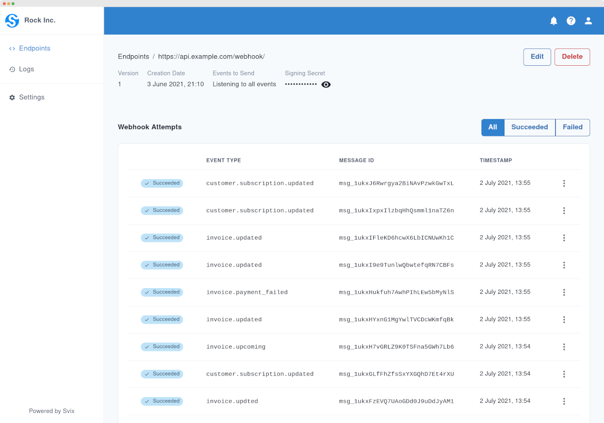
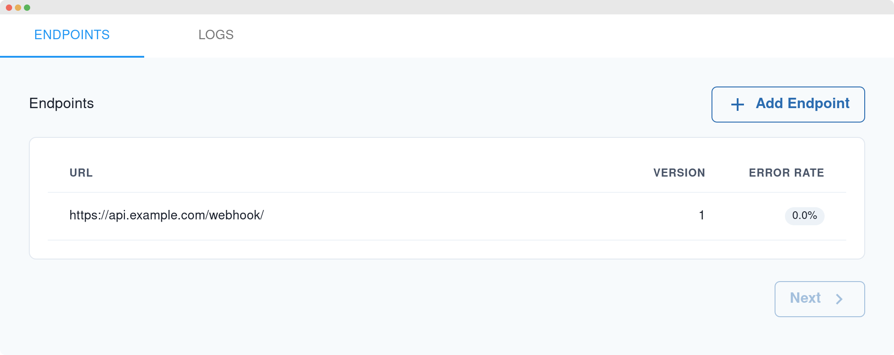

import CodeTabs from '@theme/CodeTabs';
import TabItem from '@theme/TabItem';

Svix comes with a management UI for your users that you can use out of the box. Your users can then use it to add endpoints, debug delivery, as well as inspect and replay past webhooks. This is the easiest way to get started, but you can alternatively use the API to build your own.

Here is how it looks like standalone, or scroll down for the embedded version:



## Giving your users access

To give your users access to the admin UI, just use the [dashboard access endpoint](https://api.svix.com/docs#operation/get_dashboard_access_api_v1_auth_dashboard_access__app_id___post). Calling this endpoint with an `app_id`, returns a url you can just redirect your users to in order to log them into the admin UI. They will stay logged in for a few days or until they log out.

<CodeTabs>
<TabItem value="js">

```js
const svix = new Svix("AUTH_TOKEN");
const dashboard = await svix.authentication.dashboardAccess("app_Xzx8bQeOB1D1XEYmAJaRGoj0");
// A URL that automatically logs user into the dashboard
console.log(dashboard.url);
```

</TabItem>
<TabItem value="py">

```python
svix = Svix("AUTH_TOKEN")
dashboard = svix.authentication.dashboardAccess("app_Xzx8bQeOB1D1XEYmAJaRGoj0")
# A URL that automatically logs user into the dashboard
print(dashboard.url)
```

</TabItem>
<TabItem value="go">

```go
svixClient := svix.New("AUTH_TOKEN", nil)
dashboard, _ := svixClient.Authentication.DashboardAccess("app_Xzx8bQeOB1D1XEYmAJaRGoj0")
// A URL that automatically logs user into the dashboard
fmt.Println(dashboard.Url)
```

</TabItem>
<TabItem value="java">

```java
Svix svix = new Svix("AUTH_TOKEN");
DashboardAccessOut dashboard = svix.getAuthentication().dashboardAccess("app_Xzx8bQeOB1D1XEYmAJaRGoj0");
// A URL that automatically logs user into the dashboard
System.out.println(dashboard.getUrl());
```

</TabItem>
<TabItem value="cli">

```shell
export SVIX_AUTH_TOKEN="AUTH_TOKEN"
svix authentication dashboard app_Xzx8bQeOB1D1XEYmAJaRGoj0
```

</TabItem>
<TabItem value="curl">

```shell
curl -X POST "https://api.svix.com/api/v1/auth/dashboard_access/app_Xzx8bQeOB1D1XEYmAJaRGoj0/" \
    -H  "Accept: application/json" \
    -H  "Authorization:  Bearer AUTH_TOKEN"
```

</TabItem>
</CodeTabs>


## Embedding in your own dashboard

The returned URL from the previous section can also be embedded in your own dashboard using an iframe.



To add this to your application, just pass the URL you received in the previous example to the `src` property of the iframe:

```html
<iframe
    src="http://app.svix.com/login#key=eyJhcHBJZCI6ICJhcHBfMXRSdFlMN3pwWWR2NHFuWTRRZFI1azE4eXQ0IiwgInRva2VuIjogImFwcHNrX2UxOUN0Rm5hbTFoOU1Gamh5azRSMTUzNUNSd05VSWI0In0="
    style="width: 100%; height: 100%; border: none;">
</iframe>
```

We have also included some basic styling to make the iframe to look nicer, though that can be omitted or modified depending on your needs.

## White labeling

Keep the same look and feel of your application by white labeling the Management UI. From the [Svix dashboard](https://dashboard.svix.com/settings), you can configure the color palette, font and the logo that your users will see.

To customize these settings, please head to your [Organization Settings](https://dashboard.svix.com/settings) on the Svix Dashboard.


### Custom settings per application

In some scenarios you may want to customize the management UI per application, rather than for your whole organization. For example, if you change the color of your own dashboard for each of your users.

This is possible by changing the query parameters of the URL to the settings of your choosing.

:::caution
Please use proper URL parsing rather than string manipulation as the structure of the URL (e.g. the fragment part may change). Another reason to use proper URL parsing is that you want to make sure to URL-encode the parameters.
:::

The supported parameters are:

- `primaryColor` - the primary color of the UI. Format: `RRGGBB`, e.g. `28bb93`.
- `icon` - a URL to an image file. E.g. `https://www.example.com/logo.png` (remember to URL-encode it!).
- `fontFamily` - one of the fonts listed in the dashboard (see previous section). E.g. `Roboto`.

So for example:

```
http://app.svix.com/login?primaryColor=28bb93&fontFamily=Roboto#key=eyJhcHBJZCI6ICJhcHBfMXRSdFlMN3pwWWR2NHFuWTRRZFI1azE4eXQ0IiwgInRva2VuIjogImFwcHNrX2UxOUN0Rm5hbTFoOU1Gamh5azRSMTUzNUNSd05VSWI0In0=
```
