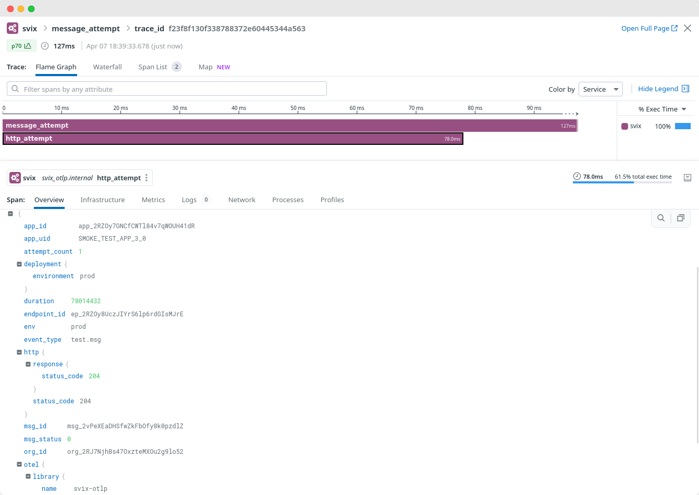

:::info[Important]
OpenTelemetry streaming is only available as part of the Enterprise tier. Please refer to [the pricing page](https://www.svix.com/pricing/) for more information.
Some of this functionality can also be achieved by using [Operational Webhooks](/incoming-webhooks).
:::

Svix offers OpenTelemetry streaming as a way to stream webhook delivery traces to observability platforms that support OpenTelemetry such as Datadog, Grafana, Coralogix, and most other observability platforms.

## What does Svix send

Svix sends OpenTelemetry traces as two spans: the outer span `message_attempt` and the inner span `http_attempt`.

Both spans include the following attributes:
```rust
start: DateTime<Utc>  // Included as the span start time (not a field)
end: DateTime<Utc>    // Included as the span end time (not a field)
org_id: OrganizationId
app_id: ApplicationId
app_uid: Option<ApplicationUid>
endpoint_id: EndpointId
msg_id: MessageId
msg_event_id: Option<MessageUid>
event_type: EventTypeName,
attempt_count: u16
status: MessageStatus
```

And the inner `http_attempt` also has:
```rust
http.response.status_code: i16
```

Here is an example of how it looks like in an observability dashboard:




### Additional attributes
You have the flexibility to add your own custom attributes to spans at either the app level or per event.

#### Application attributes
You can add additional otel attributes per app by adding key-value pairs to an application's
metadata, prefixing the key with `otel.`. Example:
```json
{
  "metadata": { "otel.custom-app-key-1": "custom-app-value-1" }
}
```

The param `custom-app-key-1=custom-app-value-1` will be added to your spans.

#### Event attributes
You can add additional per-event attributes to your spans by passing custom key-value pairs in `transformationsParams.otel`
when calling the Create Message endpoint. Example:
```json
{
  "payload": { "abc": "123" },
  "eventType": "my-event",
  "transformationsParams": {
    "otel": {
      "custom-key-1": "custom-value-1",
      "custom-key-2": "custom-value-2",
    }
  }
}
```

## How to use it

The raw spans sent by Svix can be used in a variety of ways:
* Deriving graphs and metrics for your observability dashboards.
* Alerting for when specific customers fail over a certain threshold or their latency increases.
* Storing raw delivery logs for compliance reasons.
* Much more...

For specific instructions on how to achieve the above, please refer to the documentation by your observability provider or [contact Svix support](https://www.svix.com/contact/).
