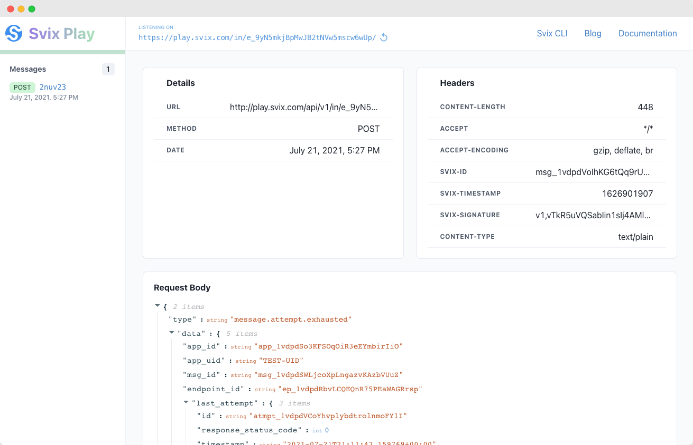

You can use the [Svix Play webhook playground and debugger](https://www.svix.com/play/) to easily inspect, test and debug operational webhooks.

It's a very useful tool for anyone developing webhooks - for both senders and consumers. More so, it's available to everyone for free, not just users of Svix!

## Echo mode (normal)

To use echo mode, just open the [Svix Play homepage](https://www.svix.com/play/) and click on the Svix Play URL.

You'd then be redirected to the main Svix Play page, where you can copy your unique webhook URL and start sending it requests. Every request sent to this URL will respond with a successful `200 OK` response, and will be visible in the UI for you to inspect.

This is how it looks like:



## Relay mode (Svix CLI)

In relay mode, you can use the Svix CLI for a free and secure public URL that relays requests to your local development server. All of these requests are then viewable in the [Svix Play webhook debugger](https://www.svix.com/play/) UI.

All you have to do is install the [Svix CLI](https://github.com/svix/svix-cli) and run `svix listen` as shown here:

```
$ svix listen http://localhost:8080/webhook/

Webhook relay is now listening at
https://play.svix.com/in/e_94XdF-OwN3EaTKty4izJDWRAH3V/

All requests on this endpoint will be forwarded to your local URL:
http://localhost:8080/webhook/
```

## Advanced usage

### Custom response codes

Under normal usage, Svix Play (in echo mode) automatically returns successful responses to every request with the HTTP response code `200 OK`.

However, in some cases you may want to check how your webhook system responds to failures. For example, does auto-retry work? Are errors properly handled?

To enable that, Svix Play supports returning custom error codes by appending the status code to the URL.

For example, if you URL was:

```
https://play.svix.com/in/e_94XdF-OwN3EaTKty4izJDWRAH3V/
```

You can change it to the following URL in order to make it always return `404 Not Found`:

```
https://play.svix.com/in/e_94XdF-OwN3EaTKty4izJDWRAH3V/404/
```
