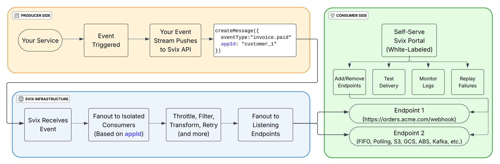
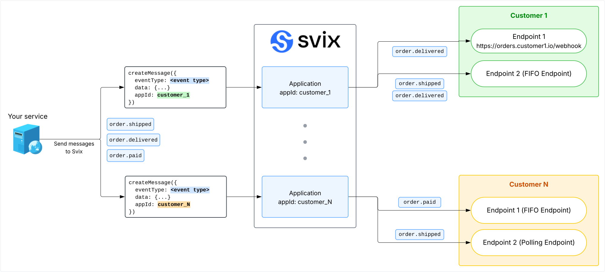
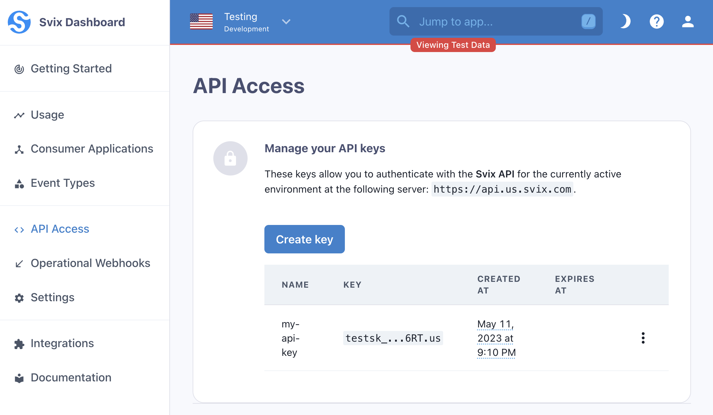

import CodeTabs from "@theme/CodeTabs";
import TabItem from "@theme/TabItem";
import RAW from '!!raw-loader!@site/docs/quickstart.mdx';
import CopyDocsButton from '@site/src/components/CopyDocsButton';

<div style={{display:'flex',alignItems:'center',justifyContent:'space-between',gap:'1rem',marginBottom:'0.5rem'}}>
  <h1 style={{margin:0}}>Quickstart</h1>
  <CopyDocsButton pageTitle="Quickstart" sourceMarkdown={RAW} />
</div>

Learn how to send your first webhook using Svix.

## How Svix works

Svix acts as your webhook sending infrastructure and enables your customers to subscribe to events to power their integrations and workflow automations. You send Svix webhook messages using a single API call, and Svix then ensures reliable, low latency delivery to your customers' endpoints, handling retries, scaling, security, observability, and much more.

Additionally, Svix offers a [white-labeled embeddable portal](app-portal.mdx), allowing your customers to self-manage their own webhook endpoints, subscriptions, rate limits, and more.



### Core concepts

Svix is composed of three core building blocks: `applications`, `endpoints`, and `messages`.

[`Messages`](overview.mdx#messages) are the webhook messages being sent. They are most commonly JSON but Svix supports a variety of additional formats.

[`Applications`](overview.mdx#consumer-applications) (aka consumer applications) are where messages are sent to. You would usually have one application for each one of your customers , which depending on your product would mean you will have dozens, hundreds of thousands, or more applications in your account. Applications are isolated between one another, ensuring that your customers only have access to their subscriptions and data.

Most people create an application programmatically when a new customer is created on their platform. However, you can alternatively create the application when a customer enables webhooks, or have Svix create these automatically for you (more on that later).

[`Endpoints`](overview.mdx#endpoints) are essentially the URLs messages will be sent to. Each application can have multiple `endpoints` and each message sent to that application will be sent to all of them (based on the [event type](event-types.mdx) and other filtering rules).

Endpoints are usually managed directly by your customers using the Consumer Application Portal (more on that below).

### Information flow

Messages are created in your backend. They are usually created among other business logic, when the event occurs. They are then either sent to Svix directly, or are first sent to an internal event system (SQS, GCP Pub/Sub, Kafka, etc.) which then sends to Svix.

A message is sent to a specific consumer application and then Svix fans them out to all of the endpoints configured for that application.



## Prerequisites

### Create an API key

Get your authentication token (`AuthToken`) from the [Svix dashboard](https://dashboard.svix.com).

To interact with the Svix service, you'll need an API key.
You can create one on the [API Access page](https://dashboard.svix.com/api-access) in the Svix dashboard.



### Install the Svix SDK (optional)

<CodeTabs>
<TabItem value="js">

```js
npm install svix
// Or
yarn add svix
```

</TabItem>
<TabItem value="py">

```shell
pip install svix
```

</TabItem>
<TabItem value="go">

```shell
go get github.com/svix/svix-webhooks/go
```

</TabItem>
<TabItem value="rust">

```toml
cargo add svix
```

</TabItem>
<TabItem value="java">

Gradle: Add this dependency to your project's build file:

```groovy
implementation "com.svix:svix:0.x.y"
```

Maven: Add this dependency to your project's POM:

```xml
<dependency>
  <groupId>com.svix</groupId>
  <artifactId>svix</artifactId>
  <version>0.x.y</version>
</dependency>
```

</TabItem>
<TabItem value="kotlin">

Gradle: Add this dependency to your project's build file:

```groovy
implementation "com.svix.kotlin:svix-kotlin:0.x.y"
```

Maven: Add this dependency to your project's POM:

```xml
<dependency>
  <groupId>com.svix.kotlin</groupId>
  <artifactId>svix-kotlin</artifactId>
  <version>0.x.y</version>
</dependency>
```

</TabItem>
<TabItem value="ruby">

```sh
gem install svix
```

</TabItem>
<TabItem value="csharp">

```shell
dotnet add package Svix
```

</TabItem>
<TabItem value="cli">

On macOS install via <a href="https://brew.sh/">Homebrew</a>:

```sh
brew install svix/svix/svix-cli
```

On Windows install via <a href="https://scoop.sh/">Scoop</a>:

```sh
scoop bucket add svix https://github.com/svix/scoop-svix.git
scoop install svix
```

For other platforms, such as linux, checkout the <a href="https://github.com/svix/svix-cli#installation">CLI docs</a> on Github.

</TabItem>
<TabItem value="php">

```shell
composer require svix/svix
```

</TabItem>
<TabItem value="curl">

```shell
# Install cURL. E.g. on arch linux:
pacman -S curl
# Or on macOS
brew install curl
```

</TabItem>
</CodeTabs>

## Create a consumer application

As [mentioned above](#how-svix-works), consumer applications are where webhooks are sent to, and each one of your customers should have their own application.

Every entity on Svix supports setting a `uid` (user defined ID) which can then be used interchangeably with the Svix IDs throughout the APIs. This means that you can use your own identifiers in Svix, and you don't need to store any Svix identifiers on your end. Most people use their internal customer identifiers as the Svix `uid`s.

In this example, we'll show how to create an application with the `example-customer-123` UID using the [create application API endpoint](https://api.svix.com/docs#operation/create_application_api_v1_app__post), though in practice you will set it to whatever unique identifier you use in your database.

<CodeTabs>
<TabItem value="js">

```js
import { Svix } from "svix";

const svix = new Svix("AUTH_TOKEN");
const app = await svix.application.create({
  name: "Application name",
  uid: "example-customer-123"
});
```

</TabItem>
<TabItem value="py">

```python
from svix.api import Svix, ApplicationIn

svix = Svix("AUTH_TOKEN")
app = svix.application.create(ApplicationIn(
    name="Application name",
    uid="example-customer-123"
))
```

</TabItem>
<TabItem value="go">

```go
import (
	svix "github.com/svix/svix-webhooks"
)

svixClient := svix.New("AUTH_TOKEN", nil)
app, err := svixClient.Application.Create(ctx, &svix.ApplicationIn{
    Name: "Application name",
    Uid:  "example-customer-123",
})
```

</TabItem>
<TabItem value="rust">

```rust
use svix::api::{ApplicationIn, Svix, SvixOptions};

let svix = Svix::new("AUTH_TOKEN".to_string(), None);
let app = svix
    .application()
    .create(
        ApplicationIn {
            name: "Application name".to_string(),
            uid: Some("example-customer-123".to_string()),
            ..ApplicationIn::default()
        },
        None,
    )
    .await?;
```

</TabItem>
<TabItem value="java">

```java
import com.svix.models.ApplicationIn;
import com.svix.models.ApplicationOut;
import com.svix.Svix;

Svix svix = new Svix("AUTH_TOKEN");
ApplicationOut app = svix.getApplication().create(
    new ApplicationIn().name("Application name").uid("example-customer-123")
);
```

</TabItem>
<TabItem value="kotlin">

```kotlin
import com.svix.kotlin.models.ApplicationIn
import com.svix.kotlin.models.ApplicationOut
import com.svix.kotlin.Svix

val svix = Svix("AUTH_TOKEN")
val applicationOut = svix.application.create(
    ApplicationIn(name = "Application name", uid = "example-customer-123")
)
```

</TabItem>
<TabItem value="ruby">

```ruby
require "svix"

svix = Svix::Client.new("AUTH_TOKEN")

application_out = svix.application.create(Svix::ApplicationIn.new({
    "name" => "Application name",
    "uid" => "example-customer-123"
}))
```

</TabItem>
<TabItem value="csharp">

```csharp
var svix = new SvixClient("AUTH_TOKEN", new SvixOptions("https://api.us.svix.com"));
applicationOut = await svix.Application.CreateAsync(
    new ApplicationIn(name: "Application name", uid: "example-customer-123")
);
```

</TabItem>
<TabItem value="cli">

```shell
export SVIX_AUTH_TOKEN='AUTH_TOKEN'
svix application create '{ "name": "Application name", "uid": "example-customer-123" }'
```

</TabItem>
<TabItem value="php">

```php
$svix = new Svix('AUTH_TOKEN');

$app = $svix->application->create(
  ApplicationIn::create(
    name: 'Application name'
  )->withUid('example-customer-123')
);
```

</TabItem>
<TabItem value="curl">

```shell
# Change URL based on your selected region
curl -X POST "https://api.us.svix.com/api/v1/app/" \
    -H  "Accept: application/json" \
    -H  "Content-Type: application/json" \
    -H  "Authorization: Bearer AUTH_TOKEN" \
    -d '{"name": "Application name", "uid": "example-customer-123"}'
```

</TabItem>
</CodeTabs>


## Send a message

When you send a message in Svix you have to specify who you want to send it to, which means choosing a specific application (one of your customers).

In addition to the application, people also set the following properties when sending messages:

- `eventType`: an identifier denoting the type of the event. You can read more about event types in [the event type docs](event-types.mdx), but for this example we'll just use `invoice.paid` as the type.
- `eventId`: an optional unique ID for the event (unique per app). This is useful if you want to map each message to unique events on your system.
- `payload`: a JSON dictionary that can hold anything. Its content will be sent as the webhook content (Svix also supports sending non-JSON payloads).


This example uses the [create message API](https://api.svix.com/docs#operation/create_message_api_v1_app__app_id__msg__post) and the application we created in the previous step (`uid = example-customer-123`):

<CodeTabs>
<TabItem value="js">

```js
const svix = new Svix("AUTH_TOKEN");
await svix.message.create("example-customer-123", {
  eventType: "invoice.paid",
  eventId: "evt_Wqb1k73rXprtTm7Qdlr38G",
  payload: {
    type: "invoice.paid",
    id: "invoice_WF7WtCLFFtd8ubcTgboSFNql",
    status: "paid",
    attempt: 2,
  },
});
```

</TabItem>
<TabItem value="py">

```python
svix = Svix("AUTH_TOKEN")
svix.message.create(
    "example-customer-123",
    MessageIn(
        event_type="invoice.paid",
        event_id="evt_Wqb1k73rXprtTm7Qdlr38G",
        payload={
            "type": "invoice.paid",
            "id": "invoice_WF7WtCLFFtd8ubcTgboSFNql",
            "status": "paid",
            "attempt": 2
        }
    )
)
```

</TabItem>
<TabItem value="go">

```go
svixClient := svix.New("AUTH_TOKEN", nil)
eventId = "evt_Wqb1k73rXprtTm7Qdlr38G"
svixClient.Message.Create(ctx, "example-customer-123", &svix.MessageIn{
    EventType: "invoice.paid",
    EventId: *svix.NullableString(&eventId),
    Payload: map[string]interface{}{
        "type":    "invoice.paid",
        "id":      "invoice_WF7WtCLFFtd8ubcTgboSFNql",
        "status":  "paid",
        "attempt": 2,
    },
})
```

</TabItem>
<TabItem value="rust">

```rust
let svix = Svix::new("AUTH_TOKEN".to_string(), None);
svix.message()
    .create(
        "example-customer-123".to_string(),
        MessageIn {
            event_type: "invoice.paid".to_string(),
            event_id: Some("evt_Wqb1k73rXprtTm7Qdlr38G".to_string()),
            payload: json!({
                "type": "invoice.paid",
                "id": "invoice_WF7WtCLFFtd8ubcTgboSFNql",
                "status": "paid",
                "attempt": 2
            }),
            ..MessageIn::default()
        },
        None,
    )
    .await?;
```

</TabItem>
<TabItem value="java">

```java
Svix svix = new Svix("AUTH_TOKEN");
svix.getMessage().create("example-customer-123",
  new MessageIn()
    .eventType("invoice.paid")
    .eventId("evt_Wqb1k73rXprtTm7Qdlr38G")
    .payload("{" +
       "\"type\": \"invoice.paid\"," +
       "\"id\": \"invoice_WF7WtCLFFtd8ubcTgboSFNql\"," +
       "\"status\":  \"paid\"," +
       "\"attempt\": 2" +
      "}"));
```

</TabItem>
<TabItem value="kotlin">

```kotlin
val svix = Svix("AUTH_TOKEN")
svix.message.create("example-customer-123",
        MessageIn(
            eventType = "invoice.paid",
            payload = mapOf<String, Any>(
                "type" to "invoice.paid",
                "id" to "invoice_WF7WtCLFFtd8ubcTgboSFNql",
                "status" to "paid",
                "attempt" to 2
            ),
            eventId = "evt_Wqb1k73rXprtTm7Qdlr38G"))
```

</TabItem>
<TabItem value="ruby">

```ruby
svix = Svix::Client.new("AUTH_TOKEN")
svix.message.create("example-customer-123",
    Svix::MessageIn.new({
        "event_type" => "invoice.paid",
        "payload" => {
            "type": "invoice.paid",
            "id" => "invoice_WF7WtCLFFtd8ubcTgboSFNql",
            "status" => "paid",
            "attempt" => 2
        },
        "event_id" => "evt_Wqb1k73rXprtTm7Qdlr38G"}))
```

</TabItem>
<TabItem value="csharp">

```csharp
var svix = new SvixClient("AUTH_TOKEN", new SvixOptions("https://api.us.svix.com"));
await svix.Message.CreateAsync("example-customer-123", new MessageIn(
    eventType: "invoice.paid",
    payload: new {
        type = "invoice.paid",
        id = "invoice_WF7WtCLFFtd8ubcTgboSFNql",
        status = "paid",
        attempt = 2
    },
    eventId: "evt_Wqb1k73rXprtTm7Qdlr38G"
));
```

</TabItem>
<TabItem value="cli">

```shell
export SVIX_AUTH_TOKEN="AUTH_TOKEN"
svix message create example-customer-123 '{ "eventType": "invoice.paid", "eventId": "evt_Wqb1k73rXprtTm7Qdlr38G", "payload": { "type": "event.type", "id": "invoice_WF7WtCLFFtd8ubcTgboSFNql", "status": "paid", "attempt": 2 } }'
```

</TabItem>
<TabItem value="php">

```php
$svix = new Svix('AUTH_TOKEN');

$svix->message->create(
  'example-customer-123',
  MessageIn::create(
    eventType: 'invoice.paid',
    payload: [
      'type' => 'invoice.paid',
      'id' => 'invoice_WF7WtCLFFtd8ubcTgboSFNql',
      'status' => 'paid',
      'attempt' => 2
    ]
  )->withEventId('evt_Wqb1k73rXprtTm7Qdlr38G'),
);

```

</TabItem>
<TabItem value="curl">

```shell
# Change URL based on your selected region
curl -X POST "https://api.us.svix.com/api/v1/app/example-customer-123/msg/" \
    -H  "Accept: application/json" \
    -H  "Content-Type: application/json" \
    -H  "Authorization: Bearer AUTH_TOKEN" \
    -d '{"eventType": "invoice.paid", "eventId": "evt_Wqb1k73rXprtTm7Qdlr38G", "payload": {"type": "event.type", "id": "invoice_WF7WtCLFFtd8ubcTgboSFNql", "status": "paid", "attempt": 2}}'
```

</TabItem>
</CodeTabs>

#### Including the event type in the payload

Webhook consumers often consume multiple event types using the same endpoint. To enable them to be able to differentiate different events, it's common practice to include the event type in the webhook's payload.
Svix, however, doesn't automatically inject the event type into the payload, in order to give our customers full control over the content and structure of the payloads they send.

Most commonly people include the event type in the payload as a top-level key called `type`, `event_type`, or `eventType`, but it's up to you how you want to call it.

#### Idempotency

Svix supports [idempotency](https://en.wikipedia.org/wiki/Idempotence) for safely retrying requests without accidentally performing the same operation twice. This is useful when an API call is disrupted in transit and you do not receive a response.

For more information, please refer to the [idempotency section](./idempotency.mdx) of the docs.

Note: while the `eventId` can potentially be used to enforce short-term uniqueness (similar to idempotency), it's recommended to use the idempotency mechanism when needed rather than relying on `eventId` checks.


## Subscribe your customers to webhooks

In the example above we showed how to send messages, though these messages were not sent to any specific URLs. In order for them to be sent, we need to add endpoints. This is what this section is about.

:::tip
You can use the [Svix Play webhook debugger](https://www.svix.com/play/) and the [Svix CLI](https://github.com/svix/svix-cli) to inspect, test and debug your webhooks during development.
:::

### Using the Application Portal

Svix offers a pre-built application portal. With one API call, you can give your users access to this UI and they can then add their own endpoints themselves. The UI can be embedded in your own dashboard and customized to match your dashboard's look-and-feel.

App portal access is based on short-lived sessions using special magic links. Your customers don't need a Svix account, and they don't even need to know that Svix exists.

You can read more about the app portal in the [application portal docs](./app-portal.mdx).


### Using the API

The app portal is built using the Svix SDKs, which means that everything you can do in the app portal you can also do using the Svix API. This includes creating endpoints.

Here is an example creating an endpoint using the [create endpoint API](https://api.svix.com/docs#operation/create_endpoint_api_v1_app__app_id__endpoint__post), and the application we created above (`uid = example-customer-123`):

<CodeTabs>
<TabItem value="js">

```js
const svix = new Svix("AUTH_TOKEN");
await svix.endpoint.create("example-customer-123", {
  url: "https://api.example.com/svix-webhooks/",
  description: "My main endpoint",
});
```

</TabItem>
<TabItem value="py">

```python
svix = Svix("AUTH_TOKEN")
svix.endpoint.create(
    "example-customer-123",
    EndpointIn(
        url="https://api.example.com/svix-webhooks/",
        description="My main endpoint",
    )
)
```

</TabItem>
<TabItem value="go">

```go
svixClient := svix.New("AUTH_TOKEN", nil)
svixClient.Endpoint.Create(ctx, "example-customer-123", &svix.EndpointIn{
    Url:         "https://api.example.com/svix-webhooks/",
    Version:     1,
    Description: svix.String("My main endpoint"),
})
```

</TabItem>
<TabItem value="rust">

```rust
let svix = Svix::new("AUTH_TOKEN".to_string(), None);
svix.endpoint()
    .create(
        "example-customer-123".to_string(),
        EndpointIn {
            url: "https://api.example.com/svix-webhooks/".to_string(),
            description: Some("My main endpoint".to_string()),
            ..EndpointIn::default()
        },
        None,
    )
    .await?;
```

</TabItem>
<TabItem value="java">

```java
Svix svix = new Svix("AUTH_TOKEN");
svix.getEndpoint()
    .create("example-customer-123",
            new EndpointIn()
              .url("https://api.example.com/svix-webhooks/")
              .description("My main endpoint"));
```

</TabItem>
<TabItem value="kotlin">

```kotlin
val svix = Svix("AUTH_TOKEN")
val endpointOut =
    svix.endpoint.create("example-customer-123",
        EndpointIn(
            url = URI("https://api.example.com/svix-webhooks/"),
            description = "My main endpoint"))
```

</TabItem>
<TabItem value="ruby">

```ruby
svix = Svix::Client.new("AUTH_TOKEN")
endpoint_out =
    svix.endpoint.create("example-customer-123",
        Svix::EndpointIn.new({
            "url" => "https://api.example.com/svix-webhooks/",
            "description" => "My main endpoint"}))
```

</TabItem>
<TabItem value="csharp">

```csharp
var svix = new SvixClient("AUTH_TOKEN", new SvixOptions("https://api.us.svix.com"));
endpointOut = await svix.Endpoint.CreateAsync(new EndpointIn(
    url: "https://api.example.com/svix-webhooks/",
    description: "My main endpoint"
));
```

</TabItem>
<TabItem value="cli">

```shell
export SVIX_AUTH_TOKEN="AUTH_TOKEN"
svix endpoint create example-customer-123 '{ "url": "https://api.example.com/svix-webhooks/", "description": "My main endpoint" }'
```

</TabItem>
<TabItem value="php">

```php
$svix = new Svix('AUTH_TOKEN');

$endpointOut = $svix->endpoint->create(
  'example-customer-123',
  EndpointIn::create(
    url: 'https://api.example.com/svix-webhooks/',
  )->withDescription('My main endpoint')
);
```

</TabItem>
<TabItem value="curl">

```shell
# Change URL based on your selected region
curl -X POST "https://api.us.svix.com/api/v1/app/example-customer-123/endpoint/" \
    -H  "Accept: application/json" \
    -H  "Content-Type: application/json" \
    -H  "Authorization: Bearer AUTH_TOKEN" \
    -d '{"url": "https://api.example.com/svix-webhooks/", "description": "My main endpoint"}'
```

</TabItem>
</CodeTabs>

Additionally, you can expose the API to your customers by creating equivalent API endpoints in your API, and making calls to the Svix API internally. For more on this, please reference the [exposing the API to your customers tutorial](./tutorials/api-webhook-management.md).


## Further reading

### Consuming webhooks documentation

Please refer to the [consuming webhooks](./consuming-webhooks.mdx) section for information you can share with your customers on how to easily consume webhooks, and how to use the application portal.


### Common Usage Examples

The above should give you everything you need to know in order to get started with Svix. However, we've gathered examples of some of the more common ways people use the Svix API in order to make it even easier for you to get started and follow the best practices.

For more information please refer to the [common usage examples section](./common-usage-examples.mdx).

### Custom server URL

The Svix libraries automatically infer the correct server URL from the authentication token, so setting a server URL is not necessary unless you are self-hosting the Svix server (open-source or Enterprise self-hosting).

This is how you override the server URL in each of the libraries:

<CodeTabs>
<TabItem value="js">

```js
import { Svix } from "svix";

const svix = new Svix("AUTH_TOKEN", { serverUrl: "THE_SERVER_URL" });
```

</TabItem>
<TabItem value="py">

```python
from svix.api import Svix, SvixAsync, SvixOptions

svix = Svix("AUTH_TOKEN", SvixOptions(server_url="THE_SERVER_URL"))

# Or use the async variants
svix = SvixAsync("AUTH_TOKEN", SvixOptions(server_url="THE_SERVER_URL"))
```

</TabItem>
<TabItem value="go">

```go
import (
	svix "github.com/svix/svix-webhooks/go"
)

serverUrl, _ := url.Parse("THE_SERVER_URL")
svixClient := svix.New("AUTH_TOKEN", &svix.SvixOptions{
	ServerUrl: serverUrl,
})
```

</TabItem>
<TabItem value="rust">

```rust
use svix::api::{ApplicationIn, Svix, SvixOptions};

let svix = Svix::new("AUTH_TOKEN".to_string(), SvixOptions {
    server_url: "THE_SERVER_URL".to_string(),
    ..SvixOptions::default()
});
```

</TabItem>
<TabItem value="java">

```java
import com.svix.Svix;

Svix svix = new Svix("AUTH_TOKEN", new SvixOptions().serverUrl("THE_SERVER_URL"));
```

</TabItem>
<TabItem value="kotlin">

```kotlin
import com.svix.kotlin.Svix;

val svix = Svix("AUTH_TOKEN", SvixOptions("THE_SERVER_URL"))
```

</TabItem>
<TabItem value="ruby">

```ruby
require "svix"

svix = Svix::Client.new("AUTH_TOKEN", Svix::SvixOptions.new(false, "THE_SERVER_URL"))
```

</TabItem>
<TabItem value="csharp">

```csharp
using Svix;

var svix = new SvixClient("AUTH_TOKEN", new SvixOptions("THE_SERVER_URL"));
```

</TabItem>
<TabItem value="cli">

```shell
export SVIX_AUTH_TOKEN='AUTH_TOKEN'
export SVIX_SERVER_URL='THE_SERVER_URL'
svix application create '{ "name": "Application name" }'
```

</TabItem>
<TabItem value="php">

```php
$svix = new Svix('AUTH_TOKEN', new SvixOptions(
    serverUrl: 'THE_SERVER_URL'
));
```

</TabItem>
<TabItem value="curl">

```shell
# Just replace the URL below
curl -X POST "https://api.us.svix.com/api/v1/app/" \
    -H  "Accept: application/json" \
    -H  "Content-Type: application/json" \
    -H  "Authorization: Bearer AUTH_TOKEN" \
    -d '{"name": "Application name"}'
```

</TabItem>
</CodeTabs>

## Closing words

That's it! There are only three API calls you should really care about. Creating applications (i.e. users), sending messages, and giving your users access to the App Portal. All of them are covered here.
