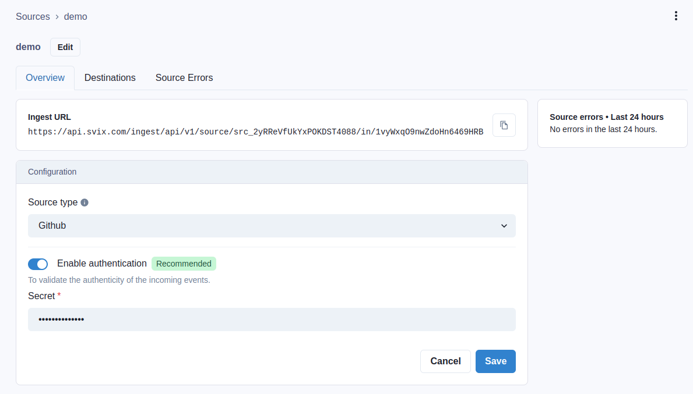
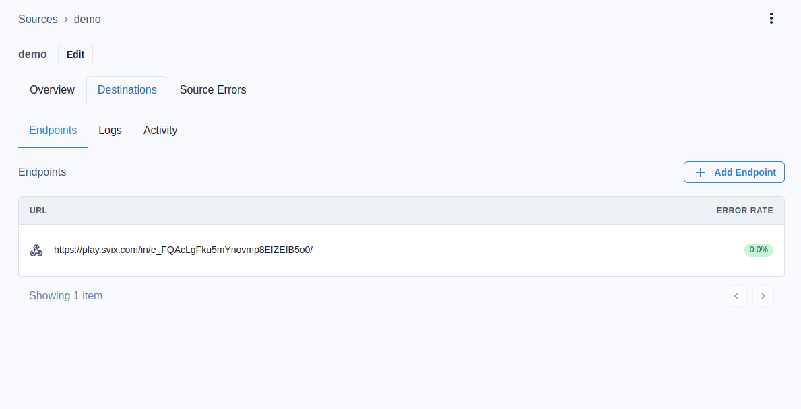
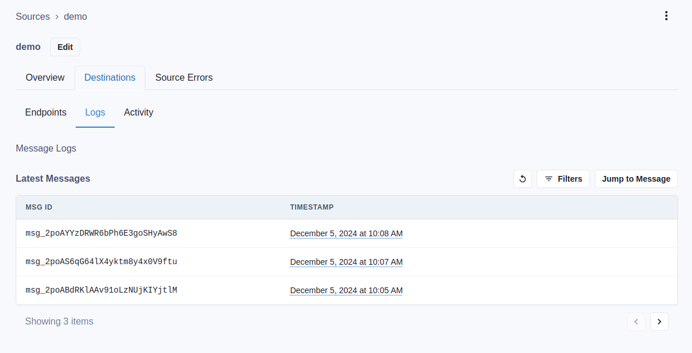

import CodeTabs from '@theme/CodeTabs';
import TabItem from '@theme/TabItem';

Receiving webhooks with [Svix Ingest] starts by creating a `Source`.

A `Source` generates an endpoint you can share with a webhook provider as a
destination for their webhooks.

Ingest supports signature verification schemes and flows used by a variety of
webhook providers. Supported values for a `Source`'s `type` include:

- `beehiiv`
- `brex`
- `clerk`
- `github`
- `guesty`
- `hubspot`
- `incidentIo`
- `lithic`
- `nash`
- `pleo`
- `replicate`
- `resend`
- `safebase`
- `sardine`
- `shopify`
- `stripe`
- `stych`
- `svix` (that's us!)
- `zoom`

Additionally there's the option to configure a `Source` as `http` to skip
performing signature verification. This is useful for providers that have no
verification scheme and for providers whose verification scheme is not yet
supported by Ingest.

:::tip
Let us know if your webhook provider isn't yet supported so we can add it!
:::


## Create a Source

Creating a `Source` can be done from either the API:

```shell
curl https://api.svix.com/ingest/api/v1/source \
  -H "Authorization: Bearer $SVIX_TOKEN" \
  -H "Content-Type: application/json" \
  -d @- << EOF
{
  "name": "demo",
  "uid": "demo",
  "type": "github",
  "config": {
    "secret": "<the signing secret>"
  }
}
EOF
```

or from the [Ingest Dashboard]:




## Tell your provider where to send webhooks

The `IngestSourceOut` response from the API will include an `ingestUrl` which is
the endpoint you give to your provider, telling them where to send their
webhooks.

The Ingest URL is also listed on the [Ingest Dashboard] for each `Source`.

For GitHub, as is used in this example, this is referred to as the
_"Payload URL"_.


## Managing incoming messages

In the [Ingest Dashboard], the Destinations tab for your `Source` is where you
can configure endpoints, view logs, inspect message payloads, etc.



Configuring endpoints allows you to forward messages received by Ingest over to
the endpoints you choose using Svix Core.



Logs and statistics are available to help monitor for problems, replay or
recover messages.


## Managing Source Tokens

The last portion of the Ingest URL is a `Token` which can be
invalidated and rotated:

```shell
curl https://api.svix.com/ingest/api/v1/source/src_xxxxx/token/rotate \
  -H "Authorization: Bearer $SVIX_TOKEN" \
  -H "Content-Type: application/json" \
  -d '{}'
```

`Token`s that are rotated stay usable for 24 hours. During this time both the
old and new `Token`s are honored by Ingest. During this period it's important
that you reconfigure your provider with the new Ingest URL in order to have a
seamless transition.

:::note
Token rotation for Sources can only be configured via the API.
:::


## Transformations Support

A Javascript Transformation can optionally be configured per Source. This allows
for reshaping of the payload prior to the message being forwarded to any of the
configured Endpoints.

```shell
curl https://api.svix.com/ingest/api/v1/source \
  -H "Authorization: Bearer $SVIX_TOKEN" \
  -H "Content-Type: application/json" \
  -d @- << EOF
{
  "name": "demo-transformed",
  "uid": "demo-with-transformation",
  "type": "github",
  "config": {
    "secret": "<the signing secret>"
  },
  "transformation": "function handler(input) { return { ...input, transformedByIngest: true }; }",
  "transformationEnabled": true
}
EOF
```

:::note
Transformations for Sources can only be configured via the API.
:::

[Svix Ingest]: https://svix.com/ingest
[Ingest Dashboard]: https://dashboard.svix.com/ingest
