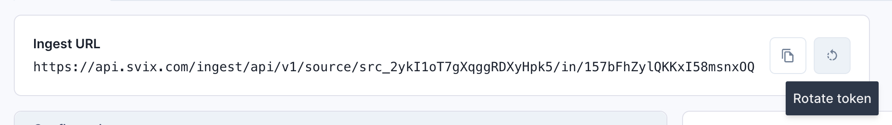

import CodeTabs from '@theme/CodeTabs';
import TabItem from '@theme/TabItem';

Receiving webhooks with [Svix Ingest] starts by creating a `Source`.

A `Source` generates an endpoint you can share with a webhook provider as a
destination for their webhooks.

Ingest supports signature verification schemes and flows used by a variety of
webhook providers. Supported values for a `Source`'s `type` include:

- `beehiiv`
- `brex`
- `clerk`
- `github`
- `guesty`
- `hubspot`
- `incidentIo`
- `lithic`
- `nash`
- `pleo`
- `replicate`
- `resend`
- `safebase`
- `sardine`
- `segment`
- `shopify`
- `slack`
- `stripe`
- `stych`
- `svix` (that's us!)
- `zoom`
- `adobeSign`
- `docusign`

Additionally there's the option to configure a `Source` as `genericWebhook` to
skip performing signature verification. This is useful for providers that have
no verification scheme and for providers whose verification scheme is not yet
supported by Ingest.

:::tip
Let us know if your webhook provider isn't yet supported so we can add it!
:::


## Create a Source

Creating a `Source` from the [Ingest Dashboard]:


<CodeTabs>
  <TabItem value="js">
  
  ```javascript
  const svix = new Svix("AUTH_TOKEN");
  const ingestSourceOut = await svix.ingest.source.create({
    name: "myGithubWebhook",
    uid: "unique-identifier",
    type: "github",
    config: {
        secret: "SECRET"
    },
  });
  ```

  </TabItem>
  <TabItem value="py">
  
  ```python
  svix = Svix("AUTH_TOKEN")
  ingest_source_out = svix.ingest.source.create(IngestSourceIn(
    name="myGithubWebhook",
    uid="unique-identifier",
    type="github",
    config=GithubConfig(
        secret="SECRET"
    ),
  ))
  ```

  </TabItem>
  <TabItem value="go">
  
  ```go
  svixClient := svix.New("AUTH_TOKEN", nil)
  ingestSourceOut, err := svixClient.Ingest.Source.Create(
    ctx,
    &IngestSourceIn{
        Name: "myGithubWebhook",
        Uid: "unique-identifier",
        Type: IngestSourceInTypeGithub,
        Config: GithubConfig{
            Secret: "SECRET",
        },
    },
  )
  ```

  </TabItem>
  <TabItem value="kotlin">
  
  ```kotlin
  val svix = Svix("AUTH_TOKEN")
  val ingestSourceOut = svix.ingest.source.create(IngestSourceIn(
    name = "myGithubWebhook",
    uid = "unique-identifier",
    config = IngestSourceInConfig.Github(GithubConfig(
        secret = "SECRET"
    )),
  ))
  ```

  </TabItem>
  <TabItem value="java">
  
  ```java
  Svix svix = new Svix("AUTH_TOKEN");
  IngestSourceOut ingestSourceOut = svix
    .getIngest()
    .getSource()
    .create(new IngestSourceIn()
        .name("myGithubWebhook")
        .uid("unique-identifier")
        .config(new IngestSourceInConfig.Github(new GithubConfig()
          .secret("SECRET")
        ))
    );
  ```

  </TabItem>
  <TabItem value="ruby">
  
  ```ruby
  svix = Svix::Client.new("AUTH_TOKEN")
  ingest_source_out = svix.ingest.source.create(Svix::IngestSourceIn.new({
    "name": "myGithubWebhook",
    "uid": "unique-identifier",
    "config": Svix::IngestSourceInConfig::Github.new({
      "secret": "SECRET"
    })
}))
  ```

  </TabItem>
  <TabItem value="rust">
  
  ```rust
  let svix = Svix::new("AUTH_TOKEN".to_string(), None);
  let ingest_source_out = svix.ingest().source().create(
      IngestSourceIn {
          name: "myGithubWebhook".to_owned(),
          uid: Some("unique-identifier".to_owned()),
          config: IngestSourceInConfig::Github(GithubConfig {
              secret: "SECRET".to_owned(),
              ..Default::default()
          }),
          ..Default::default()
      },
      None,
  ).await?;
  ```

  </TabItem>
  <TabItem value="csharp">
  
  ```csharp
  var svix = new SvixClient("AUTH_TOKEN", new SvixOptions("https://api.svix.com"));
  var ingestSourceOut = await svix.Ingest.Source.CreateAsync(
    new IngestSourceIn{
        Name = "myGithubWebhook",
        Uid = "unique-identifier",
        Config = IngestSourceInConfig.Github(new GithubConfig {
            Secret = "SECRET",
        }),
    }
  );
  ```

  </TabItem>
  <TabItem value="cli">
  
  ```shell
  svix ingest source create '{
    "name": "myGithubWebhook",
    "uid": "unique-identifier",
    "type": "github",
    "config": {
        "secret": "SECRET"
    }
  }'
  ```

  </TabItem>
  <TabItem value="curl">
  
  ```shell
  curl -X 'POST' \
    'https://api.eu.svix.com/ingest/api/v1/source' \
    -H 'Authorization: Bearer AUTH_TOKEN' \
    -H 'Accept: application/json' \
    -H 'Content-Type: application/json' \
    -d '{
        "name": "myGithubWebhook",
        "uid": "unique-identifier",
        "type": "github",
        "config": {
            "secret": "SECRET"
        }
    }'
  ```

  </TabItem>
</CodeTabs>

## Tell your provider where to send webhooks

The Ingest URL is also listed on the [Ingest Dashboard] for each `Source`.

The `IngestSourceOut` response from the API will include an `ingestUrl` which is
the endpoint you give to your provider, telling them where to send their
webhooks.

For GitHub, as is used in this example, this is referred to as the
_"Payload URL"_.


## Managing incoming messages

In the [Ingest Dashboard], the Destinations tab for your `Source` is where you
can configure endpoints, view logs, inspect message payloads, etc.


Configuring endpoints allows you to forward messages received by Ingest over to
the endpoints you choose using Svix Core.


Logs and statistics are available to help monitor for problems, replay or
recover messages.


## Managing Source Tokens

The last portion of the Ingest URL is a `Token` which can be
invalidated and rotated:



`Token`s that are rotated stay usable for 24 hours. During this time both the
old and new `Token`s are honored by Ingest. During this period it's important
that you reconfigure your provider with the new Ingest URL in order to have a
seamless transition.

[Svix Ingest]: https://svix.com/ingest
[Ingest Dashboard]: https://dashboard.svix.com/ingest
