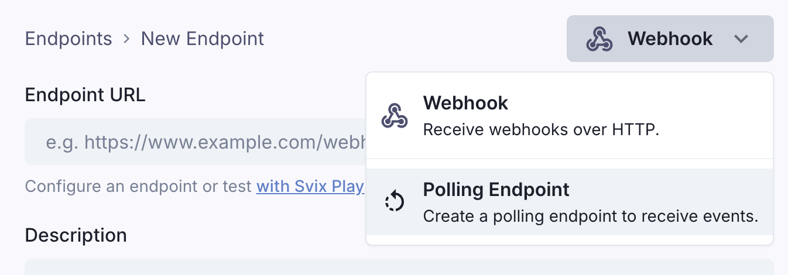
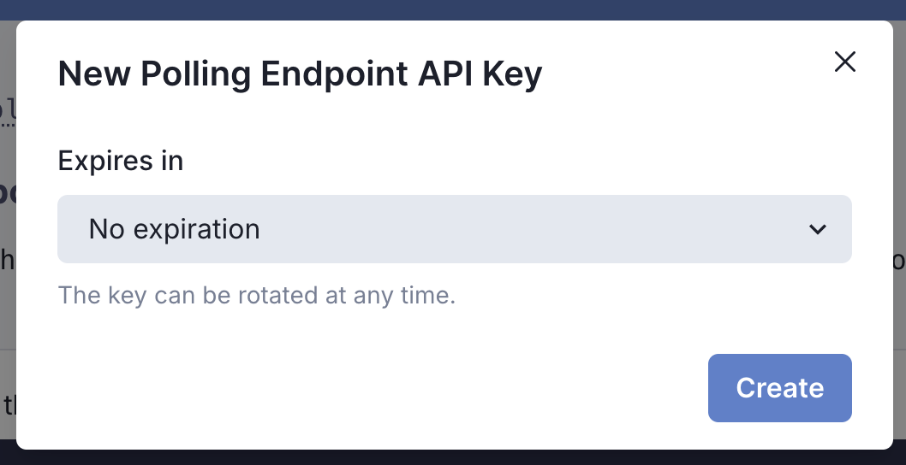

Polling Endpoints are a way to get a stream of events by polling, without having to set up a webhook endpoint.

Start by creating an endpoint and select *Polling Endpoint* as the type.



As with [regular webhook endpoints](/receiving/using-app-portal/adding-endpoints), you can control which event types and channels you want to receive.


# Usage

Once you've created a Polling Endpoint, you'll get a unique URL like `https://api.svix.com/api/v1/app/app_2mG6DgUaGlwCNdM5oRCUJec2kQC/poller/poll_59q`.

You can call this endpoint directly once you have an API key (see [API Keys](/receiving/using-app-portal/polling-endpoints#api-keys)).

```bash
curl \
  -X GET "https://api.svix.com/api/v1/app/app_2mG6DgUaGlwCNdM5oRCUJec2kQC/poller/poll_59q" \
  -H 'Content-Type: application/json' \
  -H 'Accept: application/json' \
  -H 'Authorization: Bearer sk_poll_*****.eu'
```

When first calling the endpoint, it will return an empty array and an iterator.

```json
{
  "data": [],
  "iterator": "eyJvZmZzZXQiOi05MjIzMzcyMDM2ODU0Nzc1ODA4LCJhZnRlciI6bnVsbH0",
  "done": false
}
```

Then, using the iterator in the next call, you can iterate through the events and poll for new ones.

```bash
curl \
  -X GET "https://api.svix.com/api/v1/app/app_2mG6DgUaGlwCNdM5oRCUJec2kQC/poller/poll_59q?iterator=eyJv..." \
  -H 'Content-Type: application/json' \
  -H 'Accept: application/json' \
  -H 'Authorization: Bearer sk_poll_*****.eu'
```

### API Keys

To call the Polling Endpoint, you'll need to create an endpoint-specific API key.


<div style={{ display: 'flex', justifyContent: 'center', width: '100%', marginBottom: '2rem' }}>
  
</div>



API keys are scoped exclusively to the endpoint they were created for, and they can be expired or rotated at any time.

