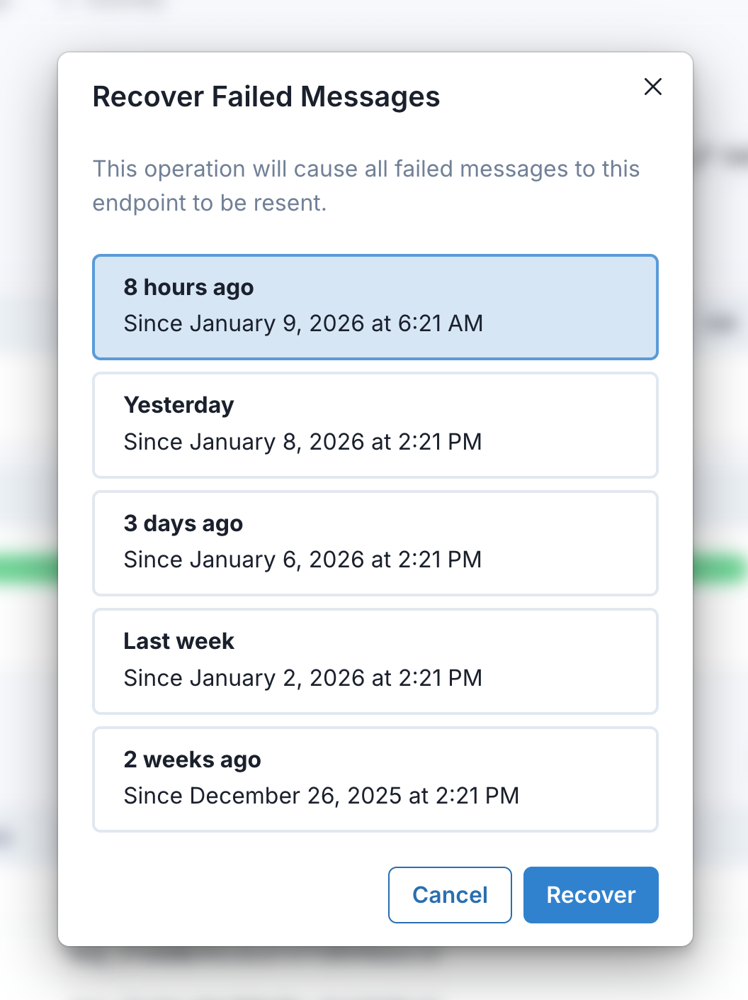
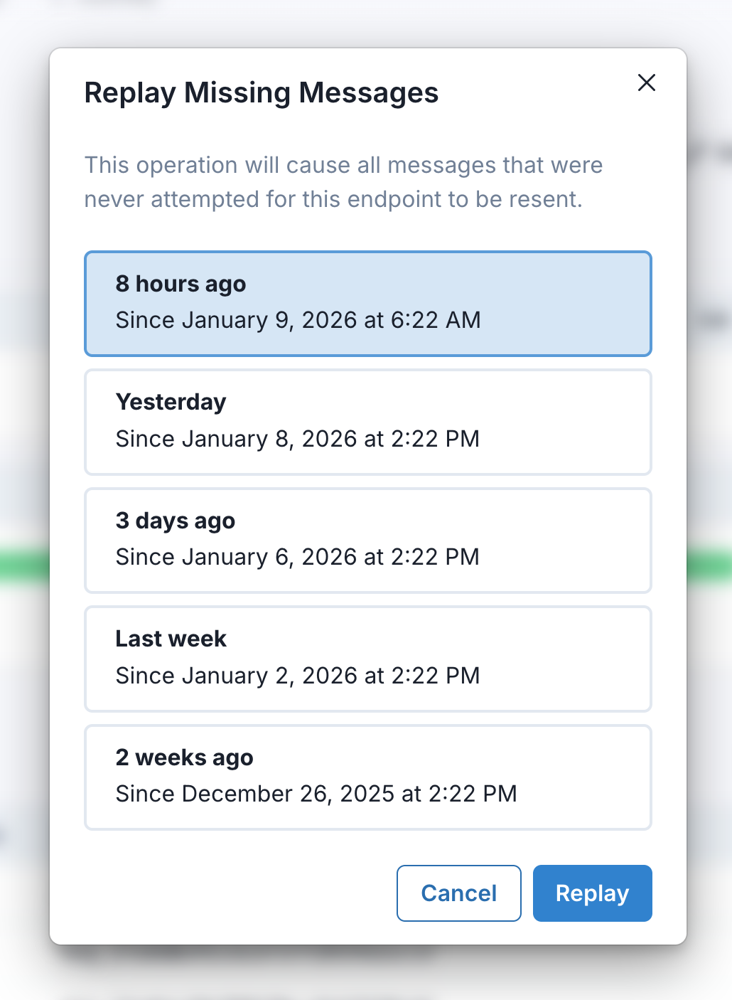

Svix attempts to deliver each webhook message based on a retry schedule with exponential backoff.

## The schedule

Each message is attempted based on the following schedule, where each period is started following the failure of the preceding attempt:

- Immediately
- 5 seconds
- 5 minutes
- 30 minutes
- 2 hours
- 5 hours
- 10 hours
- 10 hours (in addition to the previous)

If an endpoint is removed or disabled delivery attempts to the endpoint will be disabled as well.

For example, an attempt that fails three times before eventually succeeding will be delivered roughly 35 minutes and 5 seconds following the first attempt.

## Indicating successful delivery

The way to indicate that a webhook has been processed is by returning a `2xx` (status code `200-299`) response to the webhook message within a reasonable time-frame (15s with Svix). Any other status code, including `3xx` redirects are treated as failures.

## Failed delivery handling

After the conclusion of the above attempts the message will be marked as `Failed` for this endpoint, and the webhook sender's account will get [an operational webhook](./incoming-webhooks.mdx) of type `message.attempt.exhausted` notifying them of this error.

## Disabling failing endpoints

If all attempts to a specific endpoint fail for a period of 5 days, the endpoint will be disabled and an operational webhook (`EndpointDisabledEvent`) will be sent to your account.
The clock only starts after multiple deliveries failed within a 24 hour span, with at least 12 hours difference between the first and the last failure.

You can disable this behavior from the [Environment settings page](https://dashboard.svix.com/settings/organization/general-settings) on the dashboard.

## Manual retries

Your customers can also use the application portal to manually retry each message at any time, automatically retry ("Recover Failed") all failed messages starting from a given date, or replay messages that have never been attempted to an endpoint ("Replay Missing").

  

    
  

  

    
  

Alternatively, you can use the respective APIs:
- [Resend webhook](https://api.svix.com/docs#operation/resend_webhook_api_v1_app__app_id__msg__msg_id__endpoint__endpoint_id__resend__post) for retrying a single message.
- [Resend failed webhooks](https://api.svix.com/docs#operation/recover_failed_webhooks_api_v1_app__app_id__endpoint__endpoint_id__recover__post) for the failed messages recovery.
