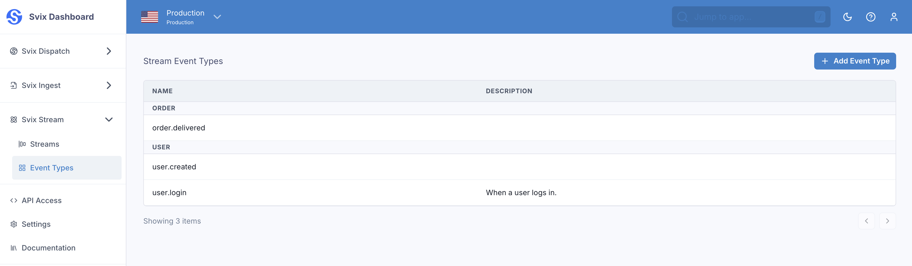
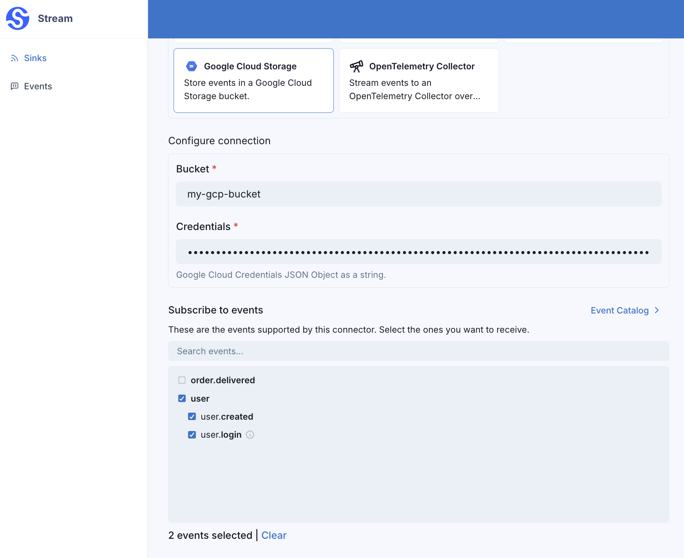

import CodeTabs from "@theme/CodeTabs";
import TabItem from "@theme/TabItem";

# Event Types

Just like Svix Webhooks, each event sent through Svix has an associated event type. Event types are identifiers denoting the type of event being sent, and are primarily used by sinks to filter on events.

Event types are just a string, for example: `user.signup`, `invoice.paid` and `workflow.completed`.

You can see all of your environment's Stream Event Types under the "Event Types" tab in the Stream Dashboard.



You can create event types in the Stream Dashboard, or via the [API](https://api.svix.com/docs#tag/Stream-Event-Type/operation/v1.stream.event-type.create).

<CodeTabs>
<TabItem value="js">

```js
import { Svix } from "svix";

const streamEventTypeOut = await svix.stream.eventType.create({
    name: "user.signup",
    description: null,
    featureFlags: ["cool-new-feature"]
});
```

</TabItem>
<TabItem value="py">

```python
from svix.api import Svix, StreamEventTypeIn

stream_event_type_out = svix.stream.event_type.create(StreamEventTypeIn(
    name="user.signup",
    description=None,
    feature_flags=["cool-new-feature"]
))
```

</TabItem>
<TabItem value="go">

```go
import (
	svix "github.com/svix/svix-webhooks/go"
)

svixClient := svix.New("AUTH_TOKEN", nil)
streamEventTypeOut, err := svixClient.Stream.EventType.Create(ctx, &StreamEventTypeIn{
    Name: "user.signup",
    Description: nil,
    FeatureFlags: []string{"cool-new-feature"},
})
```

</TabItem>
<TabItem value="rust">

```rust
let svix = Svix::new("AUTH_TOKEN".to_string(), None);
let stream_event_type_out = svix
    .stream()
    .event_type()
    .create(StreamEventTypeIn {
        name: "user.signup".to_string(),
        description: None,
        feature_flags: Some(vec!["cool-new-feature".to_string()]),
    }, None)
    .await?;
```

</TabItem>
<TabItem value="java">

```java
import com.svix.Svix;
import com.svix.models.StreamEventTypeIn;


StreamEventTypeOut streamEventTypeOut = svix.getStream().getEventType().create(new StreamEventTypeIn()
    .name("user.signup")
    .description(null)
    .featureFlags(new String[]{"cool-new-feature"})
);
```

</TabItem>
<TabItem value="kotlin">

```kotlin
import com.svix.kotlin.Svix;
import com.svix.kotlin.models.StreamEventTypeIn;

val svix = Svix("AUTH_TOKEN");
val streamEventTypeOut = svix.stream.eventType.create(StreamEventTypeIn()
    .name("user.signup")
    .description(null)
    .featureFlags(arrayOf("cool-new-feature"))
)
```

</TabItem>
<TabItem value="ruby">

```ruby
stream_event_type_out = svix.stream.event_type.create(Svix::StreamEventTypeIn.new({
    "name": "user.signup",
    "description": nil,
    "feature_flags": ["cool-new-feature"]
}))
```

</TabItem>
<TabItem value="csharp">

```csharp
var svix = new SvixClient("AUTH_TOKEN", new SvixOptions("https://api.us.svix.com"));
var streamEventTypeOut = await svix.Stream.EventType.CreateAsync(new StreamEventTypeIn{
    name: "user.signup",
    description: null,
    featureFlags: new string[] {"cool-new-feature"}
});
```

</TabItem>
<TabItem value="curl">

```shell
export SVIX_AUTH_TOKEN='AUTH_TOKEN'

curl -X 'POST' \
  'https://api.us.svix.com/api/v1/stream/event-type' \
  -H 'Authorization: Bearer AUTH_TOKEN' \
  -H 'Accept: application/json' \
  -H 'Content-Type: application/json' \
  -d '{
        "name": "user.signup",
        "description": null,
        "featureFlags": ["cool-new-feature"]
    }'
```

</TabItem>
</CodeTabs>

## Event Type Filtering

When creating a sink, you can optionally specify which event types the Sink should filter on.

In this example, the Google Cloud Storage sink will only receive events with the event type `user.created` or `user.login`.



If no event types are selected when creating a Sink, the Sink will receive all events, regardless of the event type.