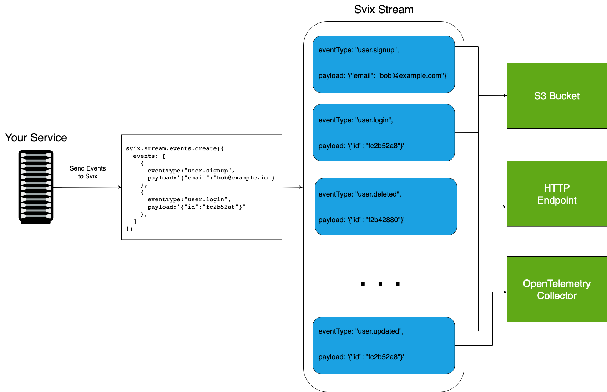
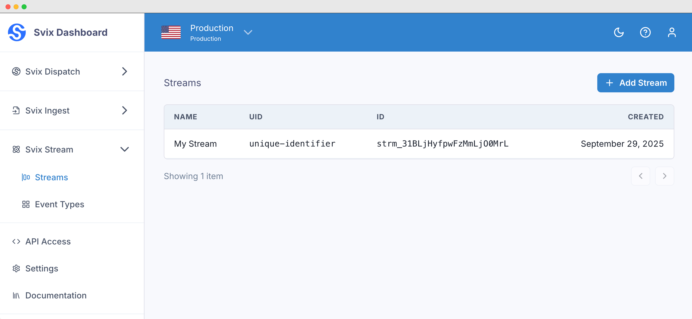
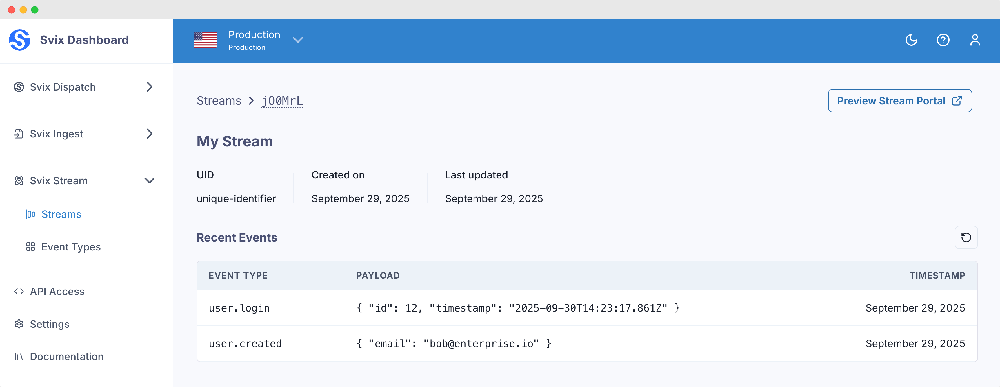

import CodeTabs from "@theme/CodeTabs";
import TabItem from "@theme/TabItem";
import RAW from '!!raw-loader!@site/docs/stream/introduction.mdx';
import HeaderWithCopyButton from '@site/src/components/HeaderWithCopyButton';

<HeaderWithCopyButton title="Introduction" sourceMarkdown={RAW} />

# Svix Stream

Svix Stream is an event streaming platform that enables services to reliably deliver events to multiple destinations through a single integrated API.

The core of Svix Stream is built on top of **Streams**, **Events**, and **Sinks**. Events are pushed to a Stream, and Svix will batch, transform, and dispatch the events to one or more Sinks.



### Streams

**Streams** are unbounded, append only data stores, where events are stored and processed in a stable, first-in-first-out ordering.

Creating a Stream is simple using the [API](https://api.svix.com/docs#tag/Stream/operation/v1.stream.stream.create):

<CodeTabs>
<TabItem value="js">

```js
import { Svix } from "svix";

const streamOut = await svix.streaming.stream.create({
    name: "My Stream",
    uid: "unique-identifier"
});
```

</TabItem>
<TabItem value="py">

```python
from svix.api import Svix, StreamIn

stream_out = svix.streaming.stream.create(StreamIn(
    name="My Stream",
    uid="unique-identifier"
))
```

</TabItem>
<TabItem value="go">

```go
import (
	svix "github.com/svix/svix-webhooks/go"
)

svixClient := svix.New("AUTH_TOKEN", nil)
streamOut, err := svixClient.Streaming.Stream.Create(ctx, &svix.StreamIn{
    Name: "My Stream",
    Uid: "unique-identifier",
})
```

</TabItem>
<TabItem value="rust">

```rust
let svix = Svix::new("AUTH_TOKEN".to_string(), None);

let stream_out = svix
    .streaming()
    .stream()
    .create(
        StreamIn {
            name: "My Stream".to_string(),
            uid: Some("unique-identifier".to_string()),
        },
        None
    ).await?;
```

</TabItem>
<TabItem value="java">

```java
StreamOut streamOut = svix.getStreaming().getStream().create(new StreamIn()
    .name("My Stream")
    .uid("unique-identifier")
);
```

</TabItem>
<TabItem value="kotlin">

```kotlin
import com.svix.kotlin.Svix;
import com.svix.kotlin.models.StreamIn;

val streamOut = svix.streaming.stream.create(StreamIn()
    .name("My Stream")
    .uid("unique-identifier")
)
```

</TabItem>
<TabItem value="ruby">

```ruby
stream_out = svix.streaming.stream.create(Svix::StreamIn.new({
    "name": "My Stream",
    "uid": "unique-identifier"
}))
```

</TabItem>
<TabItem value="csharp">

```csharp
var svix = new SvixClient("AUTH_TOKEN", new SvixOptions("https://api.svix.com"));

var streamOut = await svix.Streaming.Stream.CreateAsync(new StreamIn{
    name: "My Stream",
    uid: "unique-identifier"
});
```

</TabItem>

<TabItem value="cli">
```shell
Support for svix-cli coming soon
```
</TabItem>

<TabItem value="curl">

```shell
curl -X 'POST' \
  'https://api.svix.com/api/v1/stream' \
  -H 'Authorization: Bearer AUTH_TOKEN' \
  -H 'Accept: application/json' \
  -H 'Content-Type: application/json' \
  -d '{
        "name": "My Stream",
        "uid": "unique-identifier"
    }'
```

</TabItem>
</CodeTabs>


The new Stream will look something like:

```json
{
    "id": "strm_31BLjHyfpwFzMmLjO0MrL",
    "uid": "unique-identifier",
    "name": "My Stream",
    "createdAt": "2025-09-29T19:41:36.153Z",
    "updatedAt": "2025-09-29T19:41:36.153Z",
    "metadata": {}
}
```

And can be viewed in the Stream section of the Svix Dashboard.



### Events

With the new Stream, you can immediately start writing events.

<CodeTabs>

<TabItem value="js">
```js
const events = await svix.streaming.events.create("stream_id", {
    events: [
        {
            "eventType": "user.created",
            "payload": "{ \"email\": \"bob@enterprise.io\" }"
        },
        {
            "eventType": "user.login",
            "payload": "{ \"id\": 12, \"timestamp\": \"2025-07-21T14:23:17.861Z\" }"
        }
    ]
});
```
</TabItem>

<TabItem value="py">
```python
create_stream_events_out = svix.streaming.events.create("stream_id", CreateStreamEventsIn(
    events=[
        {
            "eventType": "user.created",
            "payload": '{"email": "bob@enterprise.io"}'
        },
        {
            "eventType": "user.login",
            "payload": '{"id": 12, "timestamp": "2025-07-21T14:23:17.861Z"}'
        }
    ]
))
```

</TabItem>
<TabItem value="go">

```go
createStreamEventsOut, err := svixClient.Streaming.Events.Create(ctx, "stream_id", &CreateStreamEventsIn{
    Events: []interface{}{
        map[string]interface{}{
            "eventType": "user.created",
            "payload":   `{"email": "bob@enterprise.io"}`,
        },
        map[string]interface{}{
            "eventType": "user.login",
            "payload":   `{"id": 12, "timestamp": "2025-07-21T14:23:17.861Z"}`,
        },
    },
})
```

</TabItem>
<TabItem value="rust">

```rust
let create_stream_events_out = svix.streaming().events().create("stream_id", CreateStreamEventsIn {
    events: vec![
        json!({
            "eventType": "user.created",
            "payload": "{\"email\": \"bob@enterprise.io\"}"
        }),
        json!({
            "eventType": "user.login",
            "payload": "{\"id\": 12, \"timestamp\": \"2025-07-21T14:23:17.861Z\"}"
        })
    ],
    stream: None,
}, None).await?;
```

</TabItem>
<TabItem value="java">

```java
CreateStreamEventsOut createStreamEventsOut = svix.getStreaming().getEvents().create("stream_id", new CreateStreamEventsIn()
    .events(new Object[]{
        Map.of(
            "eventType", "user.created",
            "payload", "{\"email\": \"bob@enterprise.io\"}"
        ),
        Map.of(
            "eventType", "user.login",
            "payload", "{\"id\": 12, \"timestamp\": \"2025-07-21T14:23:17.861Z\"}"
        )
    })
);
```

</TabItem>
<TabItem value="kotlin">

```kotlin
val createStreamEventsOut = svix.streaming.events.create("stream_id", CreateStreamEventsIn()
    .events(arrayOf(
        mapOf(
            "eventType" to "user.created",
            "payload" to "{\"email\": \"bob@enterprise.io\"}"
        ),
        mapOf(
            "eventType" to "user.login",
            "payload" to "{\"id\": 12, \"timestamp\": \"2025-07-21T14:23:17.861Z\"}"
        )
    ))
)
```

</TabItem>
<TabItem value="ruby">

```ruby
create_stream_events_out = svix.streaming.events.create("stream_id", Svix::CreateStreamEventsIn.new({
    "events": [
        {
            "eventType" => "user.created",
            "payload" => '{"email": "bob@enterprise.io"}'
        },
        {
            "eventType" => "user.login",
            "payload" => '{"id": 12, "timestamp": "2025-07-21T14:23:17.861Z"}'
        }
    ]
}))
```

</TabItem>
<TabItem value="csharp">

```csharp
var createStreamEventsOut = await svix.Streaming.Events.CreateAsync("stream_id", new CreateStreamEventsIn{
    events: new Object[] {
        new {
            eventType = "user.created",
            payload = "{\"email\": \"bob@enterprise.io\"}"
        },
        new {
            eventType = "user.login",
            payload = "{\"id\": 12, \"timestamp\": \"2025-07-21T14:23:17.861Z\"}"
        }
    }
});
```

</TabItem>
<TabItem value="cli">
```shell
Support for svix-cli coming soon
```
</TabItem>
<TabItem value="curl">

```shell
curl -X 'POST' \
  'https://api.svix.com/api/v1/stream/{stream_id}/events' \
  -H 'Authorization: Bearer AUTH_TOKEN' \
  -H 'Accept: application/json' \
  -H 'Content-Type: application/json' \
  -d '{
        "events": [
            {
                "eventType": "user.created",
                "payload": "{\"email\": \"bob@enterprise.io\"}"
            },
            {
                "eventType": "user.login",
                "payload": "{\"id\": 12, \"timestamp\": \"2025-07-21T14:23:17.861Z\"}"
            }
        ]
    }'
```

</TabItem>
</CodeTabs>


**Events** written to a Stream always contain two fields:
* `eventType` - An identifier denoting the type of event being sent. (For more info, see [Event Types](./event-types/introduction))
* `payload` - A string representing the event. Payloads will typically be JSON, though in practice they can be any format that fits your use case.

In the Stream Dashboard, you'll see the most recent events that have been sent to the Stream.



Events are persisted to the Stream for 14 days. While the Events are saved to the Stream, they'll be dispatched, in order, to one or more **Sinks** attached to the Stream.

### Sinks

Sinks define where Events in the Stream are sent, and can be anything from an [HTTP endpoint](./sinks/http) to an Object Storage bucket ([S3](./sinks/s3), [Google Cloud Storage](./sinks/gcs), [Azure Blob Storage](./sinks/azure_blob)), or even an [Open Telemetry Trace collector](./sinks/otel_trace).

When configuring Sinks, you control:

* Which event types the Sink is subscribed to.
* How events are batched together before dispatch.
* Custom JavaScript transformations to modify events before delivery.

For more information on configuring Sinks, see [Introduction to Sinks](./sinks/introduction)
