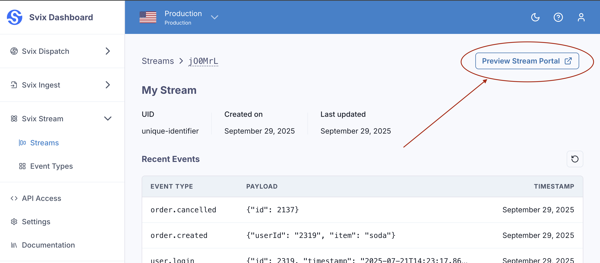
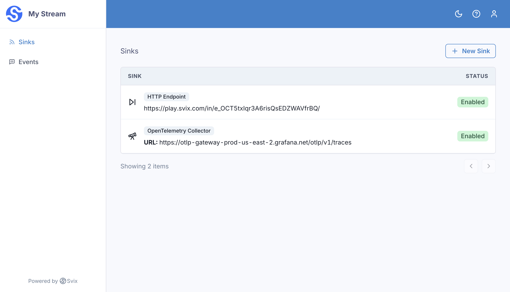
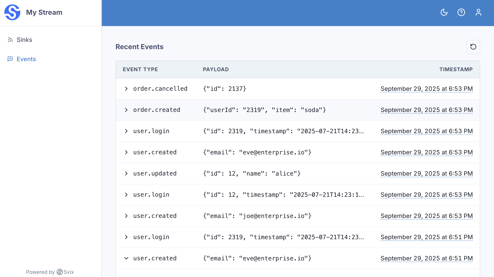

import CodeTabs from "@theme/CodeTabs";
import TabItem from "@theme/TabItem";

Svix comes with a Stream Portal for your users (sink consumers) that you can use out of the box. Your users can then use it to configure sinks, debug delivery, as well as inspect and retry events. This is the easiest way to get started, but you can alternatively use the API to build your own.

You can preview the Stream portal by clicking the "Preview Stream Portal" in the dashboard.

On the Stream Portal, you can view and configure all of the Sinks for your stream.

In addition, you can see the most recent 50 events sent to the stream.

