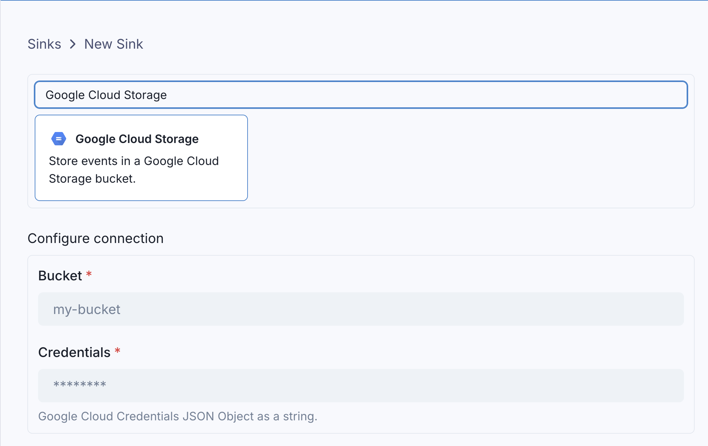
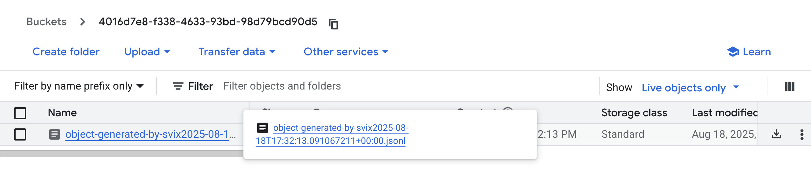

# Google Cloud Storage

Events can be sent to a Google Cloud Storage bucket using the `googleCloudStorage` sink type.

Like all sinks, you can create the GCS sink in the UI...



... or [in the API](https://api.svix.com/docs#tag/Sink/operation/v1.stream.sink.create).

```shell
curl -X 'POST' 'https://api.svix.com/api/v1/stream/strm_30XKA2tCdjHue2qLkTgc0/sink' \
  -H 'Authorization: Bearer AUTH_TOKEN' \
  -H 'Content-Type: application/json' \
  -d '{
  "type": "googleCloudStorage",
  "config": {
    "bucket": "my-bucket-name",
    "credentials": "<json encoded service account credentials>"
  },
  "uid": "unique-identifier",
  "status": "enabled",
  "batchSize": 1000,
  "maxWaitSecs": 300,
  "eventTypes": [],
  "metadata": {}
}'
```

Every event batch written to your GCS bucket will put a new object in the bucket.

# Transformations

By default, all `googleCloudStorage` sinks come bundled with the following transformation code.

```JavaScript
/**
 * @param input - The input object
 * @param input.events - The array of events in the batch. The number of events in the batch is capped by the Sink's batch size.
 * @param input.events[].payload - The message payload (string or JSON)
 * @param input.events[].eventType - The message event type (string)
 *
 * @returns Object describing what will be put to the bucket.
 * @returns returns.config
 * @returns returns.config.format - The format of the request object put to the bucket. Valid values are "jsonl", "json", or "raw" (Defaults to jsonl).
 * @returns returns.config.key - The name of the object that will be put to the bucket. This will be suffixed with a timestamp to avoid duplicate object names.
 * @returns returns.data - The array of events to send to the bucket. This will be formatted according to the format.
 */
function handler(input) {
    return {
        config: {
            format: "jsonl",
            key: "object-generated-by-svix"
        },
        data: input.events
    }
}
```

`input.events` matches the events sent in [`create_events`](https://api.svix.com/docs#tag/Event/operation/v1.stream.events.create).

`config` describes the object put in the sink - the key name of the object, and the format of the object saved to the bucket.

By default, the actual object key is always suffixed with a timestamp after the transformations are run. This ensures each event batch is saved as a unique object in the bucket.

For example, if the following events are written to the stream:

```shell
curl -X 'POST' \
  'https://api.svix.com/api/v1/stream/{stream_id}/events' \
  -H 'Authorization: Bearer AUTH_TOKEN' \
  -H 'Accept: application/json' \
  -H 'Content-Type: application/json' \
  -d '{
        "events": [
            {
                "eventType": "user.created",
                "payload": "{\"email\": \"joe@enterprise.io\"}"
            },
            {
                "eventType": "user.login",
                "payload": "{\"id\": 12, \"timestamp\": \"2025-07-21T14:23:17.861Z\"}"
            }
        ]
    }'
```

The default transformation code would result in the following object being uploaded to your bucket.



And the files contents would match the jsonl format.

```jsonl
{"payload":{"email":"joe@enterprise.io"},"eventType":"user.created"}
{"payload":{"id":12,"timestamp":"2025-07-21T14:23:17.861Z"},"eventType":"user.login"}
```

If you want to control the format of the object more precisely, you can use `config.format = "raw"`, and set `data` to a string of the exact file contents you want.

