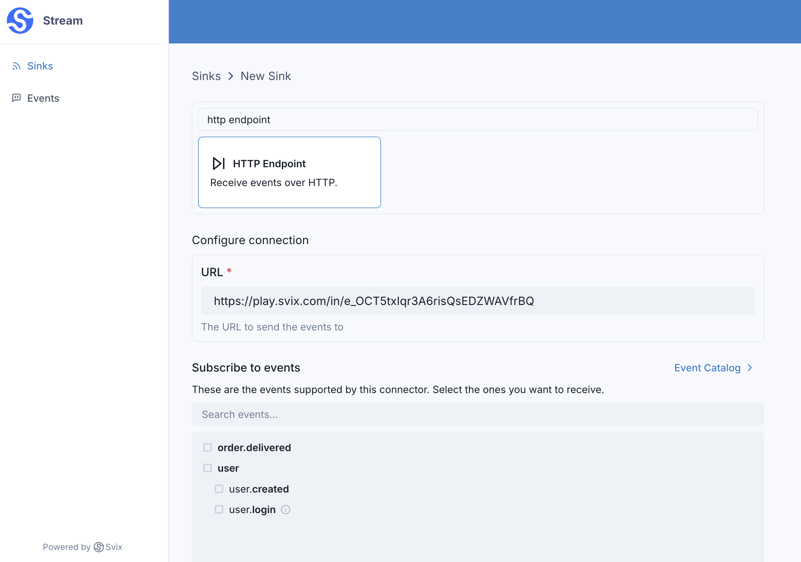
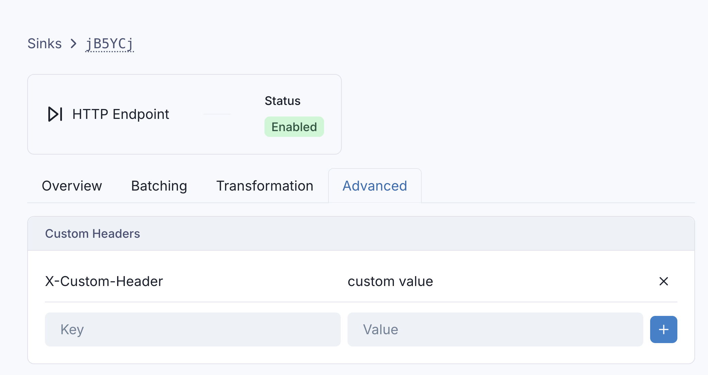

# HTTP Endpoints 

Events can be sent to any arbitrary HTTP endpoint using the `http` sink type.

Like all Sinks, HTTP receivers can be created in the Stream Portal...



... or [in the API](https://api.svix.com/docs#tag/Sink/operation/v1.stream.sink.create).

```shell
curl -X 'POST' 'https://api.svix.com/api/v1/stream/strm_30XKA2tCdjHue2qLkTgc0/sink' \
  -H 'Authorization: Bearer AUTH_TOKEN' \
  -H 'Content-Type: application/json' \
  -d '{
  "type": "http",
  "config": {
    "url": "https://example.com"
  },
  "uid": "unique-identifier",
  "status": "enabled",
  "batchSize": 100,
  "maxWaitSecs": 0,
  "eventTypes": [],
  "metadata": {}
}'
```

Just like with Svix Endpoints, you can [configure](https://api.svix.com/docs#tag/Sink/operation/v1.stream.sink-headers-patch) the `http` sink with custom headers that will be injected on each request.




# Transformations

By default, all `http` Sinks come bundled with the following transformation code.

```JavaScript
/**
 * @param input - The input object
 * @param input.url - The http(s) url of the Sink (string).
 * @param input.events - The array of events in the batch. The number of events in the batch is capped by the Sink's batch size.
 * @param input.events[].payload - The event payload (string or JSON).
 * @param input.events[].eventType - The event type (string).
 *
 * @returns Object describing the HTTP request.
 * @returns returns.config - An object describing the configuration of the request.
 * @returns returns.config.format - The format of the request body. Valid values are "json" or "raw".
 * @returns returns.config.headers - An object describing the headers of the request. All keys and values must be strings. Optional.
 * @returns returns.config.method - The HTTP method of the request. Valid values are "POST", "PUT", and "PATCH". If left unspecified, the request defaults to "POST".
 * @returns returns.config.url - The url of the request. Optional. If left unspecified, the request defaults to the original sink's url.
 * @returns returns.data - The array of events to send in the HTTP request. If config.format is "json", the data will be sent as a JSON object. If config.format is "raw", data
 *                         should be a string and will be sent as the request body.
 * @returns returns.cancel - An optional bool indicating whether the request should be cancelled. If true, the request will not be sent.
 */
function handler(input) {
  return {
    config: {
        format: "json",
        headers: {},
        method: "POST",
        url: input.url
    },
    data: input.events,
    cancel: false
  }
}
```

`input.events` matches the events sent in [`create_events`](https://api.svix.com/docs#tag/Event/operation/v1.stream.events.create).

`config` describes the request - the sink URL, the http verb, the desired format of the request (e.g. `json`), and any additional headers you want to inject in the request.

By default, `config` can be omitted, in which case a `POST` request with `json` format will be sent.

`data` is what will be sent in the request body. By default, we send the `input.events` without any modifications.

For example, if the following events are written to the stream:

```shell
curl -X 'POST' \
  'https://api.svix.com/api/v1/stream/{stream_id}/events' \
  -H 'Authorization: Bearer AUTH_TOKEN' \
  -H 'Accept: application/json' \
  -H 'Content-Type: application/json' \
  -d '{
        "events": [
            {
                "eventType": "user.created",
                "payload": "{\"email\": \"joe@enterprise.io\"}"
            },
            {
                "eventType": "user.login",
                "payload": "{\"id\": 12, \"timestamp\": \"2025-07-21T14:23:17.861Z\"}"
            }
        ]
    }'
```

The default transformation code would result in the following, semantically equivalent, request being made to the Sink:

```shell
curl -X 'POST' \
  'https://the-sink-url' \
  -H 'Content-Type: application/json' \
  -H 'User-Agent: Svix-Stream/1.70.0' \
  -H 'Svix-Id: qoMDqncM7278tPF06iwYlVgkeugYg8UdwKScB8kpCdQ=-1' \
  -H 'Svix-Timestamp: 1755100641' \
  -d '{
        "data": [
            {
                "eventType": "user.created",
                "payload": {"email": "joe@enterprise.io"}"
            },
            {
                "eventType": "user.login",
                "payload": {"id": 12, "timestamp": "2025-07-21T14:23:17.861Z"}
            }
        ]
    }'
```

(Note that the same headers Svix includes with webhooks, are also included when dispatching to a Stream's sinks)

If you want tighter control over the request body, you can use set `config.format = "raw"`. This will set the body to the `data` field without any modifications.

For example, the following transformation code would make a `PATCH` request with a json lines payload.

```JavaScript
function handler(input) {
  
  // note that the body here is just a string.
  const body = input
    .events
    .map((event) => JSON.stringify(event.payload))
    .join("\n");
  
  return {
    config: {
        format: "raw",
        method: "PATCH"
    },
    data: body,
  }
}
```

And would be semantically equivalent to the following curl request

```shell
curl -X 'PATCH' \
  'https://the-sink-url' \
  -H 'User-Agent: Svix-Stream/1.70.0' \
  -H 'Svix-Id: qoMDqncM7278tPF06iwYlVgkeugYg8UdwKScB8kpCdQ=-1' \
  -H 'Svix-Timestamp: 1755100641' \
  -d '{"email": "joe@enterprise.io"}
      {"id": 12, "timestamp": "2025-07-21T14:23:17.861Z"}'
```