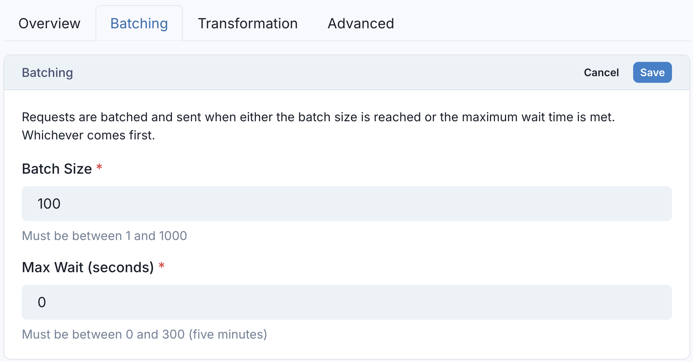
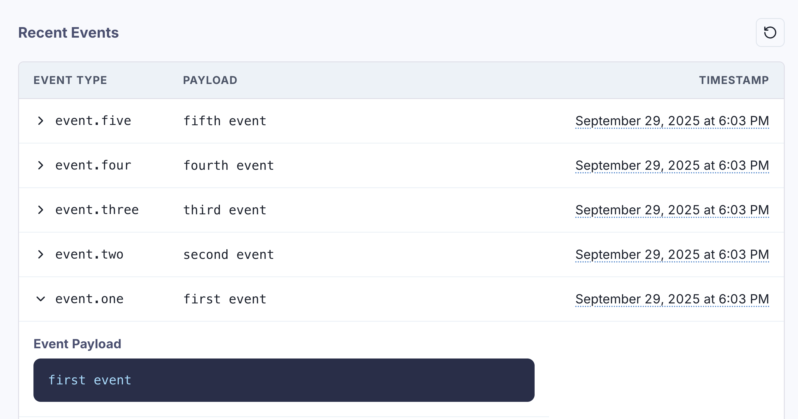
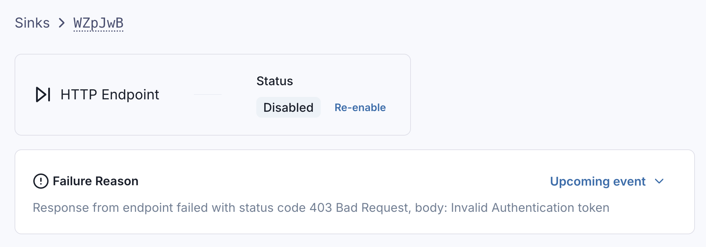

# Introduction to Sinks 

Sinks allow you to control where events are sent, and how events are shaped before dispatch.

The following Sink types are supported by Svix Stream:

* [HTTP Endpoints](./http)
* [Amazon S3](./s3)
* [Azure Blob Storage](./azure_blob)
* [Google Cloud Storage](./gcs)
* [OpenTelemetry Trace Collector](./otel_trace)
* [Poller](./poller)

All Sinks can be configured with event type filtering, batching, and transformations, and can be created through the Stream Portal or the [API](https://api.svix.com/docs#tag/Sink/operation/v1.stream.sink.create).

## Event Type Filtering

When creating a sink, you can optionally specify which event types the Sink should filter on.

In this example, the Google Cloud Storage sink will only receive events with the event type `user.created` or `user.login`.


If no event types are selected when creating a Sink, the Sink will receive all events, regardless of the event type.

## Batching

All Sinks (with the exception of Poller) can be configured with a `batchSize` and `maxWaitSecs`, which determines how large and how frequently batches are sent.



Larger batch sizes allow for better resource utilization, while max wait time anchors throughput to ensure dispatch doesn't hang if the target batch size isn't reached.

To maximize throughput on the Sink, keep batch sizes large and set `maxWaitSecs` to `0`.

To minimize resource utilization on the Sink, keep batch sizes large and set `maxWaitSecs` to the largest tolerable value by your system.

## Transformations

All Sinks (with the exception of Poller) are configured with custom transformation code, which gives tight control over how events are shaped before being sent to the Sink.

## Dispatch Order

Events are always dispatched to Sinks in the same order that Events were persisted to the Stream.

Consider events written to the Stream as such:

```shell
curl -X POST 'https://api.svix.com/api/v1/stream/strm_30XKA2tCdjHue2qLkTgc0/events' \
    -H 'Content-Type: application/json' \
    -H 'Accept: application/json' \
    -H 'Authorization: Bearer ************' \
    -D '{
        "events": [
            {
                "payload": "1",
                "eventType": "event.one"
            },
            {
                "payload": "2",
                "eventType": "event.two"
            },
            {
                "payload": "3",
                "eventType": "event.three"
            },
            {
                "payload": "4",
                "eventType": "event.four"
            },
            {
                "payload": "5",
                "eventType": "event.five"
            }
        ]
}'
```

These events will be persisted to the Stream in the same order they were written.



When dispatch occurs, the order in the stream is preserved. `event.one` will always be sent before (or batched in the same request as) `event.two`, `event.two` will always be sent before (or batched in the same request as) `event.three`, and so on.

## Dispatch Failures and Retries

If dispatch fails, Svix Stream will make a best effort to deliver the events by retrying with exponential backoff.

You can see if dispatch is in a `retrying` state on the Sink's page in the Stream Portal.


This will tell you:
1. When the next retry is scheduled at.
2. What the reason for the dispatch failure was.

If dispatch fails because the Sink is misconfigured in some way, or the retry schedule was exhausted, the Sink will automatically be disabled.



While a Sink is disabled, events can still be written to the Stream without interruption. The Sink can still be reconfigured and reenabled, after which dispatch will resume from the Sink's original place in the stream.