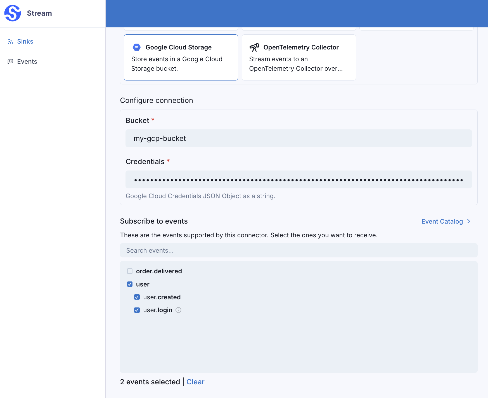
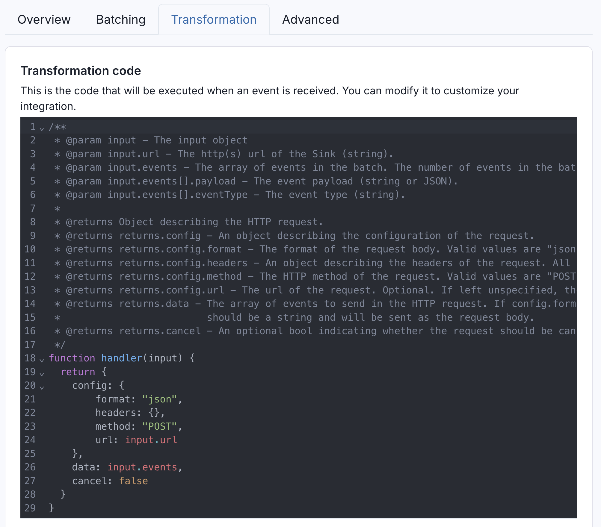
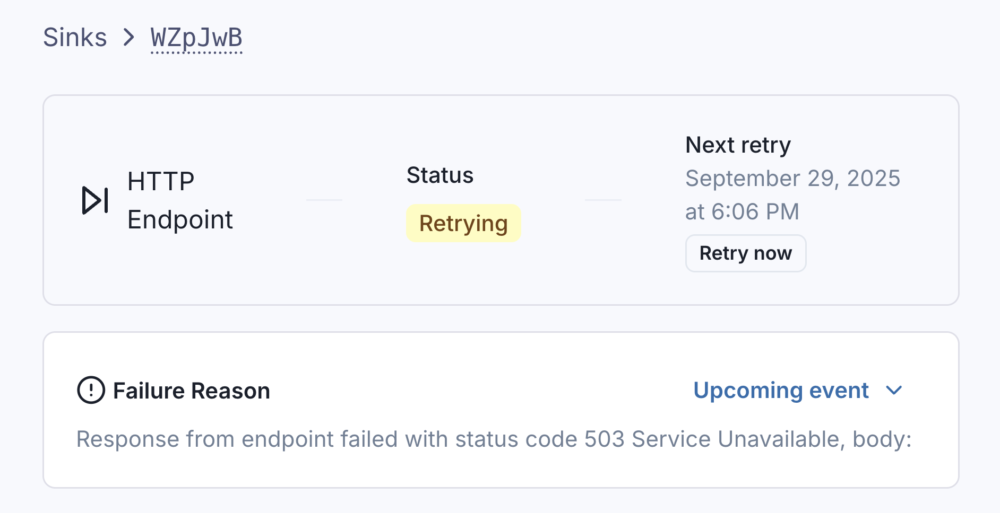

# Introduction to Sinks

Sinks define where events are sent, and how events are shaped before dispatch.

The following sink types are supported by Svix Stream:

* [HTTP Endpoints](./http)
* [OpenTelemetry Trace Collector](./otel_trace)
* [Amazon S3](./s3)
* [Amazon SQS](./sqs)
* [Amazon SNS](./sns)
* [Google Cloud Storage](./gcs)
* [Azure Blob Storage](./azure_blob)
* [Polling Endpoint](./poller)

All Sinks can be configured with event type filtering, batching, and transformations, and can be created through the Stream Portal or the [API](https://api.svix.com/docs#tag/Sink/operation/v1.stream.sink.create).

## Event Type Filtering

When creating a Sink, you can optionally specify which event types the sink should filter on.

In this example, the Google Cloud Storage sink will only receive events with the event type `user.created` or `user.login`.



If no event types are selected when creating a Sink, the sink will receive all events, regardless of the event type.

## Batching

All Sinks (with the exception of Polling Endpoints) can be configured with a `batchSize` and `maxWaitSecs`, which determines how large and how frequently batches are sent.


Events are dispatched when either condition is met:

* Even events have accumulated to meet the batch size, _or_
* The `maxWaitSecs` has passed since the last event was dispatched

To maximize throughput on the Sink, keep batch sizes large and set `maxWaitSecs` to `0`.

To minimize resource utilization on the Sink, keep batch sizes large and set `maxWaitSecs` to the largest value your Sink can tolerate.

## Transformations

All Sinks (with the exception of Polling Endpoints) are configured with custom transformation code, which gives precise control over how events are shaped before being sent to the sink.



Because transformations shape the request to the Sink, each sink type has its own transformation template. `http` Sinks let you configure the parameters like URL, body, and headers, while object storage Sinks (`amazonS3`, `googleCloudStorage`) let you control the object key name and contents.

For example, the transformation code for `http` Sinks can be as simple as:

```JavaScript
/**
 * @param input.events - The array of events in the batch.
 * @param input.events[].payload - The event payload (string or JSON).
 * @param input.events[].eventType - The event type (string).
 */
function handler(input) {
  return {
    config: {
        format: "json",
    },
    data: input.events
  }
}
```

This would take all the events in the batch, and make a `POST` request to the HTTP endpoint with the body:
```json
{
    "data": [
        {
            "eventType": "user.created",
            "payload": { "email": "joe@enterprise.io" }
        },
        {
            "eventType": "user.login", 
            "payload": {"id": 12, "timestamp": "2025-07-21T14:23:17.861Z"}
        }
    ]
}
```

You can also test your transformation code on custom events directly in the Stream Portal in the transformations tab.


## Dispatch Order

Events are always dispatched to Sinks in the same order that Events were persisted to the Stream.

Consider events written to the Stream as such:

```shell
curl -X POST 'https://api.svix.com/api/v1/stream/strm_30XKA2tCdjHue2qLkTgc0/events' \
    -H 'Content-Type: application/json' \
    -H 'Accept: application/json' \
    -H 'Authorization: Bearer ************' \
    -D '{
        "events": [
            {
                "payload": "first event",
                "eventType": "event.one"
            },
            {
                "payload": "second event",
                "eventType": "event.two"
            },
            {
                "payload": "third event",
                "eventType": "event.three"
            },
            {
                "payload": "fourth event",
                "eventType": "event.four"
            },
            {
                "payload": "fifth event",
                "eventType": "event.five"
            }
        ]
}'
```

These events will be persisted to the Stream in the same order they were written.


When dispatch occurs, the order in the Stream is preserved. `event.one` will always be sent before (or batched in the same request as) `event.two`, `event.two` will always be sent before (or batched in the same request as) `event.three`, and so on.

## Dispatch Failures and Retries

If dispatch fails, Svix Stream will make a best effort to deliver the events by retrying with exponential backoff.

You can see if dispatch is in a `retrying` state on the sink's page in the Stream Portal.



The status bar will also tell you:
1. When the next retry is scheduled at.
2. What the reason for the dispatch failure was.

If dispatch fails because the sink is misconfigured, or the retry schedule was exhausted, the sink will automatically be disabled.


While a sink is disabled, events can still be written to the Stream without interruption.

In the UI, you can still alter the sink's configuration, and re-enable the sink once you're sure the error is resolved. Once a sink is re-enabled, it will resume dispatching events from where it left off.
