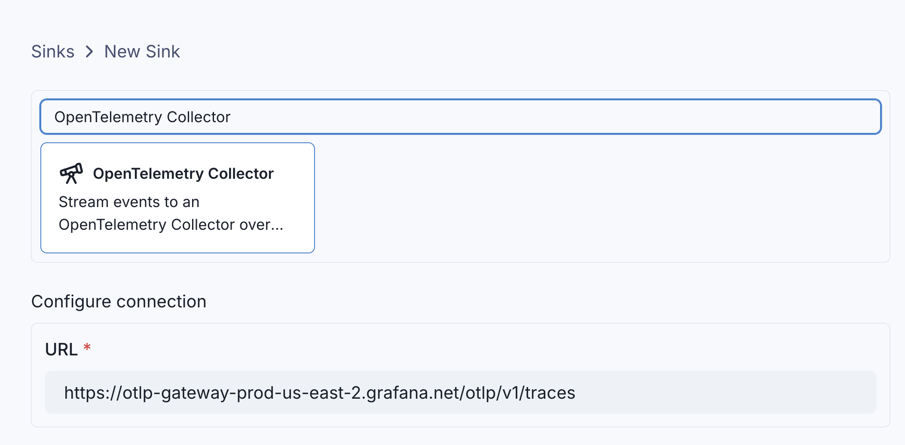
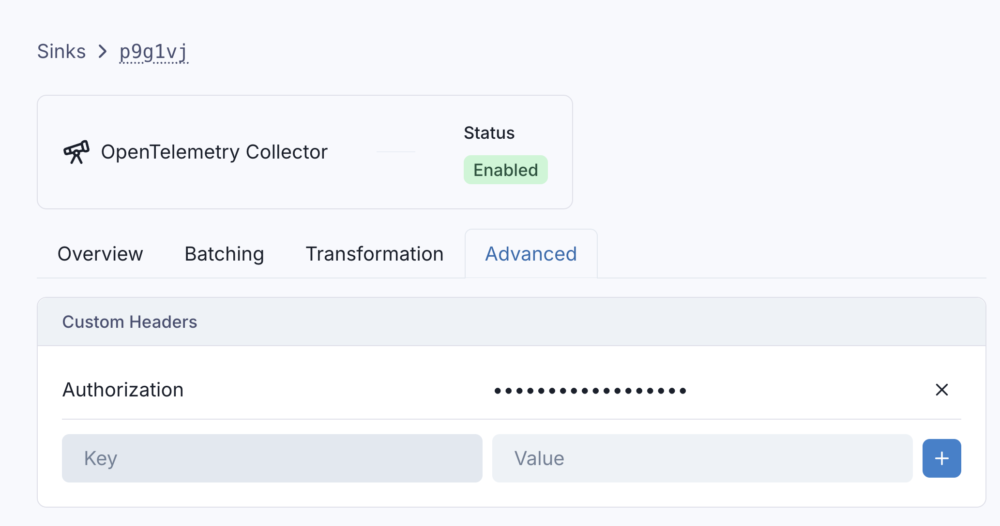
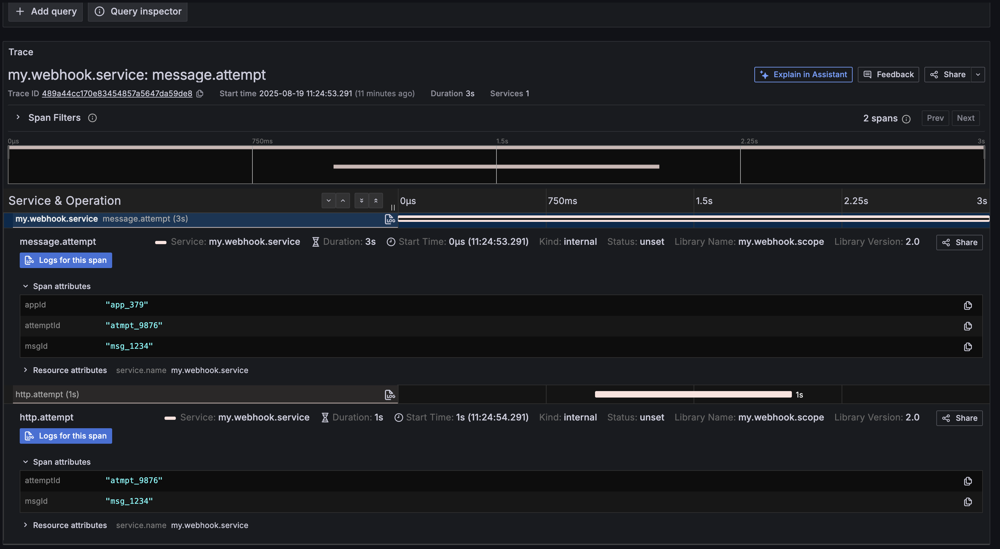

import RAW from '!!raw-loader!@site/docs/stream/sinks/otel_trace.mdx';
import HeaderWithCopyButton from '@site/src/components/HeaderWithCopyButton';

<HeaderWithCopyButton title="OpenTelemetry Tracing" sourceMarkdown={RAW} />

# OpenTelemetry Tracing

Events can be sent to an OpenTelemetry tracing collector using the `otelTracing` sink type.

Like all Sinks, OpenTelemetry tracing collectors can be created in the Stream Portal...



... or [in the API](https://api.svix.com/docs#tag/Sink/operation/v1.stream.sink.create).

```shell
curl -X 'POST' 'https://api.svix.com/api/v1/stream/strm_30XKA2tCdjHue2qLkTgc0/sink' \
  -H 'Authorization: Bearer AUTH_TOKEN' \
  -H 'Content-Type: application/json' \
  -d '{
  "type": "otelTracing",
  "config": {
    "url": "https://otlp-gateway-prod-us-east-2.grafana.net/otlp/v1/traces"
  },
  "uid": "unique-identifier",
  "status": "enabled",
  "batchSize": 100,
  "maxWaitSecs": 0,
  "eventTypes": [],
  "metadata": {}
}'
```

Typically, the `url` of an OpenTelemetry tracing sink will be the `OTEL_EXPORTER_OTLP_ENDPOINT` URL given by your opentelemetry provider, appended with `/v1/traces`, following the [conventions of OTLP exporters](https://opentelemetry.io/docs/languages/sdk-configuration/otlp-exporter/#otel_exporter_otlp_endpoint).

Just like with `http` Sinks, you can [configure](https://api.svix.com/docs#tag/Sink/operation/v1.stream.sink-headers-patch) the `otelTracing` sink with custom headers that will be injected on each request.




# Transformations

By default, all `otelTransformation` Sinks come bundled with the following transformation code.

```JavaScript
/**
 * @param input - The input object
 * @param input.events - The array of events in the batch. The number of events in the batch is capped by the Sink's batch size.
 * @param input.events[].payload - The message payload (string or JSON)
 * @param input.events[].eventType - The message event type (string)
 *
 * @returns Object describing the otel spans to be created.
 * @returns returns.config
 * @returns returns.config.serviceName - The name of the otel service.
 * @returns returns.config.scope - The scope of the otel service. Includes a name and version string.
 * @returns returns.spans - Array of objects, each describing an otel span.
 * @returns returns.spans[].kind - The kind of span. Can be one of "SERVER", "CLIENT", "PRODUCER", "CONSUMER", or "INTERNAL". (Defaults to "INTERNAL")
 * @returns returns.spans[].traceIdKey - An optional string. Attaches the span to traces with the same traceIdKey.
 * @returns returns.spans[].spanIdKey - An optional string. Identifies the span.
 * @returns returns.spans[].parentSpanIdKey - An optional string. Attaches the span to a parent with the same spanIdKey.
 * @returns returns.spans[].startTime - The start time of the span. Must be a string in ISO 8601 format.
 * @returns returns.spans[].endTime - The end time of the span. Must be a string in ISO 8601 format.
 * @returns returns.spans[].name - The name of the span.
 * @returns returns.spans[].attributes - An optional object. Contains key-value pairs of attributes.
 */
function handler(input) {
    const spans = input.events.map((event) => {
        return {
            // The start and end times of the span.
            // You'll likely want to override these based on values from the event.payload.
            startTime: new Date().toISOString(),
            endTime: new Date().toISOString(),

            name: event.eventType,
            attributes: event.payload
        }
    })

    return {
        config: {
            serviceName: "svix.stream",
            scope: {
                name: "svix.stream",
                version: "0.0.1"
            },
        },
        spans
    }
}
```

`input.events` matches the events sent in [`create_events`](https://api.svix.com/docs#tag/Event/operation/v1.stream.events.create).

`config` describes the [service](https://opentelemetry.io/docs/specs/semconv/registry/attributes/service/#service-name) and [scope attributes and definitions](https://opentelemetry.io/docs/concepts/instrumentation-scope/) that all tracing data are grouped under.

`spans` is an array of [OpenTelemetry spans](https://opentelemetry.io/docs/concepts/signals/traces/#spans). Each span has the following properties:

* `startTime` and `endTime`: These mark the start and end of the span. By default, they are set to the current timestamp, so you'll likely want to derive these from your events directly.
* `kind`: One of `"SERVER"`, `"CLIENT"`, `"PRODUCER"`, `"CONSUMER"`, or `"INTERNAL"` (`"INTERNAL"` is the default). For more details on the meaning behind these values, see [OpenTelemetry - Span Kinds](https://opentelemetry.io/docs/concepts/signals/traces/#span-kind)
* `name`: A string, denoting the name of the span.
* `attributes`: key-value pairing of attributes for the span. These can be any values you want associated with your span.
* `traceIdKey`: By default, each span is assigned it's own trace ID that is randomly generated by Svix.
However, you can specify a `traceIdKey` to derive a fixed key for the given span. This allows you to correlate multiple spans to the same trace.
* `spanIdKey`: Uniquely identifies a `span` with a fixed key. By default, Svix will use a randomly generated ID if left unspecified.
* `parentSpanIdKey`: Attaches the span as a child, to another span with the `spanIdKey` set to the same value. This allows you to set child spans.


# Example

To better understand how you can use OpenTelemetry Sinks, let's walk through an example use case where you want to send webhook dispatch telemetry to a cloud observability platform like Grafana.

Your service may produce events that look like the following:

```shell
curl -X 'POST' \
  'https://api.svix.com/api/v1/stream/{stream_id}/events' \
  -H 'Authorization: Bearer AUTH_TOKEN' \
  -H 'Accept: application/json' \
  -H 'Content-Type: application/json' \
  -d '{
    "events": [
        {
            "eventType": "message.attempt",
            "payload": "{\"appId\": \"app_379\", \"msgId\": \"msg_1234\", \"attemptId\": \"atmpt_9876\", \"startTime\": \"2025-08-19T15:24:53.291Z\", \"endTime\": \"2025-08-19T15:24:56.291Z\" }"
        },
        {
            "eventType": "http.attempt",
            "payload": "{\"msgId\": \"msg_1234\", \"attemptId\": \"atmpt_9876\", \"startTime\": \"2025-08-19T15:24:54.291Z\", \"endTime\": \"2025-08-19T15:24:55.291Z\" }"
        },
        {
            "eventType": "message.attempt",
            "payload": "{\"appId\": \"app_379\", \"msgId\": \"msg_5678\", \"attemptId\": \"atmpt_1224\", \"startTime\": \"2025-08-19T15:24:51.291Z\", \"endTime\": \"2025-08-19T15:24:54.291Z\" }"
        },
        {
            "eventType": "http.attempt",
            "payload": "{\"msgId\": \"msg_5678\", \"attemptId\": \"atmpt_1234\", \"startTime\": \"2025-08-19T15:24:52.291Z\", \"endTime\": \"2025-08-19T15:24:53.291Z\" }"
        }
    ]
}'
```

Here, the events model webhooks being sent. Note that:
* We have two distinct messages being sent (distinct `msgId`s), each with their own attempt. Each attempt has a clear start and end time.
* The `http.attempt` happens within a `message.attempt`. In other words, `http.attempt` is a child span of `message.attempt`.

In order to ensure that each message is grouped into its own distinct trace, and that `http.attempt`s are correctly marked as child spans of `message.attempt`s,
we'll use the following transformation code.

```JavaScript
function handler(input) {
    const spans = input.events.map((event) => {
        const payload = event.payload
        return {
            // start and end times are extracted from the event directly.
            startTime: payload.startTime,
            endTime: payload.endTime,

            // We use the eventType as the name of the span,
            // as it makes it easier to identify which events map to
            // which spans in Grafana
            name: event.eventType,

            // We use the msgId as the traceIdKey, to ensure that all spans for the same
            // message are correctly grouped into the same trace.
            traceIdKey: payload.msgId,

            // Because we want to `http.attempt` to be a child span of the `message.attempt`, we
            // use the `attemptId` to mark the parent and child spans, respectively.
            spanIdKey: event.eventType === "message.attempt" ? payload.attemptId : undefined
            parentIdKey: event.eventType === "http.attempt" ? payload.attemptId : undefined,

            // Attributes can be anything you want. Here, we extract the important ID's from the event payload.
            attributes: {
              msgId: payload.msgId,
              appId: payload.appId,
              attemptId: payload.attemptId
            }
        }
    })

    // Note that your `service.name` has been configured to `my.webhook.service`, and each individual event sent to the Stream is treated as its own span.
    return {
        config: {
            serviceName: "my.webhook.service",
            scope: {
                name: "my.webhook.scope",
                version: "2.0"
            },
        },
        spans
    }
}
```

When we send these events to the stream, they'll be dispatched to Grafana. Here, we can see `msg_1234` as its own isolated trace, with the `message.attempt` and `http.attempt` spans correctly grouped together, with the expected attributes.


