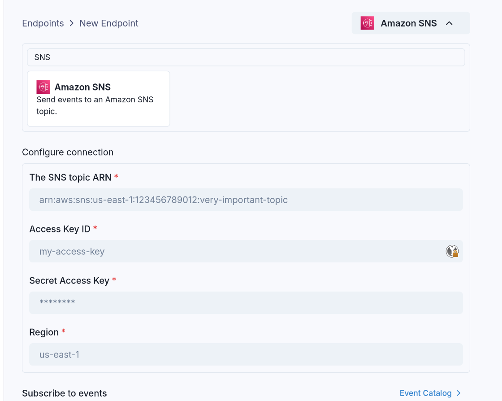

# Amazon SNS

Events can be sent to an Amazon SNS topic using the `amazonSns` sink type.

Like all Sinks, SNS topics can be created in the Stream Portal...



... or [in the API](https://api.svix.com/docs#tag/Sink/operation/v1.stream.sink.create).

```shell
curl -X 'POST' 'https://api.svix.com/api/v1/stream/strm_30XKA2tCdjHue2qLkTgc0/sink' \
  -H 'Authorization: Bearer AUTH_TOKEN' \
  -H 'Content-Type: application/json' \
  -d '{
  "type": "amazonSns",
  "config": {
    "topicArn": "arn:aws:sns:us-east-1:123456789012:my-topic",
    "region": "us-east-1",
    "accessKeyId": "xxx",
    "secretAccessKey": "xxx"
  },
  "uid": "unique-identifier",
  "status": "enabled",
  "batchSize": 100,
  "maxWaitSecs": 300,
  "eventTypes": [],
  "metadata": {}
}'
```

Each event will be sent as individual messages to your SNS topic.

# Transformations

By default, all `amazonSns` Sinks come bundled with the following transformation code.

```JavaScript
/**
 * @param input - The input object
 * @param input.events - The array of events in the batch. The number of events in the batch is capped by the Sink's batch size.
 * @param input.events[].payload - The message payload (string or JSON).
 * @param input.events[].eventType - The message event type (string).
 *
 * @returns Object containing the response.
 * @returns returns.messages - The array of SNS messages to send to the SNS topic.
 * @returns returns.messages[].payload - The content of the message (string).
 * @returns returns.messages[].subject - An optional subject of the message (string).
 */
function handler(input) {
  const messages = input.events.map((event) => ({
    payload: event,
  }));

  return {
    messages,
  };
}
```

`input.events` matches the events sent in [`create_events`](https://api.svix.com/docs#tag/Event/operation/v1.stream.events.create).

`messages` contains the array of SNS messages that will be sent to the topic. Each message in the array will be sent as a separate SNS message with the specified payload.

For example, if the following events are written to the stream:

```shell
curl -X 'POST' \
  'https://api.svix.com/api/v1/stream/{stream_id}/events' \
  -H 'Authorization: Bearer AUTH_TOKEN' \
  -H 'Accept: application/json' \
  -H 'Content-Type: application/json' \
  -d '{
        "events": [
            {
                "eventType": "user.created",
                "payload": "{\"email\": \"joe@enterprise.io\"}"
            },
            {
                "eventType": "user.login",
                "payload": "{\"id\": 12, \"timestamp\": \"2025-07-21T14:23:17.861Z\"}"
            }
        ]
    }'
```

The default transformation code would result in two separate messages being sent to your SNS topic:

**Message 1:**
```json
{
  "eventType": "user.created",
  "payload": "{\"email\": \"joe@enterprise.io\"}"
}
```

**Message 2:**
```json
{
  "eventType": "user.login",
  "payload": "{\"id\": 12, \"timestamp\": \"2025-07-21T14:23:17.861Z\"}"
}
```

If you want to add a custom subject to your SNS messages, you can customize the transformation:

```JavaScript
function handler(input) {
  const messages = input.events.map((event) => ({
    payload: event,
    subject: `Webhook: ${event.eventType}`,
  }));

  return {
    messages,
  };
}
```

This would result in the following messages being sent to your SNS topic with subjects:

**Message 1:**
```json
{
  "payload": {
    "eventType": "user.created",
    "payload": "{\"email\": \"joe@enterprise.io\"}"
  },
  "subject": "Webhook: user.created"
}
```

**Message 2:**
```json
{
  "payload": {
    "eventType": "user.login",
    "payload": "{\"id\": 12, \"timestamp\": \"2025-07-21T14:23:17.861Z\"}"
  },
  "subject": "Webhook: user.login"
}
```
