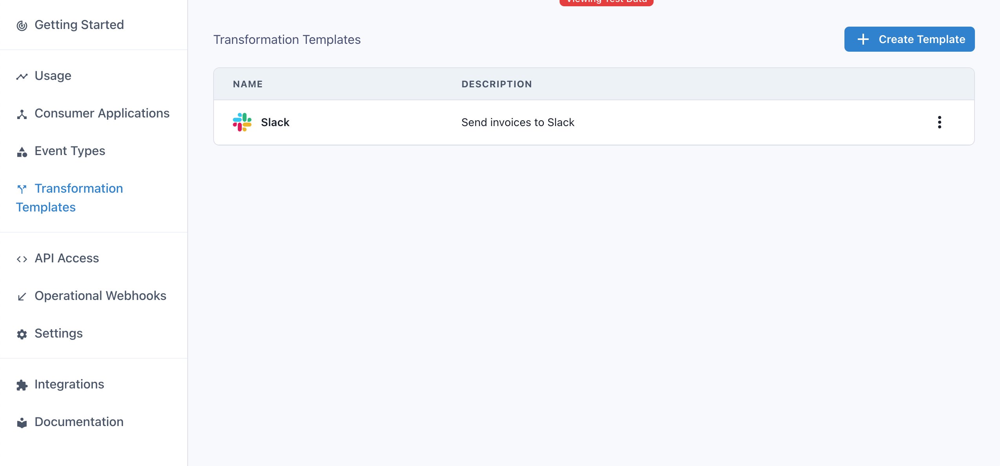
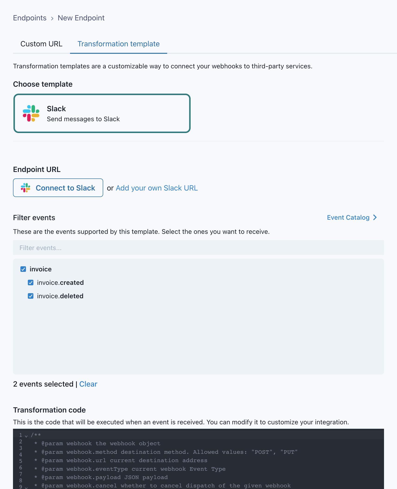
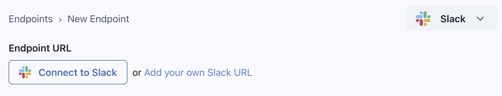
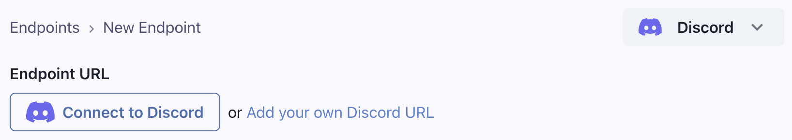
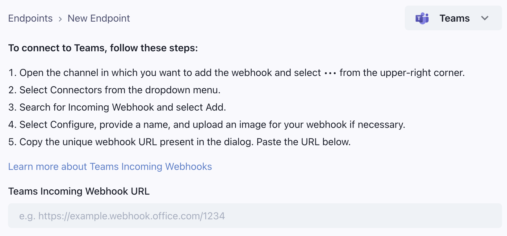
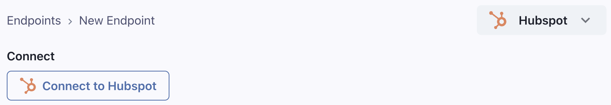
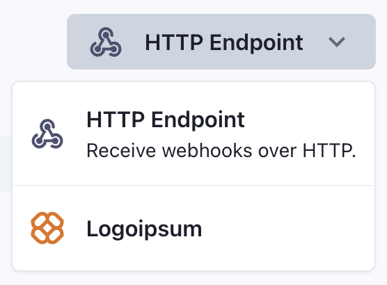
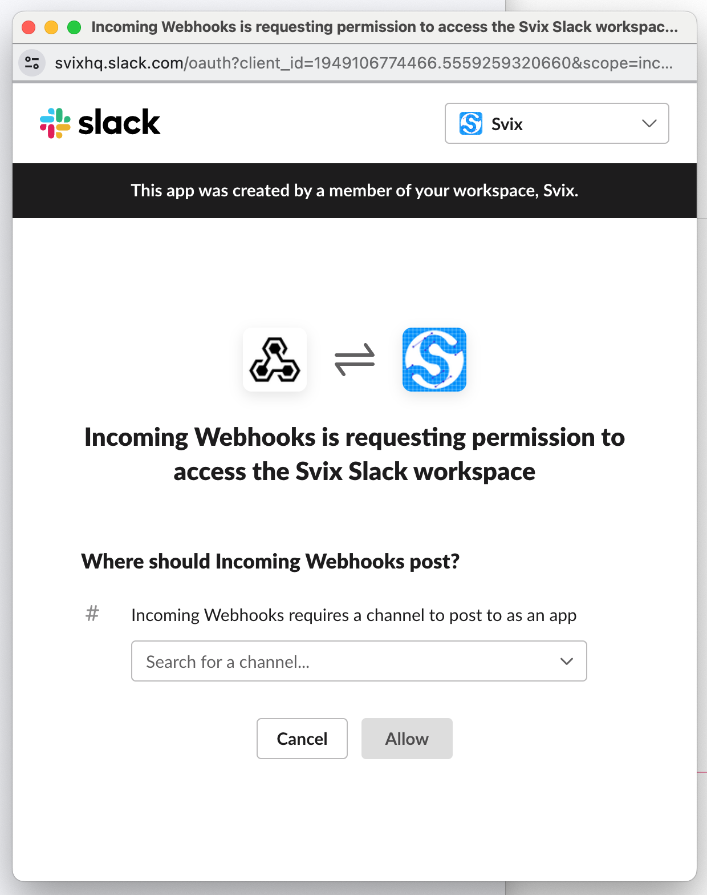
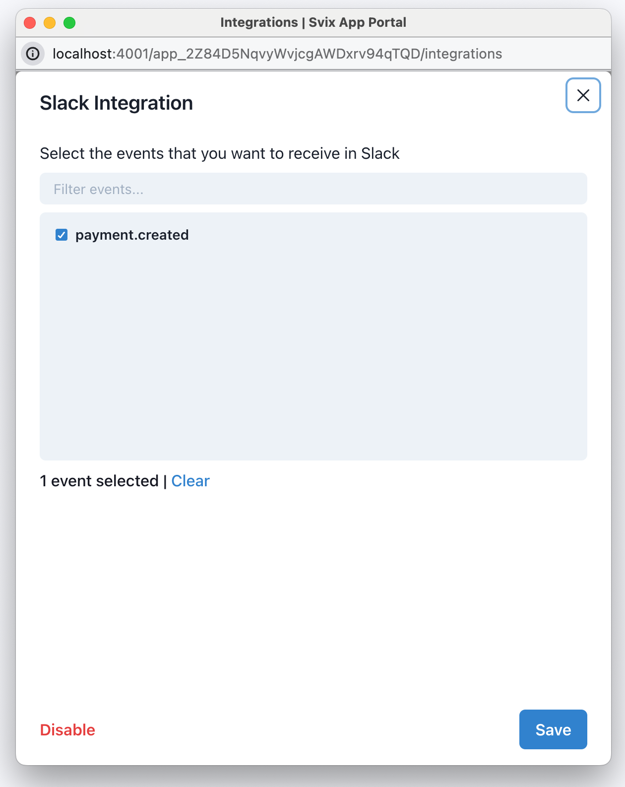

Transformation templates is a Svix feature that lets you provide your customers with pre-made integrations to connect your webhooks to other services.

### How to use Transformation Templates

Transformation templates are enabled when [enabling transformations](#enabling-transformations). After enabling Transformations, you will see a new dashboard section where you will be able to create new templates.



To create a template, you need to provide the following details:

- `Type`: Choose from a set of services that provide easy webhook integrations, or choose `Custom` to build your own integration. We currently support Slack, Discord, and many more services, listed below.
- `Description`: Describe the integration to your customers.
- `Event Types`: Specify which events are going to be supported out-of-the-box by the integration. 
- `Transformation Code`: This is the glue code that will turn incoming webhook events into useful payloads for your integration. For example, if you are building a transformation template that sends Slack messages 
every time a new invoice is created, the transformation will read `invoice.created` events and return a payload that works for Slack, like:
```js
webhook.payload = { "text": `An invoice of $${webhook.payload.amount} has been created.` }
```

The transformation code needs to account for all event types you choose to support. You can define different behaviors for each event type by switching on the `webhook.eventType` field. 

For example, this transformation will create a different message depending on if the event type is `invoice.created` or `invoice.deleted`:

```js
/**
 * @param webhook the webhook object
 * @param webhook.method destination method. Allowed values: "POST", "PUT"
 * @param webhook.url current destination address
 * @param webhook.eventType current webhook Event Type
 * @param webhook.payload JSON payload
 * @param webhook.cancel whether to cancel dispatch of the given webhook
 */
function handler(webhook) {
  if (webhook.eventType === "invoice.created") {
    webhook.payload = {
      text: `${webhook.payload.name} created an invoice for $${webhook.payload.amount}`
    }         
  } else if (webhook.eventType === "invoice.deleted") {
    webhook.payload = {
      text: `${webhook.payload.name} deleted an invoice`
    }    
  }

  return webhook
}
```

Your customers will be able to customize the transformation code and the event types they listen to. Your definition should act as a working starting point they can use. 


### Transformation Templates in the App Portal

After creating at least one transformation template, your customers will be able to choose it when creating an endpoint. 



## Connection types

### Slack

The Slack built-in integration lets you send messages to Slack channels via webhooks. It shows a 'Connect to Slack' button that lets your users get a Slack incoming webhook URL using OAuth in a few clicks, without leaving your site.

The transformation code should format the webhook payload according to [Slack's Incoming Webhook API](https://api.slack.com/messaging/webhooks#posting_with_webhooks).



### Discord

The Discord built-in integration lets you send messages to Discord channels via webhooks. It shows a 'Connect to Discord' button that lets your users get a Discord incoming webhook URL using OAuth in a few clicks, without leaving your site.

The transformation code should format the webhook payload according to [Discord's Execute Webhook API](https://discord.com/developers/docs/resources/webhook#execute-webhook).



### Microsoft Teams

The Microsoft Teams integration will show your users instructions on how to get a Teams webhook URL. 

The transformation code should format the webhook payload according to [Microsoft Teams' Incoming Webhook API](https://learn.microsoft.com/en-us/microsoftteams/platform/webhooks-and-connectors/how-to/connectors-using?#send-adaptive-cards-using-an-incoming-webhook).



### Hubspot

The Hubspot integration lets you connect webhooks directly to the [Hubspot API](https://developers.hubspot.com/docs/api/overview). It shows a 'Connect to Hubspot' button that lets your users get a Hubspot access token that can be used to connect to the Hubspot API.

The integration will request access to the following [OAuth scopes](https://developers.hubspot.com/docs/api/working-with-oauth) in the [Hubspot API](https://developers.hubspot.com/docs/api/overview):

- `crm.objects.contacts.write`
- `crm.objects.companies.write`
- `crm.objects.deals.write`
- `crm.objects.quotes.write`
- `crm.objects.marketing_events.write`



The transformation code should set the webhook URL to the Hubspot API endpoint (depending on the object) and format the payload appropriately to create the object in Hubspot.

For example, if you send a `user.created` webhook, and want to write a transformation template that creates a contact in Hubspot, the transformation code could look like this:

```js
function handler(webhook) {
  /**
  *  Example payload is { 
  *    user: { firstname: 'John', lastname: 'Doe', email: 'john.doe@example.com' }
  *  }   
  *  webhook.method is "POST" 
  */  
  webhook.url = "https://api.hubapi.com/crm/v3/objects/contacts"
  webhook.payload = {
    properties: {
      email: webhook.payload.email,
      firstname: webhook.payload.user.firstname,
      lastname: webhook.payload.user.lastname,
    }
  }

  return webhook
}
```


### Custom Integration

In case you don't find a built-in integration for the service you want to connect to, you can create a custom integration. You can provide your own integration name and icon, and write instructions for your users on how to use it. 



If you have a request for a built-in integration not listed above, [contact us](https://www.svix.com/contact/).


## Slack integration portal (beta)

Another way of using transformation templates is by using the Slack integration portal. 
It is a way for your users to receive events as Slack messages in a few clicks, without thinking about webhooks at all.

To use the Slack integration portal, create a Slack transformation template and use the transformation code to define
how you want to format the Slack message for each of your event types.

Get the App Portal URL and add the `mode=slack-button` query parameter (like `app.svix.com/login?mode=slack-button#key=<login-key>`).

Add a button to your site and when the button is clicked, redirect the user to the Slack portal URL.





The Slack integration portal can be used in a popup, to avoid taking the user away from your site, and make it quick and easy to use.

```js
export const getPopupWindowFeatures = () => {
  // Recommended parameters for the popup window
  const features = {
    popup: "yes",
    width: 600,
    height: 700,
    top: "auto",
    left: "auto",
    toolbar: "no",
    menubar: "no",
  };

  return Object.entries(features)
    .reduce((str, [key, value]) => {
      if (value === "auto") {
        if (key === "top") {
          const v = Math.round(window.innerHeight / 2 - features.height / 2);
          str += `top=${v},`;
        } else if (key === "left") {
          const v = Math.round(window.innerWidth / 2 - features.width / 2);
          str += `left=${v},`;
        }
        return str;
      }

      str += `${key}=${value},`;
      return str;
    }, "")
    .slice(0, -1);
};
```

```jsx
<button onClick={() => window.open(appPortalUrl, "slack-portal", getPopupWindowFeatures())}>Configure Slack</button>
```

In the portal, your users can enable/disable the connection and choose which events they want to receive. The popup will automatically close
once they've completed the setup.

