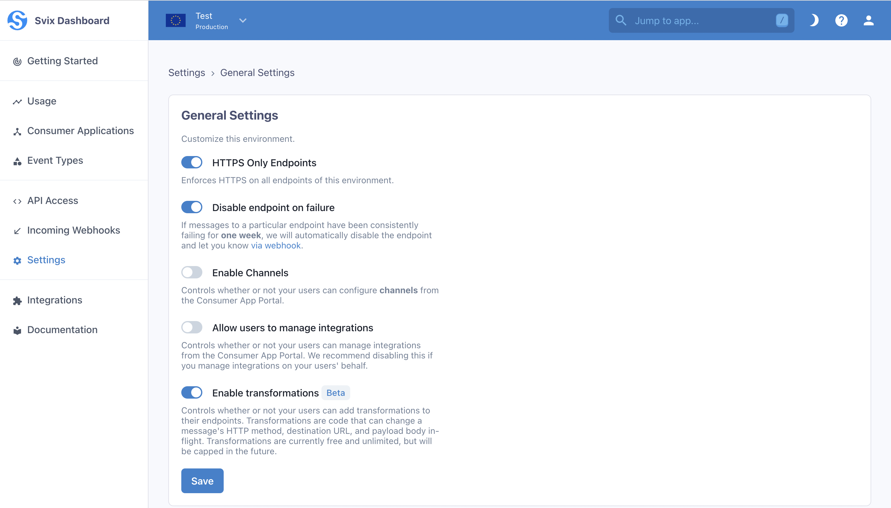
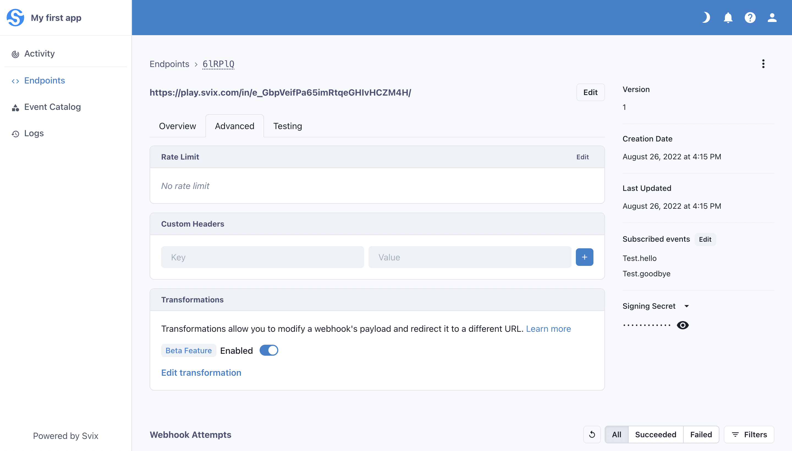
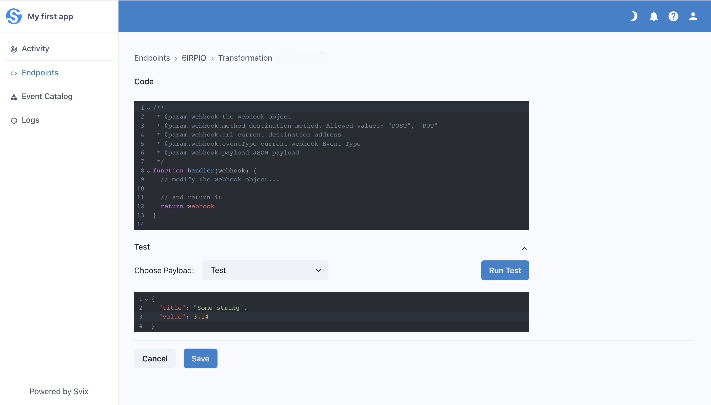

Transformations are a powerful Svix feature that allows the modification of certain webhook properties in-flight. When you enable Transformations, your customers can write JavaScript code on their endpoints that can change a webhook's HTTP method, target URL, and body payload.

## Enabling Transformations

Transformations can be enabled at the environment level. When you enable Transformations for an environment, your customers will be able to use Transformations on their endpoints.

To enable Transformations, navigate to the Settings page in the dashboard. Under the Environment Settings section, click General Settings, and then toggle the Enable Transformations switch. Your customers will need to reenter the Consumer App Portal for the change to take effect.



## Using Transformations

Once enabled for an environment, you customers can begin using Transformations by logging into the Consumer Portal, clicking on an endpoint, clicking into the Advanced tab, and scrolling down to the Transformations card:



An endpoint's Transformation can be enabled or disabled at any time by toggling the switch on this card.

Your customers can write Javascript code to edit an endpoint's Transformation, and test their code against an event type's payload or a custom payload to see the resulting webhook.



### How to write a Transformation

Svix expects a Transformation to declare a function named `handler`. Svix will pass an object with the following properties to the function:

- `method`, a string representing the HTTP method the webhook will be sent with. It is always `"POST"` by default, and its only valid values are `"POST"` or `"PUT"`.
- `url`, a string representing the endpoint's URL. It can be changed to any valid URL.
- `payload`, which contains the webhook's payload as a JSON object. It can be changed as needed.
- `eventType`, a string representing the event type. Changes to it are ignored.
- `transformationsParams`, object passed to the parameter of the same name in the [create-message API call](https://api.svix.com/docs#tag/Message/operation/v1.message.create). Changes are ignored.

The Transformation must return the same object, but may modify its properties as described above.
In addition to the ones listed above, it can also set the following properties on the returned object:

- `cancel`, a boolean which controls whether or not to cancel the dispatch of a webhook. This value defaults to `false`. Note that canceled messages appear as successful dispatches.
- `headers`, an object with keys being HTTP header names and values being the associated header values. Headers set here take precedence over endpoint headers.

### An example Transformation

Suppose that sometimes, your customer wants to redirect webhooks to a custom URL instead of the endpoint's defined URL. They only want to do this redirect if a custom URL is present in the webhook payload. They can write a transformation like this:

```js
function handler(webhook) {
	if (webhook.payload.customUrl) {
		webhook.url = webhook.payload.customUrl;
	}
	return webhook;
}
```

Great, the webhook is redirected to the custom URL if the `customUrl` property exists on the payload. Otherwise, it is sent to the endpoint's defined URL.
