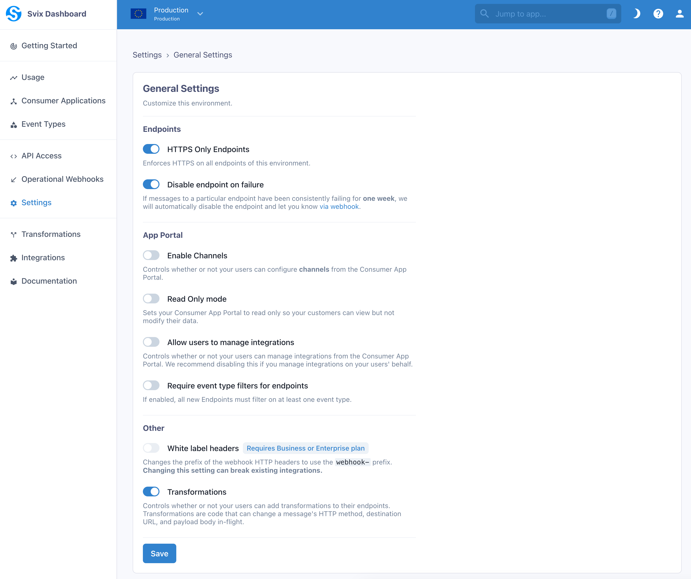

Transformations are a powerful new Svix feature that allow the modification of certain webhook properties in-flight. When you enable Transformations, your customers can write Javascript code on their endpoints that can change a webhook's HTTP method, target URL, and body payload.

Transformations are a beta feature. While in beta, they are free and unlimited. However, this will likely change when the feature exits the beta stage.

## Enabling Transformations

Transformations can be enabled at the environment level. When you enable Transformations for an environment, your customers will be able to use Transformations on their endpoints.

To enable Transformations, navigate to the Settings page in the dashboard. Under the Environment Settings section, click General Settings, and then toggle the Enable Transformations switch. Your customers will need to reenter the Consumer App Portal for the change to take effect.



## Using Transformations

Once enabled for an environment, you customers can begin using Transformations by logging into the Consumer Portal, clicking on an endpoint, clicking into the Advanced tab, and scrolling down to the Transformations card:


An endpoint's Transformation can be enabled or disabled at any time by toggling the switch on this card.

Your customers can write Javascript code to edit an endpoint's Transformation, and test their code against an event type's payload or a custom payload to see the resulting webhook.


### How to write a Transformation

Svix expects a Transformation to declare a function named `handler`. Svix will pass a `WebhookObject` to this function as its only argument, and expects the function to always return a `WebhookObject`.

`WebhookObject` is a JSON object containing 3 properties:

- `method`, a string representing the HTTP method the webhook will be sent with. It is always `"POST"` by default, and its only valid values are `"POST"` or `"PUT"`
- `url`, a string representing the endpoint's URL. It can be changed to any valid URL.
- `payload`, which contains the webhook's payload as a JSON object. It can be changed as needed.
- `cancel`, a Boolean which controls whether or not to cancel the dispatch of a webhook. This value defaults to `false`. Note that canceled messages appear as successful dispatches.

The Transformation will only work if the `handler` function returns the modified `WebhookObject`.

### An example Transformation

Suppose that sometimes, your customer wants to redirect webhooks to a custom URL instead of the endpoint's defined URL. They only want to do this redirect if a custom URL is present in the webhook payload. They can write a transformation like this:

```js
function handler(webhook) {
	if (webhook.payload.customUrl) {
		webhook.url = webhook.payload.customUrl;
	}
	return webhook;
}
```

Great, the webhook is redirected to the custom URL if the `customUrl` property exists on the payload. Otherwise, it is sent to the endpoint's defined URL.

## Transformation Templates

Transformation templates is a Svix feature that lets you provide your customers with pre-made integrations to connect your webhooks to other services.

### How to use Transformation Templates

Transformation templates are enabled when [enabling transformations](#enabling-transformations). After enabling Transformations, you will see a new dashboard section where you will be able to create new templates.


To create a template, you need to provide the following details:

- `name`, `description` and `logo url` - Describe the integration to your customers.
- `Instructions` and `Learn more link` - Explain how to use and customize the template. Your customers may need to set a specific endpoint when using the template. This is a good place to let them know how to get that endpoint.
- `Event Types` - Specify which events are going to be supported out-of-the-box by the integration. 
- `Transformation Code` - This is the glue code that will turn incoming webhook events into useful payloads for your integration. For example, if you are building a transformation template that sends Slack messages 
every time a new invoice is created, the transformation will read `invoice.created` events and return a payload that works for Slack, like:
```js
webhook.payload = { "text": `An invoice of $${webhook.payload.amount} has been created.` }
```

The transformation code needs to account for all event types you choose to support. You can define different behaviors for each event type by switching on the `webhook.eventType` field. 

For example, this transformation will create a different message depending on if the event type is `invoice.created` or `invoice.deleted`:

```js
/**
 * @param webhook the webhook object
 * @param webhook.method destination method. Allowed values: "POST", "PUT"
 * @param webhook.url current destination address
 * @param webhook.eventType current webhook Event Type
 * @param webhook.payload JSON payload
 * @param webhook.cancel whether to cancel dispatch of the given webhook
 */
function handler(webhook) {
  if (webhook.eventType === "invoice.created") {
    webhook.payload = {
      text: `${webhook.payload.name} created an invoice for $${webhook.payload.amount}`
    }         
  } else if (webhook.eventType === "invoice.deleted") {
    webhook.payload = {
      text: `${webhook.payload.name} deleted an invoice`
    }    
  }

  return webhook
}
```

Your customers will be able to customize the transformation code and the event types they listen to. Your definition should act as a working starting point they can use. 

### Transformation Templates in the App Portal

After creating at least one transformation template, your customers will see a new tab when creating an endpoint where they will be able to choose a template from the ones you created. 

