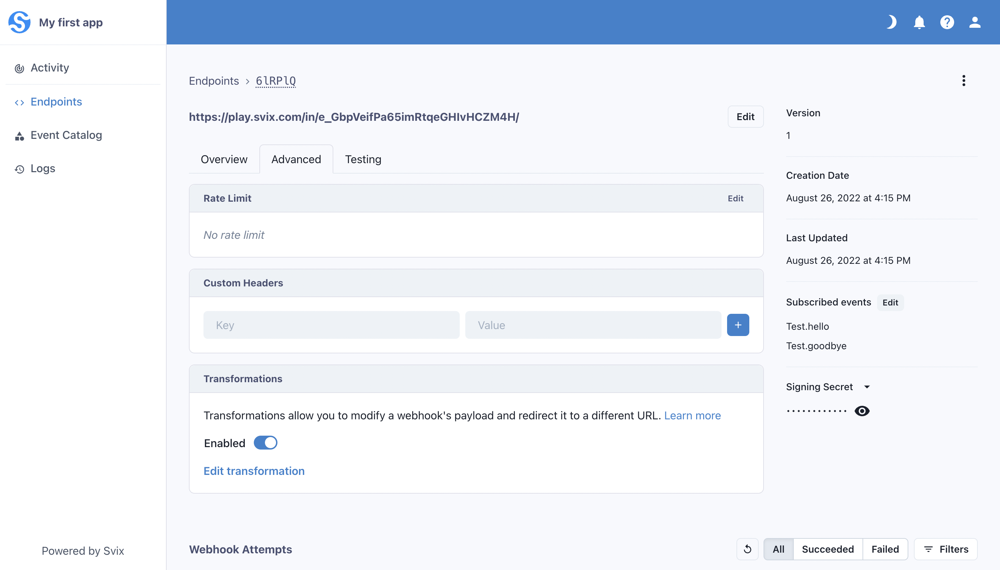

Transformations are a powerful new Svix feature that allow the modification of certain webhook properties in-flight. When you enable Transformations, your customers can write Javascript code on their endpoints that can change a webhook's HTTP method, target URL, and body payload.

## Enabling Transformations

Transformations can be enabled at the environment-level. When you enable Transformations for an environment, your customers will be able to use Transformations on their endpoints.

To enable Transformations, navigate to the Settings page in the dashboard. Under the Environment Settings section, click General Settings, and then toggle the Enable Transformations switch. Your customers will need to reenter the Consumer App Portal for the change to take effect.


## Using Transformations

Once enabled for an environment, you customers can begin using Transformations by logging into the Consumer Portal, clicking on an endpoint, clicking into the Advanced tab, and scrolling down to the Transformations card:



An endpoint's Transformation can be enabled or disabled at any time by toggling the switch on this card.

Your customers can write Javascript code to edit an endpoint's Transformation, and test their code against an event type's payload or a custom payload to see the resulting webhook.


### How to write a Transformation

Svix expects a Transformation to declare a function named `handler`. Svix will pass a `WebhookObject` to this function as its only argument, and expects it to always return a `WebhookObject`.

Here is what a `WebhookObject` looks like:

```json
{
	method: "POST",
	url: "https://play.svix.com/in/e_GbpVeifPa65imRtqeGHIvHCZM4H/",
	payload: {
		"title": "Some string",
		"value": 3.14
	}
}
```

`handler` can mutate this object as desired, affecting how and where the webhook is sent, and what it sends. There are a few constraints:
- The `method` property can only be `"POST"` or `"PUT"`; it is always `"POST"` by default.
- The `url` property must be a valid URL.

The Transformation will only work if the `handler` function returns the modified `WebhookObject`.

### An example Transformation

Suppose your customer has an endpoint that they only want to redirect if a numerical value in the webhook's payload is greater than 5. They can write a Transformation like this:

```js
function handler(webhook) {
	if (webhook.payload.value > 5) {
		webhook.url = "https://api.myservice.com/greater-than-5"
	}
	return webhook
}
```

Great, the webhook is redirected to a different URL if the `value` property of the payload is greater than 5. Otherwise, it is sent to the endpoint's defined URL.