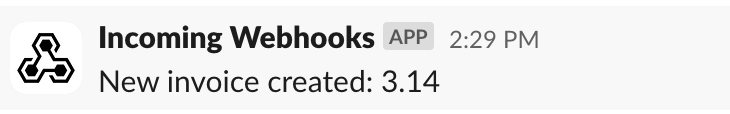

:::info Prerequisites
This guide assumes your familiar with the basics of [event types](../event-types), the [App Portal](../app-portal) and [Connectors](../transformation-templates).
:::

[Connectors](https://docs.svix.com/connectors) make it easy for your customers to link your webhooks to popular services like Slack, Hubspot, or Microsoft Teams in just a few clicks—no code or new backend infrastructure required.

With the Slack connector, you can offer your users an easy-to-use way of integrating your webhooks with Slack.


## Creating a Slack connector

1. Go to the [Connectors page](https://dashboard.svix.com/connectors) and click on the "Configure Connector" button.

2. Add a description. This will be displayed to the user in the App Portal. 

3. Select the event types this connector will support. You can choose specific event types that make sense for Slack, or select all of them.

4. Write the transformation code. This is the code that will be used to transform the webhook payload into a format that the Slack Incoming Webhooks API uses.

## Writing the transformation

Transformations allow the modification of certain webhook properties in-flight using Javascript code. The transformation is the key component that makes your connector work.

For the Slack connector, the transformation should make sure the webhook payload is formatted for the [Slack Incoming Webhooks API](https://api.slack.com/messaging/webhooks#posting_with_webhooks), for each of the event types you support (step 3).

For example, let's say you have two event types, `invoice.created` and `invoice.paid`, with the following schemas:

```json
{
  "invoice.created": {
    "type": "object",
    "properties": {
      "amount": {
        "type": "number"
      },
      "name": {
        "type": "string"
      }
    }
  },
  "invoice.paid": {
    "type": "object",
    "properties": {
      "invoice_id": {
        "type": "string"
      },
      "amount": {
        "type": "number"
      }
    }
  }
}
```

Your transformation should `switch` on the `webhook.eventType` to determine how to use the payload and transform it for the Slack API.

```js
/**
 * @param webhook the webhook object
 * @param webhook.method destination method. Allowed values: "POST", "PUT"
 * @param webhook.url current destination address
 * @param webhook.eventType current webhook Event Type
 * @param webhook.payload JSON payload
 * @param webhook.cancel whether to cancel dispatch of the given webhook
 */
function handler(webhook) {
  switch (webhook.eventType) {
    case "invoice.created":
      webhook.payload = { 
        text: `New invoice created: ${webhook.payload.amount}`
      };
      break;
    case "invoice.paid":
      // You can also use advanced formatting options (see https://api.slack.com/messaging/webhooks#advanced_message_formatting)
      webhook.payload = {
        text: `Invoice paid: ${webhook.payload.invoice_id}`,
        blocks: [
          {
            type: "section",
            text: {
              type: "mrkdwn",
              text: `Invoice paid: ${webhook.payload.invoice_id}`
            }
          },
          {
            type: "actions",
            elements: [
              {
                type: "button",
                text: {
                  type: "plain_text",
                  text: "View in dashboard"
                },
                url: `https://dashboard.invoices.com/invoices/${webhook.payload.invoice_id}`
              }
            ]
          }
        ]
      };
      break;
  }
  return webhook;
}
```

Your customers will be able to modify the transformation code if they want to, but, ideally, if your connector is useful enough and works without any modifications, they won't need to change it. 

## Testing the connector

Now that you've created your Slack connector, you can test it out in the App Portal.

[Create a sample application](https://docs.svix.com/quickstart#creating-a-consumer-application) and use the 'Preview App Portal' button in the Svix Dashboard. 

In the App Portal, the new connector will be visible when creating a new endpoint.


:::tip 
When creating an endpoint, your connector should work without any further changes, so just click create and test it!
:::


After sending a test event, we should see the message directly in Slack:




And the message using advanced formatting:


And that's it! In just a few clicks, your users will be able to connect their Slack account and start receiving notifications from your webhook events. 

The only thing we did was write the transformation, select the event types the connector supports, and Svix did the rest.

Learn more about connectors [in the docs](../transformation-templates).

