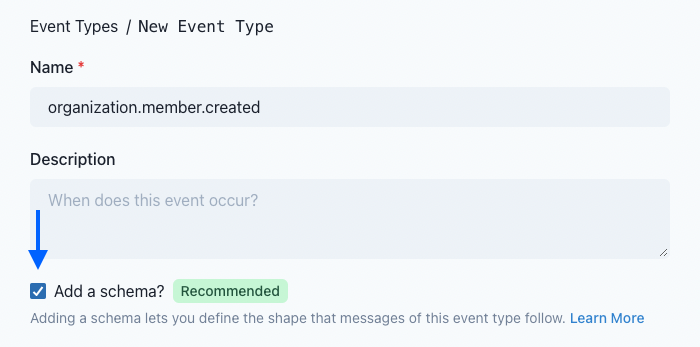
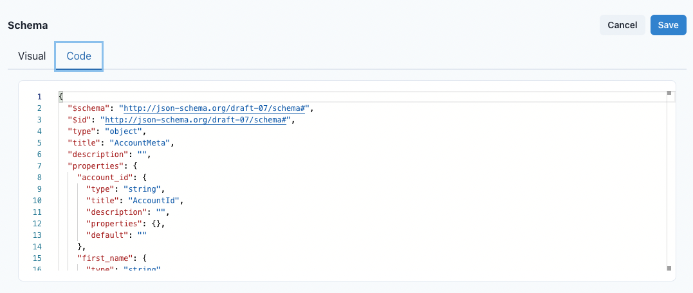

:::note[Prerequisites]
This guide assumes your familiar with the basics of [event types](../event-types) and the [App Portal](../app-portal).
:::

The key to providing an easy webhook integration experience for your users lays in your event types.
The first thing your users are interested in seeing when integrating with you is: what events do you send and what information do the events provide.

It's very important that users can answer these two questions just by looking at your event types.

Let's walk through creating a new event type with Svix.

## Choosing an event type name

Let's imagine we are defining webhooks for when an organization within your service changes. Webhook consumers might be interested in when a user is added or removed from the organization. Or when the organization settings are changed. It's important to imagine what hypothetical endpoints a user might have listening to those events.

Your consumers might have one endpoint for organization member changes and one for listening to settings changes.

To make the event types discoverable, let's define them as follows:

- `organization.member.added`
- `organization.member.deleted`
- `organization.member.modified`
- `organization.settings.modified`

We have defined logic groups of event types and dot-delimited them. Svix understands this syntax and will group them visually in the App Portal UI.

## Defining the schema

Now we want our users to know just exactly what they can expect to see in the message payload for `organization.member.added`.

So let's add a schema to the event type:



### Option A. Using the visual editor

To get started with the visual editor, let's add some child fields. We need a field for `account_id`, `first_name`, `last_name` and `created_at`.

To create a new child field, click "Add child" from under the parent field. Each field row has the following properties:

- field name
- type
- title
- is required?

First, fill in the field names. You'll notice that the field titles will automatically update to match the field name. You can choose to override this with your own title if you'd like. Next, since all of these fields will always be present, make sure to check the "is required" checkboxes next to each field.

Finally, we can make the field data types more specific. `created_at` isn't just a string, we also know the format of the string. To specify the format, click the gear icon to the right of the field. You should see a list of configuration options for the `created_at` field. Change the format to `date-time` and add a description here if you'd like.

Once you've defined this basic schema, save your event type. The event type detail view will now show you a preview of the schema that matches the interface your users will see in the Event Catalog.

#### Adding a custom example

Next to the schema preview, you should see an example event defined. While this example is based on the schema parameters you defined, it might not be the best representation of reality.

For this reason, it's best to provide your own custom example.

To do so, go back into edit mode for the schema.

From there, click "Configure example". In the example textarea, you can change the example to be something like the following:

```json
{
  "account_id": "acct_0123456",
  "first_name": "Bruce",
  "last_name": "Wayne",
  "created_at": "2021-09-22T17:47:43.575Z"
}
```

Then click "Save" to see your changes reflected in the schema preview and the Event Catalog.

### Option B. Providing a JSONSchema

Instead of using the visual editor, you can also choose to provide your own JSONSchema. If you already have a JSONSchema (or JSONSchema-compatible definition) defined for your events, this is likely your fastest option.

When you are configuring your schema, you can switch to the "Code" tab to fill out your own JSONSchema (Draft 7) spec.



After saving the raw JSONSchema, you can preview your event type to make sure that the schema matches what you expected.

## Event Catalog

After defining your event types and schemas, your users will be able to preview all your event types from the Event Catalog in the [App Portal](../app-portal), or optionally from the [published event catalog](../event-types#publishing-your-event-catalog) if enabled.
